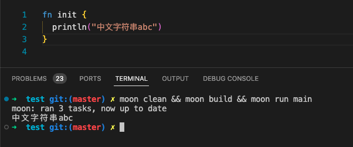
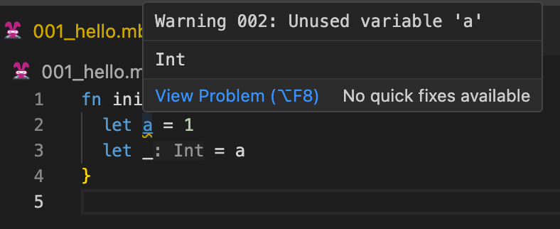
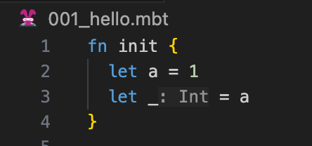
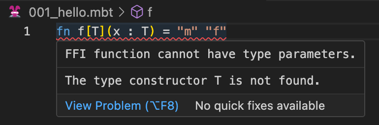

# weekly 2023-11-27

<!--truncate-->

## MoonBit更新

### 1. struct 与 enum 支持派生 Eq/Compare/Show/Default

```
struct T {
  x: Int
  y: Int
} derive(Eq, Show, Compare, Default)

fn init {
  let t0 = T::default()
  let t1 = { x : 1, y : 1 }
  println(t0)
  println(t1)
  println(t0 < t1)
  println(t0 == t1)
}

// {x: 0, y: 0}
// {x: 1, y: 1}
// true
// false
```

具体文档查看：https://www.moonbitlang.cn/docs/syntax#%E8%87%AA%E5%8A%A8%E5%AE%9E%E7%8E%B0%E5%86%85%E5%BB%BA%E6%8E%A5%E5%8F%A3

### 2. 命令行环境支持打印 UTF-8 字符串



### 3. 允许使用 `_` 忽略未使用变量警告

修改前


修改后



### 更友好的错误提示

更友好的错误提示，试图给FFI声明类型参数的代码会报错



## MoonBit Gallery

上周MoonBit Gallery增加马里奥游戏，在实时编程环境中，你可以灵活调整马里奥的跳跃高度，实时创建多个马里奥角色，探索多重乐趣。此外，你还能实时调整游戏结束的逻辑，带来全新的游戏体验。

对这种游戏体验感兴趣吗？快访问我们的官网展览页面一探究竟，开始你的个性化马里奥冒险之旅吧！

官网展览页👉：

https://www.moonbitlang.cn/gallery/
