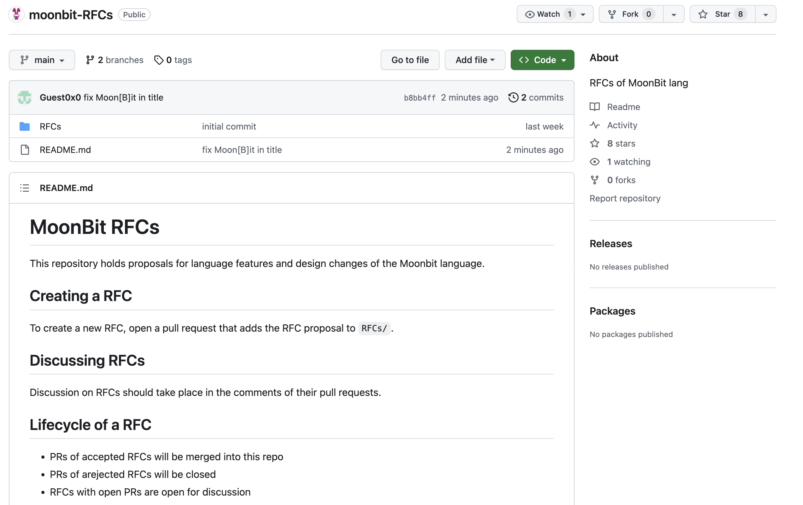

# weekly 2023-12-04

<!--truncate-->

## MoonBit更新

### 1.支持在浏览器上进行源码调试

- 使用构建命令`moon build --debug --target wasm-gc`支持输出sourcemap，可用于在浏览器中进行源码调试，具体用法请参考示例 https://github.com/moonbit/moonbit-debugging-example.git

### 2. 优化对于只有常量构造器枚举数据类型的布局

例如，对于以下代码，优化后会将`A`与`B`直接使用整数`0`和`1`表示，不再需要装箱与拆箱操作。

```
enum T {
  A
  B
}

fn init {
  let t = T::A
  match t {
    A => println(0)
    B => println(1)
  }
}
```

### 3. 引用类型在函数边界改为了 non-nullable

引用类型在函数边界改为了 non-nullable，这有助于后续为部分基础类型（比如Array，String 等）提供稳定的ABI

## 构建系统

移除 `moon.pkg.json` 中的 `name` 字段，不再以 `"name": "main"` 识别入口，而是显式地使用 `"is_main": true`来识别。

## 社区

我们新启动了一个GitHub项目，专注于MoonBit语法和功能的改进。链接是：[https://github.com/moonbitlang/moonbit-RFCs](https://github.com/moonbitlang/moonbit-RFCs)



在这里，我们会分享关于MoonBit语法修改与功能修改的想法，并邀请大家共同参与讨论，探索每个提案的可行性。同时，我们也欢迎任何有对MoonBit感兴趣的朋友们可以在这里提交你的提案。我们将共同探讨每一项提案的可行性，期待你的参与～
