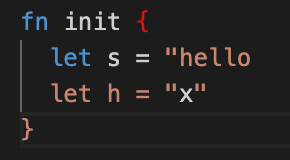

# weekly 2023-12-11


<!--truncate-->

## MoonBit更新

### 1. 支持使用 `type` 关键字定义 newtype

```
type MyInt Int derive(Show)

fn init {
    let x = MyInt::MyInt(5)
    println(x) // Output: MyInt(5)
    println(x.0) // Output: 5
}
```

### 2. 支持内联 Wasm 函数，例如

```
fn char_to_string(c: Char) -> String =
   "(func $char_to_string (param $c i32) (result (ref $moonbit.string)) (array.new $moonbit.string (local.get $c) (i32.const 1)))"
```

不过目前内联 Wasm 指令只支持 wasm-gc 后端

### 3. 改进自动分号插入

现在 MoonBit 支持下面的链式调用写法：

```
fn init {
  receiver
    .method1()
    .method2()
    .method3()
}
```

此外，多行的函数调用和结构体创建不再需要在最后加上逗号了：

```
fn init {
  let record = {
    x: 1,
    y: "abc" // 以前这里必须加逗号
  }
  function(
    arg1,
    arg2 // 以前这里必须加逗号
  )
}
```

### 4. 字符串插值现在支持Unicode

```
let s = "string interpolate unicode \( 中文 )"
```

### 5. 优化字符串高亮

修改前



修改后


### 6. 内置类型改进

- 字符串

  - 添加 `String::make`

```
fn init {
  let s = String::make(3, 'a')
  println(s) // Output: aaa
}
```

- 修复 `String::compare`，修改前 `String::compare` 只比较长度，修改后，按照字典序比较
- Bytes 和 Buffer

  - 添加Bytes相关函数: `blit`, `to_string`, `of_string`, `sub_string`, `blit_from_string`, `copy`, `set_utf8_char`

  - 新增Buffer类型和相关函数: `to_string`, `make`, `write_string`, `write_char`, `length`

- `Option` 添加 `Eq/Compare/Show/Default` 的默认实现， `Ref/Array` 添加 `Show` 的默认实现
