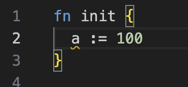
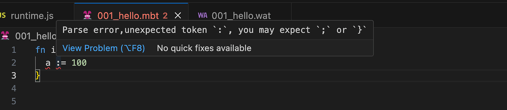
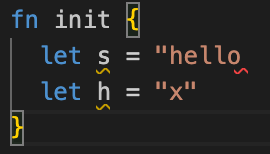

# weekly 2023-12-18


<!--truncate-->

## 1. 添加 `Debug` 接口

```moonbit
interface Debug {
  debug_write(Self, Buffer)
}
```

以及`debug[X: Debug](X)` 函数。并且给内建类型实现了 `Debug` 接口。和之前的 `Show` 接口相比，`Debug` 的性能更好，而且会正确地在类型为 `String` 的值的两侧加上双引号。在输出调试信息时，我们鼓励用户用 `Debug` 代替 `Show`，用 `debug` 代替 `println`。未来 `Show` 和 `println` 可能会被废弃或发生 API 上的不兼容变化。

`Debug` 的使用示例：

```moonbit
struct T[X] {
  s: String
  x: X
} derive (Debug)

fn init {
  let t = { s : "hello", x: "world" }
  debug(t) // Output: {s: "hello", x: "world"}
}
```

## 2. `while` 中添加迭代表达式，在循环的每次迭代之后执行

```moonbit
var i = 0
while i < len, i = i + 1 {
  do_something_with(i)
}
```

上面的例子粗略地等价于：

```moonbit
var i = 0
while i < len {
  do_something_with(i)
  i = i + 1
}
```

但 `continue` 语句不会跳过迭代表达式。因此迭代表达式尤其适合用于写类似 `for`的循环。例如，下面的程序会对所有小于 `10` 的奇数进行一些操作（而非死循环）：

```moonbit
var i = 0
while i < 10, i = i + 1 {
  if i % 2 == 0 {
    continue
  }
  do_something_with(i)
}
```

## 3. 移除`id := expr`语法

现在只能使用`let id = expr`声明不可变变量。

修改前



修改后



## 4. 使用内置类型 `Bytes` 重新实现速度更快的`to_string` 方法，

使用内置类型 `Bytes` 重新实现速度更快的 `Int` 和 `Int64`的`to_string` 方法，替代之前使用字符串拼接的实现

## 5. 添加 `String::default`

```moonbit
fn init {
  let s = String::default()
  debug(s) // Output: ""
}
```

## IDE更新

### 1. 本地 VS Code 插件可以自动执行 `moon check --watch`

本地 VS Code 插件可以自动执行 `moon check --watch` ，现在不再需要手动执行。

### 2. 添加对方法的提示

修改前


修改后



### 3. 优化诸多类型报错信息
