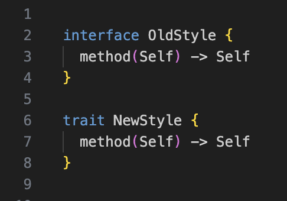
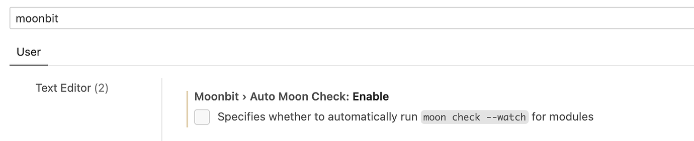
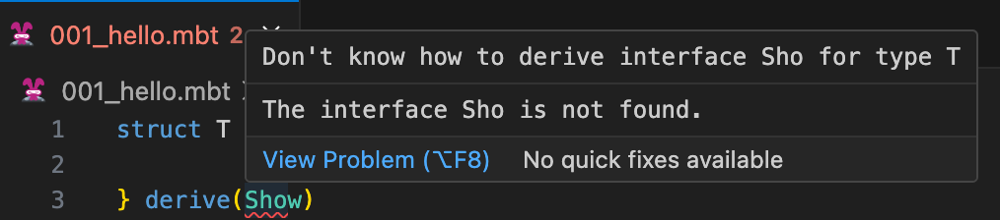
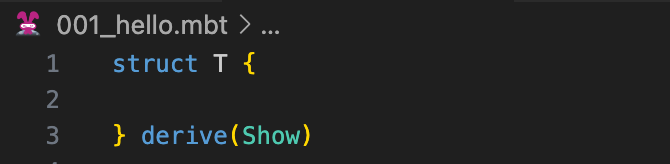
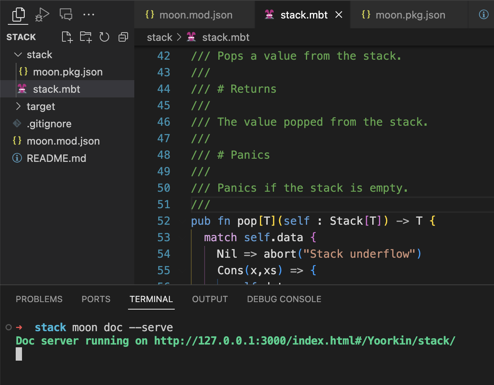
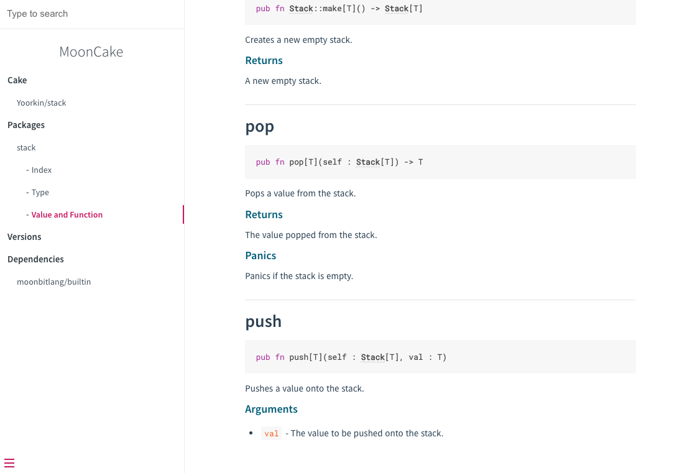

# weekly 2023-12-25
## MoonBit更新

### 01. 添加内置类型 `Result`

```
enum Result[T, E] {
  Ok(T)
  Err(E)
}
```

### 02. 添加问号操作符

新增了问号操作符，用于简化错误处理：

```
fn may_fail() -> Option[Int] { ... }

fn compose_may_fail() -> Option[String] {
  let x = may_fail()?
  let y = may_fail()?.lsr(3)
  Some ((x + y).to_string())
}
```

问号操作符的语义是：如果 `t?` 中 `t` 的结果是 `None`,那么 `t?` 相当于 `return None`（直接跳出当前函数）。如果 `t?` 中 `t` 的结果是 `Some(x)`，那么 `t?` 相当于 `x`。除了 `Option` 类型，问号操作符也能作用在 `Result` 类型上：

```
fn may_error() -> Result[Int, String] { ... }

fn compose_may_error() -> Result[Int, String] {
  let x = may_error()?
  let y = may_error()?
  if y == 0 {
    return Err("divide by zero")
  }
  Ok (x / y)
}
```

### 03. 将关键字 `interface` 修改为 `trait`

根据社区的反馈，将关键字 `interface` 修改为 `trait`，暂时保留对关键字`interface`的兼容:



### 04. 修改死代码消除的逻辑

对于顶层 `let` 在没有被使用的情况下，一律视作可以被删除，无论其是否有副作用。比如,

```
let a = 1       // will be removed
let b: T = f(a) // will be removed
fn init {
  ..            // a and b are not used
}
```

如果函数 `f` 会触发副作用，需要把 `f(a)` 这个调用放到 `fn init { .. }` 中以避免其被删除

### 05. 修复代码格式化工具不能正确处理中文注释的问题

### 06.修复不能正确处理中文全局标识符的问题

## IDE更新

### 01. 添加是否自动启动 `moon check` 的选项

vscode用户可以在`settings.json`中使用`moonbit.autoMoonCheck.enable`控制是否自动启动`moon check`。

或者你也可以在设置中搜索MoonBit：



### 02. 修复 `derive(Show)` 误报错误的问题

修复前



修复后



## 构建系统更新

### 01. 添加 `moon doc` 命令

添加 `moon doc` 命令，用于生成和预览文档。`moon doc --serve`会根据代码中的markdown注释生成文档，并在本地启动网页服务器。访问输出的链接即可查看效果。




