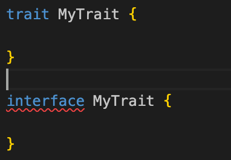
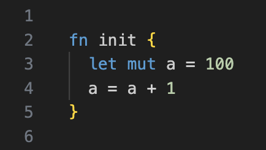
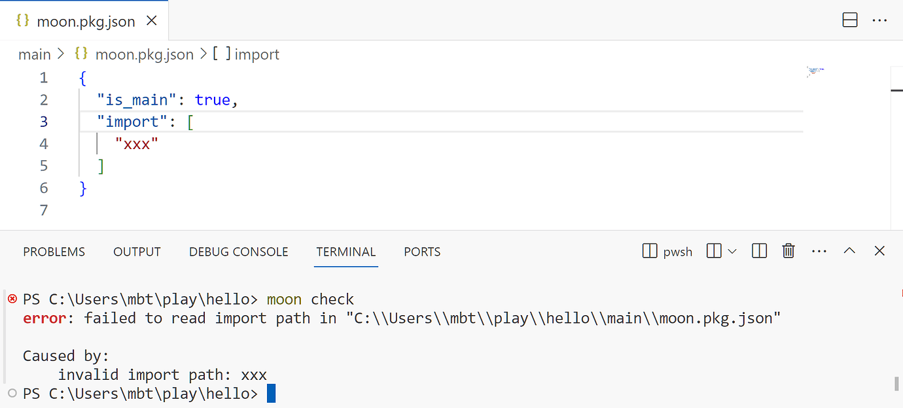

# weekly 2024-01-08
## MoonBit更新

### 1. 正式移除 `interface` 关键字

正式移除了 `interface` 关键字，使用 `trait` 代替。



### 2. 引入`let mut id = expr`

根据社区的反馈，引入`let mut id = expr`的语法替代 `var id = expr`，下周将移除 `var id = expr`的支持。



### 3. 给 `Array` 类型增加了 `Default` 的实现

例如：

```
fn init {
  debug(Array::default()) // []
}
```

### 4. 给 `List` 类型增加了 `Default`、`Eq`、和`Debug` 的实现

例如：

```
fn init {
  let l1: List[_] = Cons(1, Cons(2, Cons(3, List::default())))
  let l2: List[_] = Cons(1, Cons(2, Cons(4, Nil)))
  debug(l1) // Cons(1, Cons(2, Cons(3, Nil)))
  debug(l1 == l2) // false
  debug(l2 == l2) // true
}
```

### 5. 修复对pub函数体的类型检查

形如这样的例子：

```
priv type T
pub fn f() {
  let t: T = ... // public definition cannot depend on private type
      ...
}
```

之前会在T报错，但现在不会了。

## 插件更新

### 1. 新增MoonBit AI

目前已新增MoonBit AI，地址是https://ai.moonbitlang.com，欢迎大家试用。

### 2. 提高LSP稳定性

修复一些会导致LSP崩溃的bug，提升LSP的稳定性。

## 构建系统更新

### 1. 修复 `moon test` 会测试 .mooncakes 文件夹下的包的问题

### 2. 废弃 `moon check --daemon`

### 3. 改进 `moon.pkg.json` 格式或内容错误时的错误提示

如下图所示：

