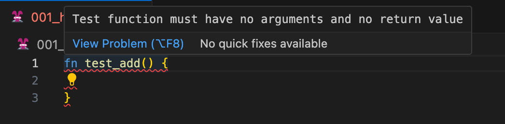
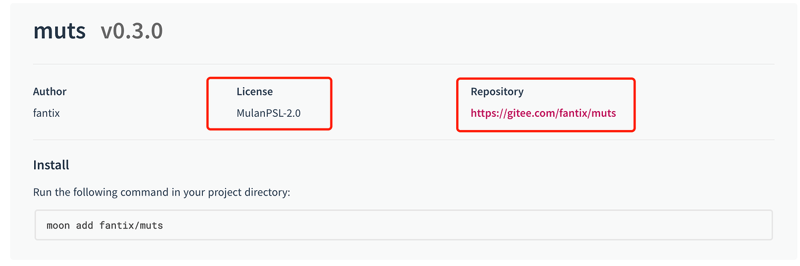

# weekly 2024-01-15
## MoonBit更新

### 1. 放宽了`match`的右手侧的语法，允许单个语句的出现。现在允许下面的写法：

    ```moonbit
    match x {
      A => return
      B => return 1
      C => i = i + 1
      D => break
      E => continue
      F => while true {}
    }

    ```

### 2. 修复formatter的各种bug，例如：

<table>
<tr>
<td> 源代码 </td> <td> 修复前 </td> <td> 修复后 </td>
</tr>
<tr>
<td>

```moonbit
fn init {
  let mut a = 1
  {
    {
      let a = 2
      f(a)
    }
    let a = 3
    f(a)
    {
      let a = 4
      f(a)
    }
  }
  f(a)
}
```

</td>
<td>

```moonbit
fn init {
  let mut a = 1
  let a = 2
  f(a)
  let a = 3
  f(a)
  let a = 4
  f(a)
  f(a)
}
```

</td>

<td>

```moonbit
fn init {
  let mut a = 1
  {
    {
      let a = 2
      f(a)
    }
    let a = 3
    f(a)
    let a = 4
    f(a)
  }
  f(a)
}
```

</td>
</tr>
</table>

### 3. 新增实验性inline测试机制

声明格式为`fn test_*`，inline测试需要在普通的 `*.mbt` 文件中（而不是 `*_test.mbt`）声明，它既不能有参数也不能有返回类型，例如以下写法会报错：



现在 `moon test` 除了会执行每个包中以 `_test.mbt` 结尾的测试文件，还会执行每个包中的 inline 测试。

## 构建系统更新

### 1. `moon new`给各个选项增加了默认值，用户可以使用回车选择默认值

    ```
    $ moon new
    Enter the path to create the project (. for current directory) [default: myproject] >
    Enter the create mode (exec or lib) [default: exec] >
    Enter your username [default: username] >
    Enter the package name [default: hello] >
    Enter your license [default: Apache-2.0] >
    Created my-project
    ```

### 2. `moon.mod.json`增加license和repository字段。

license表示这个mooncakes.io所使用的licencse，必须符合spdx标准。



### 3. 正式移除`moon check --daemon`

### 4. `moon publish`新增上传大小限制，上传大小必须小于16Mib

## 其他更新

### 1. windows平台的安装路径从`~/.moon`改为`~/.moon/bin`，与其他平台保持一致。

### 2. 修复关于newtype goto definition 和 rename 的 bug
