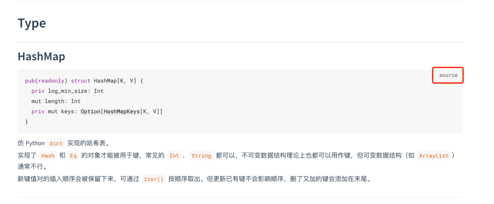

# weekly 2024-01-22
## MoonBit更新

### 1. 新增矩阵函数的语法糖

新增矩阵函数的语法糖，用于方便地定义局部函数和具有模式匹配的匿名函数：

```
fn init {
  fn boolean_or { // 带有模式匹配的局部函数
    true, _ => true
    _, true => true
    _, _    => false
  }
  fn apply(f, x) {
    f(x)
  }
  let _ = apply(fn { x => x + 1 }, 42) // 匿名函数
  let _ = apply(fn {                   // 带有模式匹配的匿名函数
    0 => 0
    1 => 1
    _ => 2
  }, 42)
}
```

### 2. 新增使用 `T::{ ... }`构造结构体的语法

这个新语法可用于显式的指定结构体的类型，并会使得结构体内有更好的补全：

```
struct T {
  x: Int
  y: Int
}

struct T2 {
  x: Int
  y: Int
}

fn init {
  let x = T::{x: 1, y: 2}
  debug(x.x + x.y) // 3
}
```

### 3. 正式移除 `var id = expr` 的语法

### 4. 增加了新的关键词 `test`

新的测试语法 `test "name" {}`，用于代替原先的`fn test_name(){}`。目前暂时只有顶格缩进的`test`会被识别成关键字，未来将不再支持使用`test`作为标识符。
旧语法: `fn test_` `name` ` {}`
新语法: `test "` `name` `" {}`

### 5. 支持在 init 或者 test 代码块中使用 return 语句

```
fn init  {
  if i > 0 {
    return
  }
  ...
}

test {
  if i > 0 {
    return
  }
  ...
}
```

## 插件更新

### 改进了语法高亮：

Before:


After:


## mooncakes.io 更新

### 1. 新增 mooncakes.io 注册方式

现在mooncakes.io 支持使用用户名+邮箱方式注册，而不仅限于之前的GitHub登录方式。现在新用户可以抢先注册你心仪的用户名。（注意：用户名字符需要>=5，如果小于5需要联系管理员后台操作。）

```
$ moon register
Choose a way to register: Email
You chose: Email
Username: xxxxxx
Password: [hidden]
Email: xxxxxx@xxx.xx
Send verification code to your email[bzy_sustech@foxmail.com]? yes
Please input the verification code: xxxxxx
Register successfully!
API token saved in ~/.moon/credentials.json
```

### 2. 增加跳转到源代码的功能


