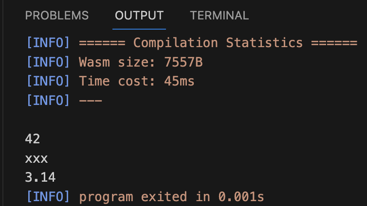
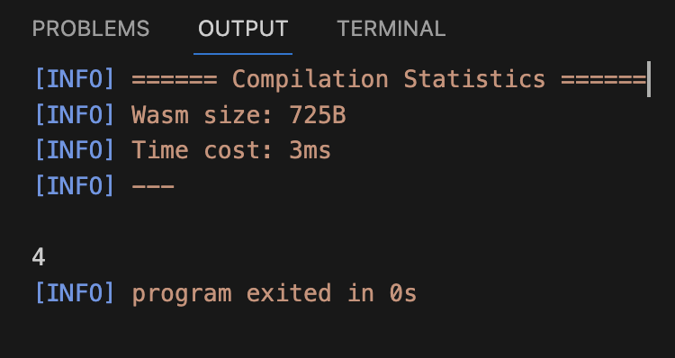
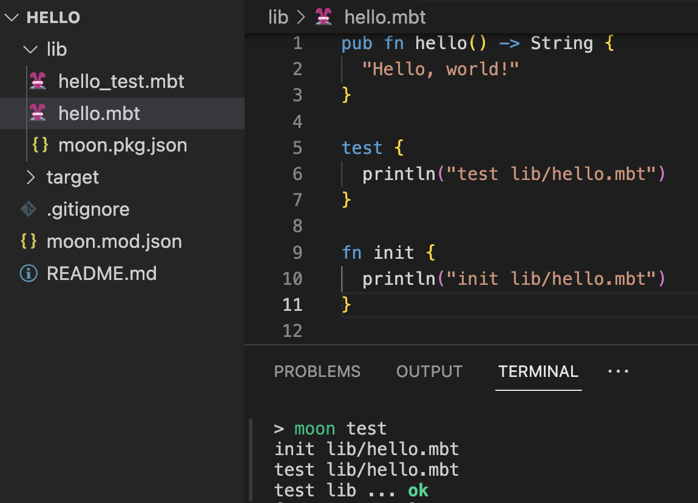
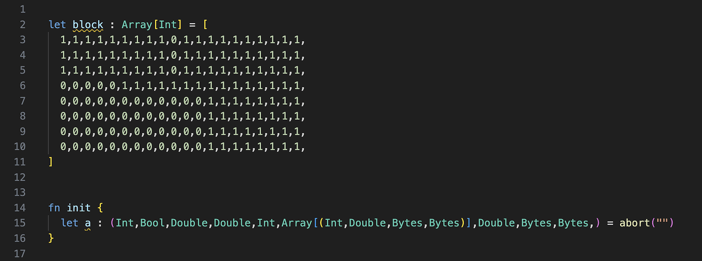
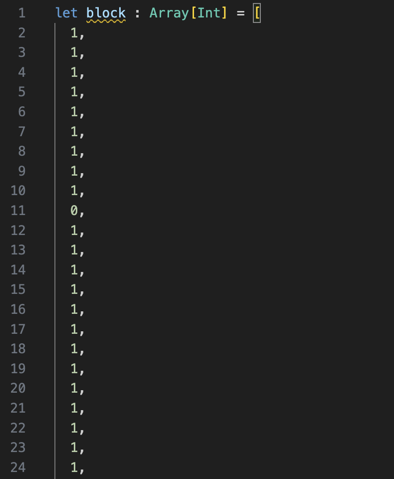
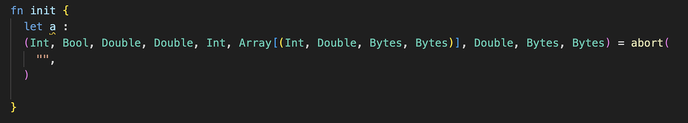
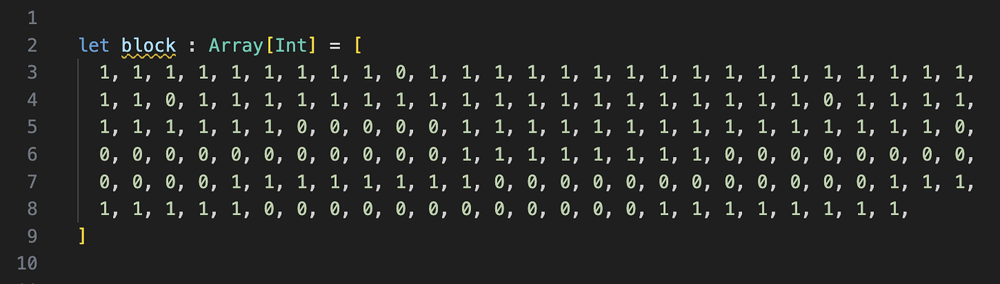
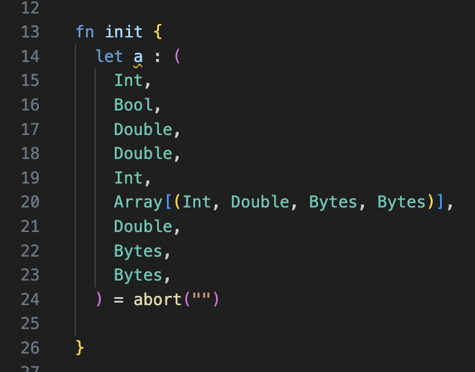

# weekly 2024-01-29
## MoonBit更新

### 1. 新增特性Trait object：

能够显式地将类型不同但实现相同trait的值装箱并表示成同一个类型，实现函数的动态分发。

```
fn get_show_list() -> List[Show] {
  let a = 42 as Show
  let b = "xxx" as Show
  let c = 3.14 as Show
  List::Cons(a, Cons(b, Cons(c, Nil)))
}

fn init {
  fn print_show_list {
    List::Cons(a, rest) => { println(a); print_show_list(rest) }
    List::Nil => ()
  }
  print_show_list(get_show_list())
}
```



### 2. 新增管道运算符

提供类似于链式调用的语法，可以串联多个连续的函数调用，省去`let name = ...`的代码。例如`value |> func1(arg1,arg2) |> func2 `相当于:

```
let a = value
let b = func1(a, arg1, arg2)
func2(b)
```

另一个例子：

```
fn sub2(x : Int, y : Int) -> Int {
  x - y
}

fn sum3(x : Int, y : Int, z : Int) -> Int {
  x + y + z
}

fn init {
  6 |> sub2(5) |> sum3(1,2) |> println()
}
```



### 3. 字符串支持使用`\xFF`进行十六进制转义

```
fn init {
  let data = "\x48\x65\x6c\x6c\x6f"
  println(data) //output: Hello
}
```

### 4. Inline test变更

现在test mode也会执行fn init，执行顺序在inline test之前。


### 5. Moonfmt：改进类型和长数组字面量的缩进

原代码：



改进前的格式化效果：





改进后的格式化效果：




