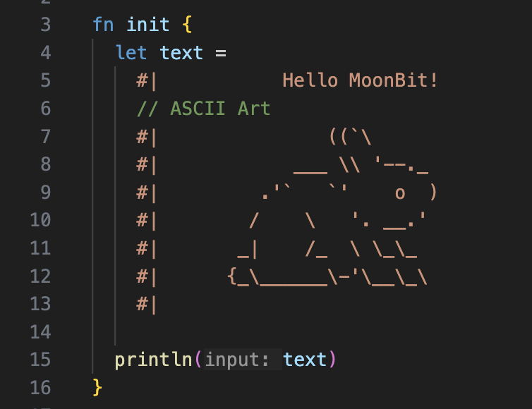
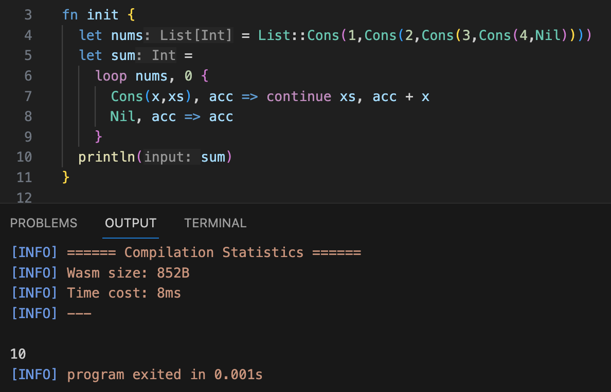
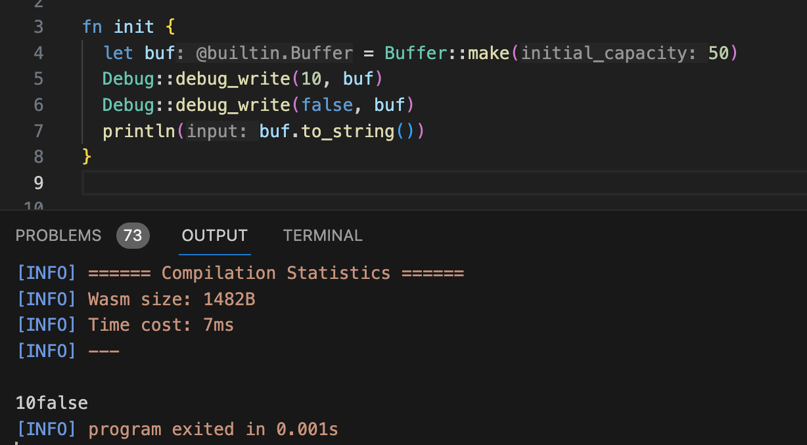
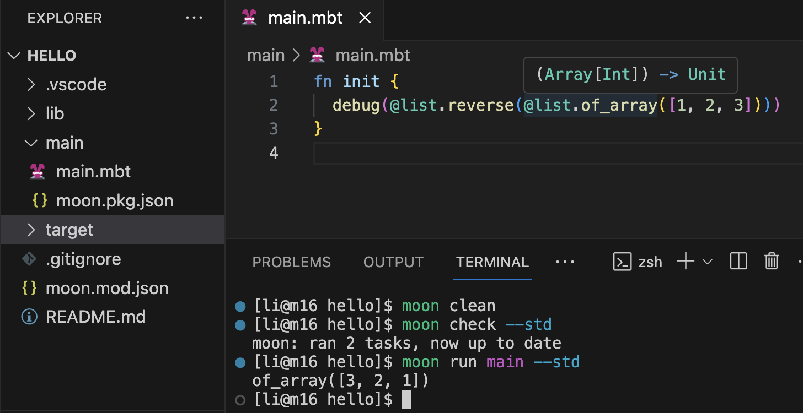
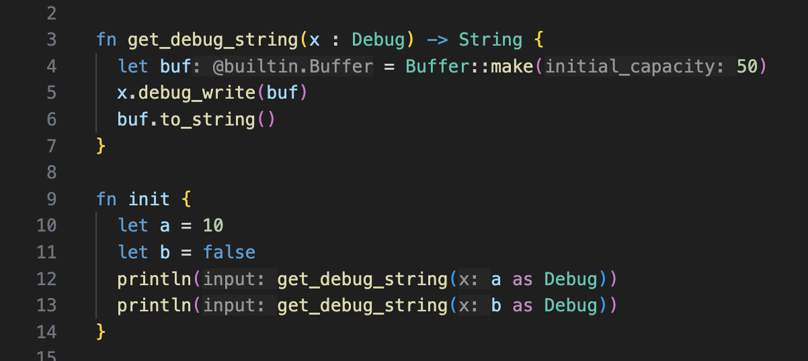
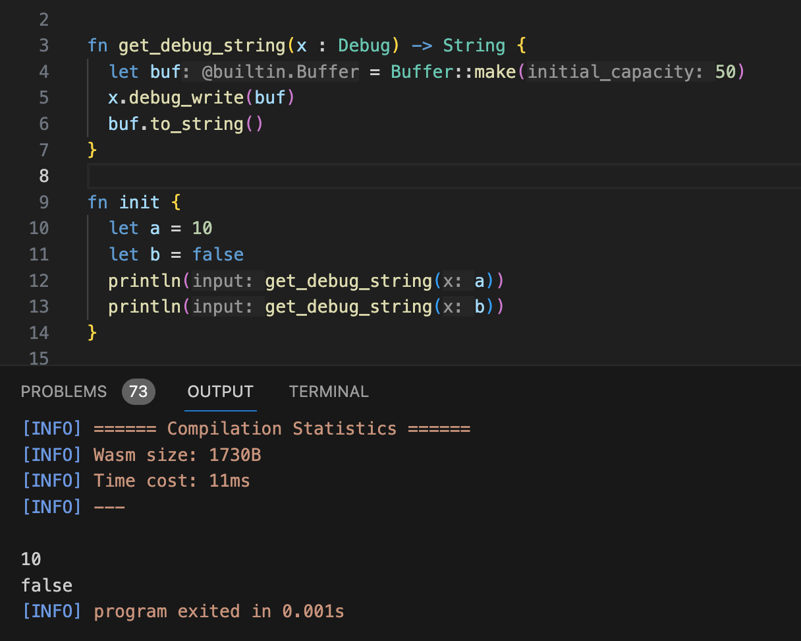
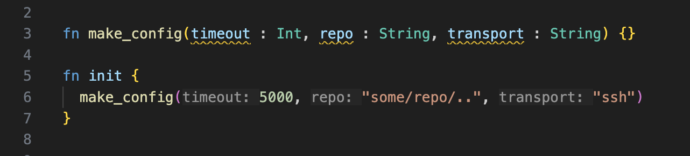
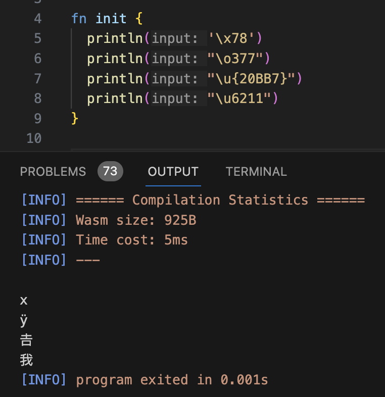

# weekly 2024-02-05
## MoonBit 更新

### 1. 新增多行字符串支持

每行需要以`#|`开头。多行字符串每行之间允许断开、插入注释，字符串内不支持转义和字符串插值。

### 2. 新增函数式的loop循环

其中`continue` 只允许出现在尾递归调用的位置，loop内允许使用`break`提前返回一个值。

### 3. 提供`Trait::method`调用支持

支持以`Debug::debug_write(self, buf)`的形式调用trait method

### 4. 添加实验性标准库机制

最新的安装脚本会将标准库下载到 `~/.moon/lib/core` 目录下。目前标准库的内容以及相关IDE支持暂不稳定，因此构建系统默认不链接标准库。对于想要提前体验标准库功能的开发者们，可以在 `moon check|build|run|test` 命令后添加 `--std` 选项用于链接标准库到当前项目。

### 5. 支持隐式到trait object的转换

在上下文中明确需要一个trait object时，会自动插入 `as SomeTrait`。例如下面的代码：

现在我们可以省略`as Debug`：

### 6. 支持函数参数的inlay hint

### 7. 字符串和char字面量支持unicode转义、十六进制转义和八进制转义

