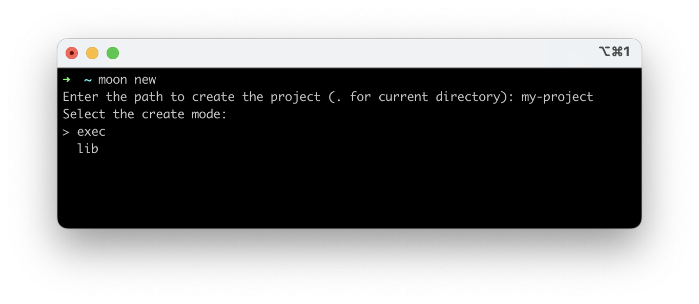
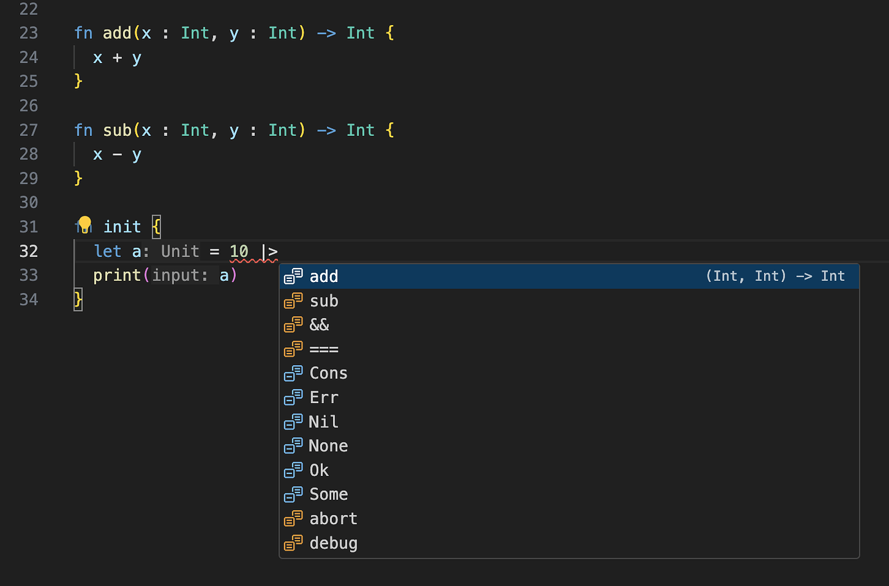

# weekly 2024-02-19
## MoonBit更新

### 1. 增加了functional for loop控制流支持

与传统的命令式for loop 不同，循环变量是不可变的。这样的设计将来也容易抽取出来做形式化验证:

```
fn init {
  for i = 0; i < 5; i = i + 1 {
    debug(i)
    // i = i + 4  error: The variable i is not mutable.
  }
}
```

输出：

```
01234
```

functional for loop也支持多个绑定。与其他语言不同的是，x和y在functional for loop的第三个表达式里具有同时更新的语义：

```
fn init {
  for x = 0, y = 0; x < 10; x = x + 1, y = x + 1 {
                                        // ^~~ 这里x的值是更新前的
    println("x: \(x), y: \(y)")
  }
}
```

输出：

```
x: 0, y: 0
x: 1, y: 1
x: 2, y: 2
x: 3, y: 3
x: 4, y: 4
x: 5, y: 5
x: 6, y: 6
x: 7, y: 7
x: 8, y: 8
x: 9, y: 9
```

functional for loop内部也支持使用`break`和`continue`。

```
fn init {
  let xs = [0,1,2,3,4,5,6,7,8]
  let mut sum = 0
  for i = 0, v = xs[0]; i < xs.length(); i = i + 1, v = xs[i + 1] {
    if v % 2 == 0 { continue }
    if v >= 7 { break }
    sum = sum + v
  }
  debug(sum) //output： 9
}
```

### 2. 改进moon new创建项目的向导

现在可以用方向键选择创建lib或者exec项目:



### 3. IDE支持管道运算符的智能补全

对于第一个参数类型与管道左侧表达式类型相等的函数，会放在补全列表的顶部，其它的补全选项仍然会显示在列表后。



### 4. 根据社区反馈调整了pipe表达式

现在管道运算符右侧支持`Double::to_int`这样的函数调用。

```
fn init {
  debug(3.14 |> Double::to_int) // output: 3
  debug(4 |> Array::make('c')) // output: ['c', 'c', 'c', 'c']
}
```

### 5. 修复IDE中缀表达式错误地插入inlay hint的问题
