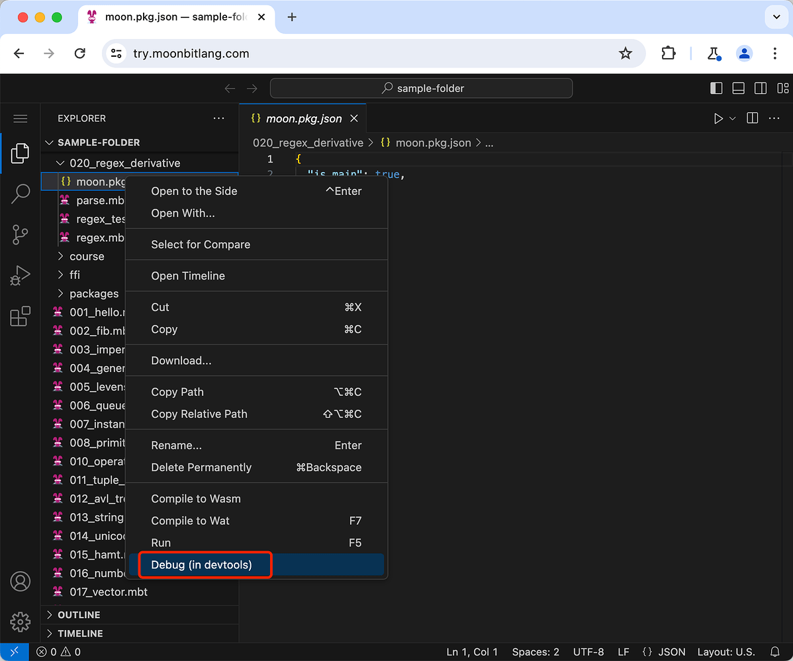
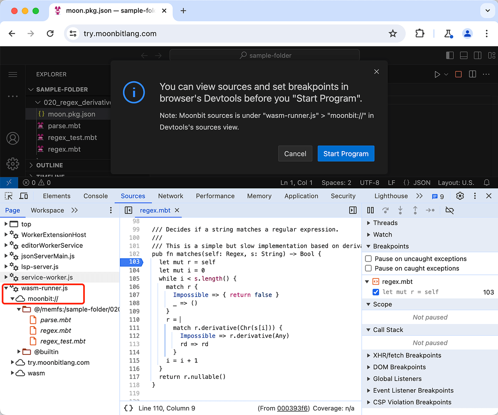
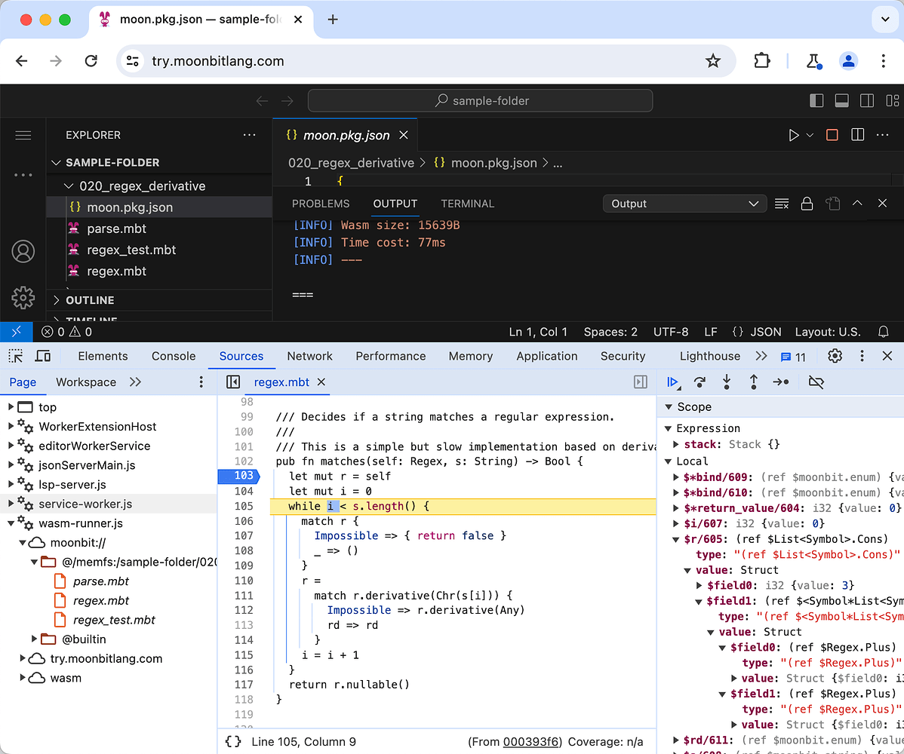
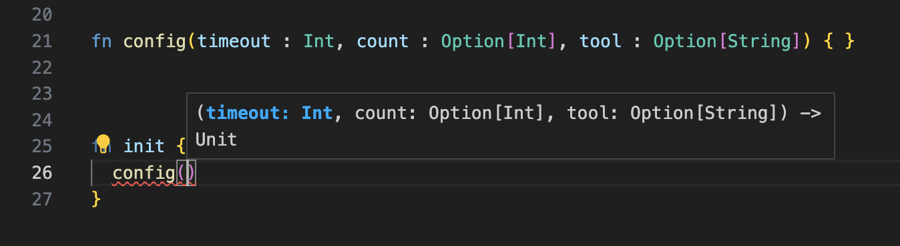

# weekly 2024-02-26
## MoonBit 更新

### 1. 支持云原生调试功能

现在，你可以通过访问 try.moonbitlang.cn，直接在浏览器中使用 devtools 调试 MoonBit 程序，无需安装任何软件。具体的使用步骤如下：





### 2. MoonBit 支持使用 `for` 关键字定义的函数式循环控制流

MoonBit 现在支持使用 `for` 关键字定义的函数式循环控制流，其性能接近于 C/C++ 等底层语言，比如 `fib` 函数可以写成如下形式：

```moonbit
fn fib( n : Int ) -> Int {
    for i = 0, a = 1, b = 2
        i < n
        i = i + 1, a = b, b = a + b {
    } else { b }
}

```

MoonBit 的 `for` 循环可以作为表达式返回一个值，比如上述程序中在循环结束后使用 `b` 作为整个 `for` 循环的值，也可以在 `for` 的循环体中通过 `break` 提前返回，比如：

```moonbit
fn exists(haystack: Array[Int], needle: Int) -> Bool {
  for i = 0; i < haystack.length(); i = i + 1 {
    if haystack[i] == needle {
      break true
    }
  } else {
    false
  }
}

```

此外，在 `for` 循环中可以像传统语言一样使用 `continue` 进入下一次循环，MoonBit 额外提供了带参数的 `continue` 来指定下一次循环过程中循环变量的值，比如:

```moonbit
fn find_in_sorted[T](xs: Array[(Int, T)], i: Int) -> Option[T] {
  for l = 0, r = xs.length() - 1; l < r; {
    let mid = (l + r) / 2
    let k = xs[mid].0
    if k == i {
      break Some(xs[mid].1)
    } else if k > i {
      continue l, mid
    } else {
      continue mid + 1, r
    }
  } else {
    None
  }
}

```

在不需要返回值的情况下，else 分支可以省略，比如：

```moonbit
fn print_from_0_to(n: Int) {
  for i = 0; i <= n; i = i + 1 {
    println(i)
  }
}

```

### 3. Inline test 改进

测试的返回类型从`Unit`改成了`Result[Unit,String]`，用于表示测试的结果：

```moonbit
 test "id" {
      if (id(10) != 10) { return Err("The implementation of `id` is incorrect.") }
    }

```

编译器会自动将`test "id" {...}` 的语句块`{...}`使用`Ok()`包裹起来。因此，当语句块的类型为`Unit`并且没有提前return时，表示inline test测试通过。配合问号操作符，可以让测试变得更加优雅：

```moonbit
fn id(x : Int) -> Int {
     x + 1 // incorrect result
   }

   fn assert(x : Bool, failReason : String) -> Result[Unit,String] {
     if x { Ok(()) } else { Err(failReason) }
   }

   test "id" {
     assert(id(10) == 10, "The implementation of `id` is incorrect.")?
   }
```

执行`moon test`，输出如下：

```moonbit
➜  my-project moon test
running 1 tests in package username/hello/lib
test username/hello/lib::hello ... ok

test result: 1 passed; 0 failed

running 1 tests in package username/hello/main
test username/hello/main::id ... FAILED: The implementation of `id` is incorrect.

test result: 0 passed; 1 failed

Hello, world!
```

### 4. 改进 VS Code 插件的函数签名提示，现在会显示参数名：



### 5. 改进了 VS Code 插件对 core 包开发的支持

### 6. `moon new` 支持快速创建新项目

- `moon new hello` 在文件夹 `hello` 中创建一个名为 `username/hello` 的可执行项目
- `moon new hello --lib` 在文件夹 `hello` 中创建一个名为 `username/hello` 的模块
