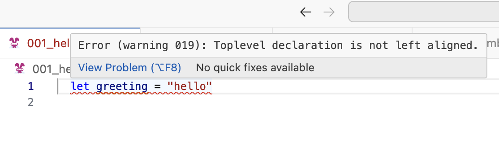
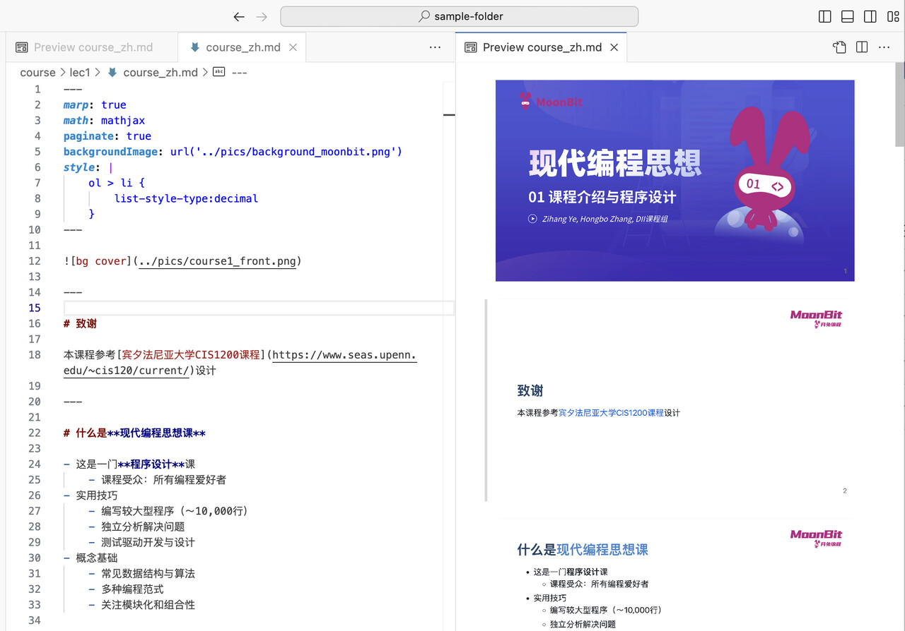
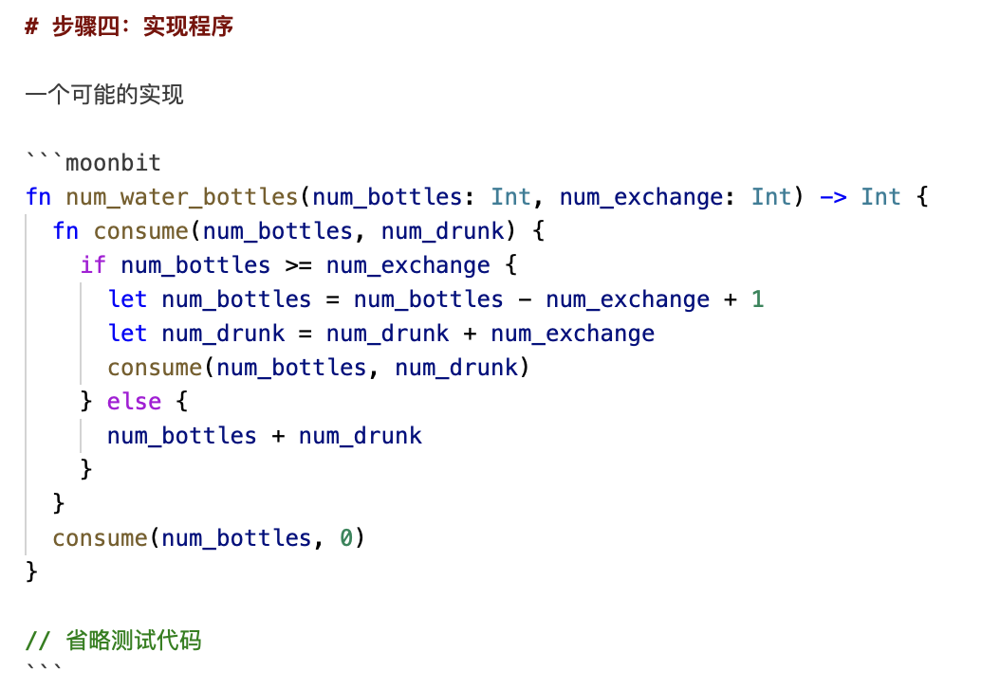

# weekly 2024-03-04
## **一、MoonBit更新**

### **1. 添加了 += 系列语句**

包括+=、-=、\*=、/=，支持运算符重载：

```moonbit
fn init {
  let array = [1,2,3,4]
  array[2] *= 10
  println(array) // [1, 2, 30, 4]
}

fn init {
  let mut a = 1
  a += 20
  println(a) // 21
}
struct Foo {
  data : Array[Int]
} derive(Debug)

fn op_set(self : Foo, index : Int, value : Int) {
  self.data[index] = value
}

fn op_get(self : Foo, index : Int) -> Int {
  self.data[index]
}

fn init {
  let foo : Foo = { data: [0,0,0,0] }
  foo[2] -= 10
  debug(foo) // {data: [0, 0, -10, 0]}
}

```

### **2. 现在 toplevel 如果没有顶格会报错**

如下图所示：



### **3. 引入 super-trait 机制**

Super-trait 通过如下的语法指定：

```moonbit
trait A {
  // ...
}

trait B : A { // A is a super trait of B, B is a sub trait of A
  // ...
}

```

可以通过 + 来指定多个 Super-trait，表示该 sub-trait 依赖这几个 super-trait：

```moonbit
// ...

trait B: A + Compare + Debug {
  //       ^~~ B is a sub-trait of A *and* Compare *and* Debug
  // ...
}

```

在使用上，可以将 sub-trait 当作 super trait 使用，但是不能够将 super-trait 当作 sub-trait 使用。目前Compare是Eq的 sub-trait，意味着实现了Compare的类型能够在要求Eq的情况下使用，所以以这两个代码为例：

```moonbit
trait Eq {
  op_equal(Self, Self) -> Bool
}

trait Compare: Eq {
  compare(Self, Self) -> Int
}

fn eq[X: Compare](this: X, that: X) -> Bool {
  this == that
}
fn compare[X: Eq](this: X, that: X) -> Int {
  this.compare(that)
  //   ^~~~~~~ Type X has no method compare.
}

```

### **4. 添加T::[x, y, ...]的语法**

这种语法结构会被解糖成T::from_array([x, y, ...])的形式。这种语法使得列表等线性数据结构的初始化更加易读。

```moonbit
enum List[X] {
  Nil
  Cons(X, List[X])
} derive(Show, Debug)

fn List::from_array[X](array: Array[X]) -> List[X] {
  let mut list = List::Nil
  for i = array.length() - 1; i >= 0; i = i - 1 {
    list = Cons(array[i], list)
  }
  list
}

fn main {
  println(List::[1, 2, 3])
}

```

输出：

```
Cons(1, Cons(2, Cons(3, Nil)))

```

### **5. 调整自动生成的 Show 的实现的逻辑**

现在它会调用 Debug 作为实现。这意味着，现在 derive(Show) 之前需要先 derive 或自行实现 Debug。Debug 的输出是 MoonBit 语法下合法的值，而 Show 可以用于输出更美观的内容。这修复了之前 derive(Show) 在有 String 的结构体上的错误行为：

```moonbit
struct T {
  x: String
} derive(Show, Debug)

fn init {
  println({ x: "1, y: 2" })
  // 之前: {x: 1, y: 2}
  // 现在: {x: "1, y: 2"}
}

```

### **6. 目前已不支持fn hello() = "xx"的语法**

fn hello() = "xx"的语法目前已经不适用了。我们建议用户这样写：

```moonbit
extern "wasm" fn hello () =
  #| ...

```

现在 inline stubs 只支持 wasmgc，不支持 wasm1。

### **7. 现在丢弃非 Unit 的值会直接报错，如果需要丢弃需要显式使用 ignore。**

```moonbit
fn f() -> Int {
  ignore(3)   // Ok.
  3 |> ignore // Ok.
  3           // Err: Expr Type Mismatch: has type Int, wanted Unit
  3           // Ok, as this value is returned, not dropped
}

```

### **8. 移除了test作为标识符使用的支持**

## **二、IDE更新**

### **1. 提供更好的线上 IDE Markdown 支持**

- 可以在线上 IDE 中使用 Marp 插件来查看之前现代编程思想课的内容了。



- Markdown 中内嵌的 MoonBit 的代码块支持语法高亮。



- 针对内嵌有 MoonBit 代码的 Markdown 文本开发了语法检查的程序，开源在：[GitHub链接](https://github.com/moonbitlang/moonbit-markdown)。使用方法可以参考项目的 README。

## **三、构建系统更新**

### **1. 添加 main 函数的支持**

- main只能写在main包（is_main: true的包）里
- main 包中应当有且仅有一个main 函数
- main函数的执行顺序在所有init函数之后
- main包中不能有test

### **2. 目前可以通过 moon upgrade 升级 MoonBit 工具链的版本了。**

p.s. 但是在使用之前，必须再用安装脚本安装一次:-)

### **3. moon check|build|run 现在默认链接到 moonbitlang/core。**
