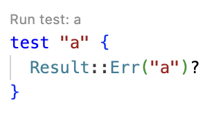

# weekly 2024-03-11
## **01 MoonBit 更新**

### **1. moonbitlang/core 开源**

moonbitlang/core（MoonBit标准库）现已开源。我们很高兴收到社区的积极反馈，想了解更多与moonbitlang/core开源的详情，可点击这里查看：[国人自主研发的编程语言 MoonBit Core 开源啦！](http://mp.weixin.qq.com/s?__biz=Mzk0MTQ3MDU4Mg==&mid=2247485150&idx=1&sn=3f9d3c88ccf9852aa2a301683b0e4f29&chksm=c2d0a0c7f5a729d141ab53c5e101ce34b1ae856e3dfacfd304f38b57c3765afca2ced3b43d26&scene=21#wechat_redirect)

Github链接：

https://github.com/moonbitlang/core

### **2. 支持带标签/可选参数**

支持带标签参数（labelled argument）和可选参数（optional argument）。带标签参数有助于区分相同类型，不同功能的函数：

```
fn greeting(~name: String, ~location: String) {
  println("Hi, \\(name) from \\(location)!")
}

fn init {
  greeting(~name="somebody", ~location="some city")
  let name = "someone else"
  let location = "another city"
  greeting(~name, ~location)// `~label=label` 可以简写成 `~label`
}
```

可选参数必须带标签，并且指定默认值。在函数调用的时候，如果没有手动指定参数，则取默认值。注意：默认值在每次调用的时候都会被重新求值：

```
fn greeting(~name: String, ~location: Option[String] = None) {
  match location {
    Some(location) => println("Hi, \\(name)!")
    None => println("Hi, \\(name) from \\(location)!")
  }
}

fn init {
  greeting(~name="A")// Hi, A!
  greeting(~name="B", ~location=Some("X")// Hi, B from X!
}
```

### **3. 提供了内建类型 SourceLoc**

`SourceLoc`，表示源码中的位置。假如某个函数声明了一个类型为 `SourceLoc`、默认值为 `_` 的可选参数，那么每次调用这个函数时，MoonBit 会自动插入调用处的位置作为这个参数的默认值：

```
fn f(~loc : SourceLoc = _) {
  println("called at \\(loc)")
}

fn g(~loc : SourceLoc = _) {
  f()// 显示 `g` 内部的位置
  f(~loc)// 自动注入的参数也可以手动覆盖。这一次调用会显示 `g` 的调用者的位置
}

test "source loc" {
  g()
}
```

在 [try.moonbitlang.cn](http://try.moonbitlang.cn) 新建一个名为 `test.mbt` 的文件，放入上述代码，并运行代码中的测试，可以得到如下的输出：

```
test source loc ...
called at memfs:/sample-folder/test.mbt:6:3-6:6
called at memfs:/sample-folder/test.mbt:11:3-11:6
```

`SourceLoc` 可以用于编写测试相关的函数，用于在测试失败时输出有用的位置信息：

```
fn assert_eq[X: Eq + Show](result: X, expect: X, ~loc : SourceLoc = _) -> Result[Unit, String] {
  if (result == expect) {
    Ok(())
  } else {
    Err("\\(loc): Assertion failed: \\(result) != \\(expect)")
  }
}

test "1 =? 2" {
  assert_eq(1, 2)?
}
```

```
running 1 tests
test 1 =? 2 ... FAILED memfs:/sample-folder/test.mbt:10:3-10:18: Assertion failed: 1 != 2

test result: 0 passed; 1 failed
```

### **4. === 已经弃用，可以使用 physical_equal 作为代替**

### **5. 添加新的内置类型 UnsafeMaybeUninit[T]**

添加新的内置类型 `UnsafeMaybeUninit[T]` 和对于该类型的一些相关操作，用以在 MoonBit Core 中实现 Vector 等数据结构，因为其不安全性，普通的 MoonBit 程序中应尽可能避免使用该类型。

## **02构建系统更新**

### **1. 支持 JavaScript 后端**

可以通过 `--target js` 来生成后端代码。例如：

a. 通过 `moon new hello` 新建一个名为 `hello` 的项目

b. 在 `main/main.mbt` 中写入：

```moonbit
fn main {
  println("Hello from JavaScript!")
}
```

c. 在命令行中构建生成 JavaScript 代码，并使用 Node 运行。

```
$ moon build --target js
moon: ran 2 tasks, now up to date
$ node target/js/release/build/main/main.js
Hello from JavaScript!
```

d. 你也可以方便地通过 `moon run main --target js` 来编译并运行编译到 JavaScript 的 MoonBit 代码。

```
$ moon run main --target js
Hello from JavaScript!
```

### **2. 修复了一些 moonbuild 的问题**

a. 修复了 Windows 上 moon upgrade 失败的问题。

b. 修复了 moon add 添加新版本没有移除旧版本的问题。

c. 修复了本地 moon check 失败仍然能够 publish 的问题。

## **IDE更新**

### **1. 线上 IDE 支持通过 CodeLens 的方式运行测试**



### 2. 大幅度改善 moonfmt 的对于包含注释的源代码的处理。

### **3. 提升 IDE 和 VSCode 插件的稳定性和用户体验**

a. VSCode插件现在是在文件更改的时候调用`moon check`而非启动`moon check -w`。

b. 提升了多行字符串和文档注释（docstring）的输入体验。现在在多行字符串/文档注释内部换行会自动补上 `#|` 或者 `///` 的前缀。

c. 修复了 hover、moon.pkg.json 出错，空文件等导致 lsp 报错的问题。

## **工具链更新**

### **Markdown linter 支持 expr 标签**

举个例子：

````
```moonbit expr
1 * 2 + 3
````

可以在运行 `mdlint` 的时候看到对应的输出：

```
5
```
