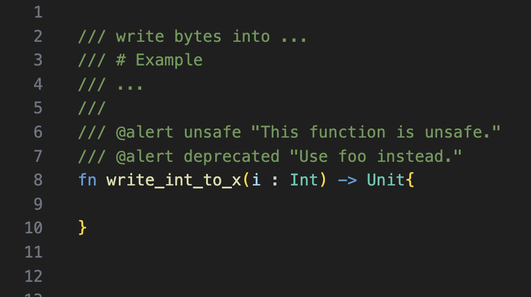

# weekly 2024-04-01
## **MoonBit 更新**

### **1. expect 测试添加 inspect 函数**

expect 测试添加针对 Show 接口的 inspect 函数，签名如下：

```moonbit
pub fn inspect(
  obj: Show,
  ~content: String = "",
  ~loc: SourceLoc = _,
  ~args_loc: ArgsLoc = _
) -> Result[Unit, String]

```

⚠️ 此API暂不稳定，在未来可能会更改为 expect 函数

使用 `inspect` 可以更方便编写测试，例如对于如下代码：

```moonbit
fn add(x: Int, y: Int) -> Int {
  x + y
}

test {
  inspect(add(1, 2))?
}

test {
  (add(3, 4) |> inspect)?
}

```

执行 `moon test -u` 之后，文件被自动更新为：

```moonbit
fn add(x: Int, y: Int) -> Int {
  x + y
}

test {
  inspect(add(1, 2), ~content="3")?
}

test {
  (add(3, 4) |> inspect(~content="7"))?
}

```

### **2.编译器内置函数迁移到标准库**

把原本的在编译器内部的一些基础的 MoonBit 定义迁移到了标准库中。[在线IDE](http://try.moonbitlang.cn/)上也可以使用标准库了

### **3. 支持 alert pragam**

MoonBit 现在支持在顶层的文档注释中书写多个 pragam。所有的 pragam 以`@`开头，并且独占一行。



目前支持函数和方法的 alert pragma，当被标记了 alert 的函数和方法被使用时会产生警告。这个机制可以用来标记已经弃用或者不安全的函数。alert pragma 的格式为`@alert id "explain string"`，其中id可以是任意的标识符。


### **4. 支持在 pragma 中标注 intrinsic**

比如标准库中的如下代码在被标注 intrinsic 之后，在 JavaScript 后端会使用 `String(..)` 函数来将浮点数转化为字符串，后续会加入更多函数的 intrinsic 支持。

```java
/// @intrinsic %f64.to_string
pub fn to_string(self : Double) -> String {
  double_to_string(self)
}
```

### **5. 生成代码性能和体积的改进**

- 引入了消除局部 alias 的优化，从而避免生成无用的局部变量
- 引入了常量传播的优化
- 优化了生成的 wasm 代码中类型声明的部分，减少了冗余的类型声明


### **6. moonfmt 改进**

- 调整 function for loop 的打印格式，特殊情况不再打印分号
- 针对 if/match 这种可读性差的嵌套的情况，格式化后加上额外的括号。格式化前和格式化后的效果：

格式化前：


格式化后：


### **7. 改进模式匹配完备性检查**

### **8. 调整字符串的编码为UTF-16**

## **构建系统更新**

### **moon.pkg.json 中支持自定义函数导出名称**

moon.pkg.json 中支持使用 `["link"][BACKEND]["exports]` 字段自定义函数导出名称，并且默认不再导出所有的 `pub` 函数，必须要在 exports 中显式指定。此外，现在支持通过设置 `link` 字段链接非 `main` 包。

例如使用 `moon new hello` 创建一个新项目，其目录结构为：

```moonbit
.
├── README.md
├── lib
│   ├── hello.mbt
│   ├── hello_test.mbt
│   └── moon.pkg.json
├── main
│   ├── main.mbt
│   └── moon.pkg.json
└── moon.mod.json

```

在过去，执行 `moon build`，只有 `main` 包会生成 wasm 文件。

现在，在 `moon.pkg.json` 中支持 link 字段，可以对非 `main` 包生成 wasm 文件。`link` 字段的内容可以是一个布尔值：

```moonbit
{
  "link": true // 表示当前包需要被链接
}

```

或者是一个对象，可以给不同的后端如 wasm 或者 wasm-gc ，设定链接选项。目前只支持 `exports` 选项，`exports` 是一个字符串数组，包含需要导出的函数及其需要导出的名称：

```moonbit
{
  "link": {
    "wasm": {
      "exports": [
        "hello" // 这里将函数 hello 导出为 hello，
      ]
    },
    "wasm-gc": {
      "exports": [
        "hello:hello_wasm_gc" // 这里将函数 hello 导出为 hello_wasm_gc
      ]
    }
  }
}

```

如果将 `lib/moon.pkg.json` 中的内容修改为：

```moonbit
{
  "link": {
    "wasm": {
      "exports": [
        "hello"
      ]
    }
  }
}

```

然后执行 `moon build --output-wat`，可以观察到输出的 `target/wasm/release/build/lib/lib.wat` 中包含如下内容：

```moonbit
(func $$username/hello/lib.hello.fn/1 (export "hello") (result i32)
 (i32.const 10000))

```

其中的 `(export "hello")` 表示配置生效了。

## **IDE 更新**

### **vscode 插件支持安装或更新 MoonBit工具链。**


