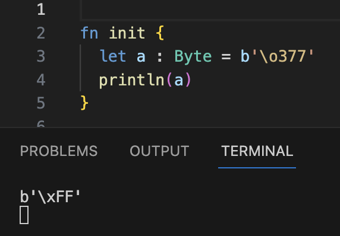

# weekly 2024-04-22
## MoonBit更新

- 标准库里添加了 Iter 类型，该类型可以高效地对容器中的元素的进行访问，并且将访问过程优化成循环，使用方式比如：

```moonbit
test "iter" {
  let sum = Iter::[1, 2, 3, 4, 5, 6]
  .filter(fn { x => x % 2 == 1 })
  .take(2)
  .map(fn { x => x * x})
  .reduce(fn (x, y) { x + y }, 0)
  inspect(sum, content="10")?
}
```

- 标准库里添加了VecView类型，可以使用如下方式对 `Vec[T]` 类型的值取它的 `VecView[T]`。

```moonbit
test "view" {
  let v = Vec::[1, 2, 3, 4, 5]
  let vv1 = v[..]
  let vv2 = v[1..]
  let vv3 = v[..4]
  let vv4 = v[1..4]
  inspect(vv1, content="VecView::[1, 2, 3, 4, 5]")?
  inspect(vv2, content="VecView::[2, 3, 4, 5]")?
  inspect(vv3, content="VecView::[1, 2, 3, 4]")?
  inspect(vv4, content="VecView::[2, 3, 4]")?
}
```

- array pattern支持 `[a, .. as rest, b]`形式，其中 `rest` 会绑定到一个VecView，例如：

```moonbit
test "view_pattern" {
    fn is_palindrome(s: VecView[Int]) -> Bool {
    match s {
      [] => true
      [_] => true
      [x, .. as rest, y] => x == y && is_palindrome(rest)
     }
    }
    let v1 = Vec::[1, 2, 3, 4, 5]
    @assertion.assert_false(is_palindrome(v1[..]))?
    let v2 = Vec::[1, 2, 3, 2, 1]
    @assertion.assert_true(is_palindrome(v2[..]))?
}
```

- 标签参数调用时允许省略标签里的波浪线 `~`，例如：

```moonbit
inspect(1, content="1")
```

- 构造器支持带标签的参数：

```moonbit
pub enum Tree[X] {
  Nil
  Branch(X, ~left : Tree[X], ~right : Tree[X])
}

pub fn leftmost[X](self : Tree[X]) -> Option[X] {
  loop self {
    Nil => None
    // 使用 `label=pattern` 来匹配构造器的带标签参数
    Branch(top, left=Nil, right=Nil) => Some(top)
    // `label=label` 可以简写成 `~label`
    Branch(_, left=Nil, ~right) => continue right
    // 可以用 `..` 来忽略所有剩余的带标签参数
    Branch(_, ~left, ..) => continue left
  }
}

fn init {
  // 创建带标签的构造器的语法和调用带标签的函数一样
  let t: Tree[Int] = Branch(0, right=Nil, left=Branch(1, left=Nil, right=Nil))
  println(t.leftmost()) // `Some(1)`
}
```

- 可选参数的默认值可以依赖前面的参数，例如：

```moonbit
fn f(~x: Int = 1, ~y: Int = x) -> Int {
  x + y
}
```

- Byte字面量支持八进制转义。



## IDE更新

- IDE 支持本地环境的 test codelens；支持expect test的自动更新。


- 修复在线 IDE 在 Windows 上找不到 core 的问题。

- 支持识别 `test_import` 和 `*_test.mbt` 文件。

## 工具链更新

- moonfmt

  - 修复了`String`和`Char`字面量中的转义序列没有被正确格式化的问题；
  - 调整针对`{ ..record }`的格式化。

- `moon info` 和 `moon coverage` 现已支持 Windows。

- `moon info` 支持在不引起歧义时缩短类型名称，使得生成结果更加干净：
  - 在没有同名类型定义的时候隐藏 builtin 的包名前缀；
  - 在没有歧义时使用包名的最后一部分代替完整的包名。
    更新前：

```moonbit
package moonbitlang/core/map

// -- snip --

type Map
fn Map::debug_write[K : @moonbitlang/core/builtin.Debug, V : @moonbitlang/core/builtin.Debug](Map[K, V], @moonbitlang/core/builtin.Buffer) -> Unit
fn Map::keys_set[K : @moonbitlang/core/builtin.Compare + @moonbitlang/core/builtin.Eq, V](Map[K, V]) -> @moonbitlang/core/immutable_set.ImmutableSet[K]
fn Map::lookup[K : @moonbitlang/core/builtin.Compare + @moonbitlang/core/builtin.Eq, V](Map[K, V], K) -> Option[V]
fn Map::to_vec[K, V](Map[K, V]) -> @moonbitlang/core/vec.Vec[Tuple[K, V]]
```

更新后：

```moonbit
package moonbitlang/core/map

alias @moonbitlang/core/immutable_set as @immutable_set
alias @moonbitlang/core/vec as @vec

// -- snip --

type Map
fn Map::debug_write[K : Debug, V : Debug](Map[K, V], Buffer) -> Unit
fn Map::keys_set[K : Compare + Eq, V](Map[K, V]) -> @immutable_set.ImmutableSet[K]
fn Map::lookup[K : Compare + Eq, V](Map[K, V], K) -> Option[V]
fn Map::to_vec[K, V](Map[K, V]) -> @vec.Vec[Tuple[K, V]]
```

## 构建系统更新

- `moon test` 添加测试过滤相关选项：

```bash
-p, --package <PACKAGE_NAME>  Run test in the specified package
-f, --file <FILE>             Run test in the specified file, only valid when --package is specified
-i, --index <INDEX>           Run the index-nth test in the specified file, only valid when --file is specified

```

命令示例：`moon test -p username/hello/A -f hello.mbt -i 0` (运行 `username/hello/A` 包中 `hello.mbt` 文件中的第 `0` 个 test block)；`-f` 和 `-i` 分别在指定 `-p` 和 `-f` 时才有效；如果不指定 `-f` 则运行 `-p` 指定包中所有测试，不指定 `-i` 则运行 `-f` 指定文件中所有测试。

- `moon check|build|test` 添加 `--sort-input` 选项，用于生成稳定的构建顺序。

- expect test 生成的 `~content=` 省略 `~`，变更为 `content=`。
