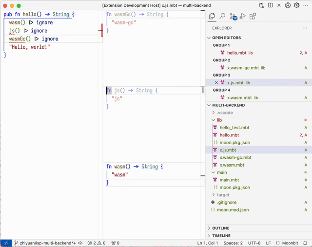

# weekly 2024-04-30
## MoonBit 更新

- **新增JavaScript后端**

目前MoonBit已新增对JavaScript的支持并带来前所未有的性能提升，在JS后端实现了超出Json5近8倍性能的优势。更详细的介绍可以看一下这篇文章：[IDEA研究院编程语言MoonBit发布JavaScript后端，速度提升25倍](https://mp.weixin.qq.com/s/pJKhiwco_059-GOpGxygUQ)

如果你想自己体验一下，可以点击：[https://github.com/moonbit-community/benchmark-202404/tree/master/bench_json5](https://github.com/moonbit-community/benchmark-202404/tree/master/bench_json5)

- **现在MoonBit允许传递回调函数至FFI**。但回调函数的参数和返回值类型目前只能是简单类型，如`Int`等。例子：

  ```moonbit
  // 使用示例：传递回调函数至外部
  fn set_callback(f : () -> Int) = "ffi" "set_callback"

  // 使用示例
  fn use_callback() -> Int = "ffi" "use_callback"

  test {
    let i = { val : 0 }
    set_callback(fn () {
      i.val += 1
      i.val
    })
    inspect(use_callback(), content="1")?
    inspect(use_callback(), content="2")?
    inspect(use_callback(), content="3")?
    inspect(use_callback(), content="4")?
  }

  ```

  ```jsx
  let f

  export default {
    // 必要外部接口：将闭包转换为JS函数。其他运行时根据语言不同实现方式不同
    'moonbit:ffi': {
      make_closure: (funcref, context) => funcref.bind(null, context)
    },
    // 使用示例
    ffi: {
      set_callback: (func) => {
        f = func
      }, // 设置回调函数
      use_callback: () => f() // 使用回调函数
    }
  }
  ```

- 修改显式实现 trait（extension method）的语法，允许显式写出要给哪个类型实现 trait

  ```moonbit
  // 为 `Trait` 的方法 `method` 提供默认实现
  impl Trait with method(...) { ... }

  // 给类型 `Type` 实现 `Trait` 的方法 `method`
  impl Trait for Type with method(...) { ... }

  // 带类型参数的情况
  impl[X] Trait for Array[X] with method(...) { ... }

  ```

  和之前的 `fn Trait::method(...)` 语法相比，新的语法允许显式写出实现 trait 的类型，签名信息更丰富、更清晰。由于写出了类型，编译器可以自动推断出方法的参数和返回值类型，不需要手动标注：

  ```moonbit
  trait MyTrait {
    f(Self) -> Option[Int]
  }

  // 无需标注 `self` 和返回值的类型
  impl MyTrait for Int with f(self) {
    // 编译器能自动推断出返回值的类型是 `Option[Int]`
    Some(self)
  }

  ```

- 支持Bytes字面量

  Bytes字面量`b"..."` 会将双引号内的ASCII字符串转换为Bytes类型，字符串内支持十六进制和八进制转义。

  ```moonbit
   let b1 : Bytes = b"ASCII"
   let b2 : Bytes = b"\xFF\o000"

  ```

- `{ x }` 的二义性问题修复

现在`{ x }`会解析成只有一个x字段的struct，相当于`{ x: x }`。对于这种容易造成混淆的写法，编译器会发出警告。

## IDE更新

- 插件新增`moonbit.autoUpdate`的选项控制是否开启自动更新的提示
- **插件支持多后端开发**
  - 用户可以在vscode里选择不同的后端
  - 非当前后端的代码对比度会变低



## 构建系统更新

- 支持后端特定文件，这些文件的拓展名以 `.wasm|wasm-gc|js.mbt`结尾，例如：`foo.wasm.mbt`，`foo.wasm-gc.mbt`，`foo.js.mbt`。例如在 `moon build --target js` 中，只有普通的 `.mbt` 文件与 `.js.mbt` 才会参与构建。相应地，`moon check|build|test`、以及`moonbitlang/core`的链接修改为与后端相关。
- `moon.pkg.json` 中的 `["link"]["js"]`中新增 `format` 字段，用于指定输出的JavaScript模块格式，可能的值为 `esm|cjs|iife`，默认为 `esm`，

  - 在`esm`模式下，使用`export { x as y }`语句导出
  - 在`cjs`模式下，使用`exports.y = x`导出
  - 在`iife`模式下，使用`globalThis.y = x`导出

  `moon.pkg.json`样例：

```moonbit
    {
      "link": {
        "js": {
          "exports": [
            "hello"
          ],
          "format": "cjs"
        }
      }
    }

```

- `moon test -u`支持自动更新测试块中的多个`inspect`函数，以及添加 `-limit` 选项用于限制自动更新的最大迭代次数。

## 工具链更新

- `moonrun`由wasmtime切换到v8，现在支持wasm-gc后端

```bash
    moon new hello
    cd hello
    moon run main --target wasm-gc
```

- `moon info` 的更新
  - 支持对方法进行分组，方便对比不同数据结构的实现
  - 支持带标签的参数、默认参数和自动填充参数

```moonbit
type Map
impl Map {
  debug_write[K : Debug, V : Debug](Self[K, V], Buffer) -> Unit
  elems[K, V](Self[K, V]) -> List[V]
  fold[K, V, T](Self[K, V], (T, V) -> T, ~init : T) -> T
  from_array[K : Compare + Eq, V](Array[Tuple[K, V]]) -> Self[K, V]
  // ...
}
```
