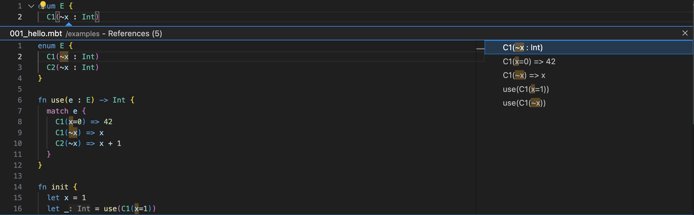

# weekly 2024-05-13

## MoonBit更新

- **支持了构造器的 payload 中出现 mutable field**，使用方式如下：
```moonbit
enum E {
  C(mut ~x : Int, mut ~y : Int)
} derive(Debug)


fn swap_xy(x : E) -> Unit {
  match x {
    // `~y` 会绑定模式匹配前 `C` 中的 `y` 字段的值
    // 当看到 `C(..) as c` 这种模式时，编译器知道 `c` 一定是构造器 `C`，
    // 所以可以在分支内部用 `c.x`、`c.y` 直接访问 `C` 的字段
    C(~y, ..) as c => {
      // `c.x` 和 `c.y` 可以用于修改/读取 `C` 中最新的值
      c.y = c.x
      c.x = y
    }
  }
}

fn init {
  let e : E = C(x=1, y=2)
  debug(e) // C(x=1, y=2)
  swap_xy(e)
  debug(e) // C(x=2, y=1)
}
```
这个例子中的 `swap_xy` 函数对构造器 `C` 的 `x` 和 `y` 两个 field 的值进行了交换，并且这个交换是 in-place 的，没有引入额外的内存分配

- **数组字面量默认构建 vector。**对 Array literal 语法进行了重载，现在 Array literal 可以用来构造 Vector 或者 Array，具体的类型通过上下文决定，当上下文中类型信息不明确时，默认使用 Vector，比如
```moonbit
fn init {
  let v = [1, 2, 3]             // v has type @vec.Vec[Int]
  let a : Array[_] = [1, 2, 3]  // a has type Array[Int]
}
```

- 报错信息中添加了错误代码，例如
```Bash
./vec/sort.mbt:68:16-68:23 [E4021] The value identifier minimum is unbound.
./vec/sort_by.mbt:90:16-90:23 [E4021] The value identifier minimum is unbound.
./vec/vec.mbt:962:37-962:50 [E4020] Package "iter" not found in the loaded packages.
./vec/vec.mbt:963:3-963:13 [E4024] The type/trait @iter.Iter is not found.
```

## IDE更新

- 对构造器中的 labeled field 的 label 支持了 gotodef/gotoref/rename 等功能，例如


## 构建系统更新

- 支持在 package 级别配置 warn list 与alert list
  - 在 `moon.pkg.json` 中如下配置，可在编译时关闭对应的 warn 与 alter【其中 `2` 与 `alter_1`、`alert_2` 分别为编译器预设的 warn id (对于 Unused variable) 与用户自定义的 alert id】
```JSON
{
  "warn_list": "-2",
  "alert_list": "-alert_1-alert_2"
}
```
  - `-`代表关闭对应 id 的 warn 与 alter，可用 `moonc build-package -warn-help` 查看预设的 warn

- `moon check|build|run|test` 的默认后端由`wasm`切换为`wasm-gc`

- `moon test` 默认执行模式由 `release` 修改为 `debug`

- `moon check|build|run|test`支持自动安装依赖，而无需手动执行 `moon install`

- `moon doc --serve` 支持指定地址与端口
```Shell
-b, --bind <BIND> [default: 127.0.0.1]
-p, --port <PORT> [default: 3000]
```
- 优化 moon 体积

| 平台 | 优化前 | 优化后 |
| -------- | ------ | ------ |
| macOS arm64 | 7.3 MiB | 3.6 MiB |
| macOS x86_64 | 8.2 MiB | 4.1 MiB |
| Ubuntu x86_64 | 14.0 MiB | 9.6 MiB |
| Windows x86_64 | 9.4 MiB | 4.9 MiB |

## 工具链更新

- moonrun 支持打印 backtrace，
  使用样例：
  使用 `moon new hello` 创建一个新项目，将 `main/main.mbt` 的内容替换为：
```moonbit
  fn bar() -> Unit {
  abort("")
}

fn foo() -> Unit {
  bar()
}

fn main {
  foo()
}
```
  执行 `moon run main --debug`，可观察到输出类似：
```moonbit
error: RuntimeError: unreachable
    at $username/hello/main.bar.fn/1 (wasm://wasm/6fe99e5e:wasm-function[3]:0xe6)
    at $username/hello/main.foo.fn/2 (wasm://wasm/6fe99e5e:wasm-function[4]:0xea)
    at *init*/3 (wasm://wasm/6fe99e5e:wasm-function[5]:0xef)
    at <anonymous>:9:22
```