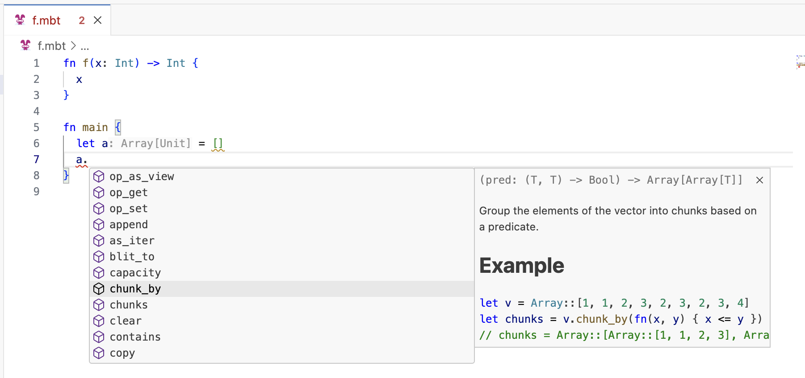

# weekly 2024-06-11
## MoonBit更新

- 【Wasm MVP】Wasm1 后端添加基于 Perceus 算法的引用计数支持

- 【语法】`throw` `raise` `try` `catch` 均被保留为关键字
  - 为了即将添加的错误处理机制

- 【Core】`List`与`sorted_map`被移动至`core/immut`下
  - `List`被移动至`core/immut/list`包中，并被移除内置类型支持
  ```moonbit

  let a = @immut/list.List::Cons(1, Cons(2, Nil))


  ```
  - `sorted_map`被移动至`core/immut/sorted_map`包中

- 【Core】JSON API被优化，以提高性能并适应新的Core API
  - 新的类型定义
```moonbit
// Types and methods
pub enum JsonValue {
  Null
  // 原为Boolean(Bool)
  True
  False
  Number(Double)
  String(String)
  Array(Array[JsonValue])
  Object(Map[String, JsonValue]) // 原为@map.Map
}
```

- 【JS】`Int64`性能优化
  - 在 JS 后端上，`Int64`现编译到两个`Int`，解决原先编译到`BigInt`的性能问题。同时，JS 下`Int64`的 runtime 实现现移动到 core 标准库中，便于开源社区参与 review 和改进。

## 构建系统更新

- moon.mod.json 和 moon.pkg.json 在开发过程中支持注释，但是在 publish 时不允许注释（只支持标准 JSON 格式）

## IDE更新

- 【LSP】函数补全增加参数名称显示
