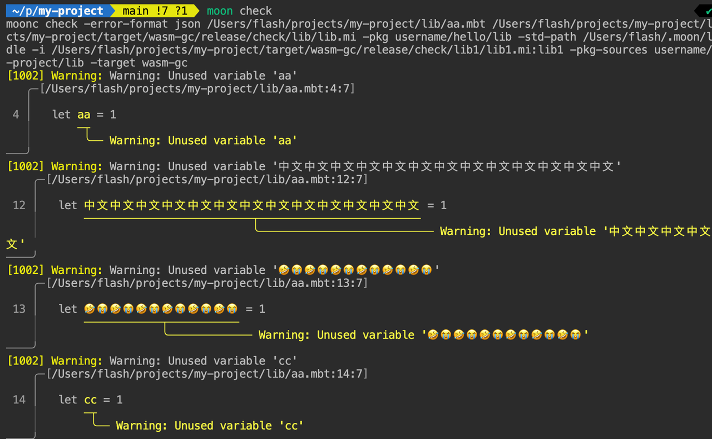

# weekly 2024-06-24

## MoonBit 更新

- 支持了 32 位无符号整数

```moonbit
let num = 100U // 32位无符号整数的字面量需要后缀U
```

- 在 wasm 后端导出返回值类型为 Unit 的函数时，之前导出函数的类型中会有 `(result i32)`，现在 MoonBit 编译器会自动生成一个没有返回值 wrapper 函数，并将其进行导出

- moonbitlang/core 的 API 一致性调整
  - 将`forall`/`exist` 和 `all`/`any`统一为`all`/`any`
  - `contains`和`member` 统一为`contains`

## IDE 更新

- 修复了 rename method 时候会丢失 type prefix 的 bug

- 增加了 `try ... catch ...` 表达式中的 match clause 中补全的功能

## 构建系统更新

- 增加了诊断信息渲染功能，目前还在试验阶段。可通过设置环境变量 MOON_RENDR=1 启用



- moon bench 命令改为 moon generate-build-matrix，bench 子命令留待后续使用
