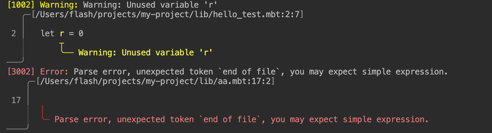

# weekly 2024-07-08

## MoonBit 更新

- 【重大更新】修改 array slice 的语法，从 `arr[start..end]` 修改为类似 Python 的 `arr[start:end]`。这是为了避免和接下来要支持的 cascade method call `x..f()` 产生语法冲突。旧的语法会在近期删除。

- 【Wasm后端重大更新】将 `fn init` 中的代码编译到 start section。
  之前版本中的 `fn init` 和 `fn main` 代码块中的代码都会被编译到一个特殊函数中，这个特殊函数会被导出为 "_start" 函数，因此宿主环境需要调用 "_start" 函数来进行初始化和执行 `main` 函数
  新版本中会使用 wasm 标准中的 start section 来存放 `fn init` 中的代码，从而在加载 wasm 模块的过程中完成初始化，这意味着 fn init 中代码的执行不再需要调用 "_start" 函数，只有需要执行 `main` 函数的时候才需要调用 "_start".

- 【重大更新】test block 不再返回 `Result` 类型的结果。
  现在的 test block 中使用错误处理机制对测试失败的情况进行处理，鼓励使用标准库中的 `inspect` 函数，和 `@test` 包中的 `@test.eq` 等辅助函数编写测试，比如：

```moonbit
test "unwrap should return value on Some" {
  let some : Int? = Some(42)
  inspect(some, content="Some(42)")!
  @test.eq(some.unwrap(), 42)!
}
```

- 支持使用 `@pkg.C` 来跨包使用构造器，比如如果在 `@pkgA` 中包含如下声明：

```moonbit
// pkgA
pub enum E1 { C1 } derive(Debug)

enum E1_hidden { C1 }
```

现在可以在另一个包中对 `E1` 的构造器 `C1` 直接进行使用，比如：

```moonbit
// pkgB
fn main {
  debug(@pkgA.C1)
}
```

当在同一个包中，如果出现重复的 public constructor，则会报错，比如：

```moonbit
pub enum E1 {
  C1
}

pub enum E2 {
  C1
  ^^ ------ There can be at most one public constructor with name C1.
}
```

## 标准库更新

- 迁移到新的错误处理机制。

- 迁移到无符号整数，移除了Int和Int64类型旧的`compare_u`、`div_u`、`mod_u`函数；调整了下面的API：
  - `Int32.trunc_double_u` 、`Int64.trunc_double_u`
  更改为 `UInt.trunc_double`、`UInt64.trunc_double`

  - `Int64::extend_i32_u` 更改为 `UInt64::extend_uint`

  - `Double::convert_i32_u`、`Double::convert_i64_u`
  更改为`Double::convert_uint`、`Double::convert_uint64`

## 构建系统更新

- moon version --all 现在会显示 moonrun 的版本信息。

```bash
$ moon version --all
moon 0.1.20240705 (0e8c10e 2024-07-05) ~/.moon/bin/moon
moonc v0.1.20240705+7fdd4a042 ~/.moon/bin/moonc
moonrun 0.1.20240703 (52ecf2a 2024-07-03) ~/.moon/bin/moonrun
```

- 修改`moon new`创建项目的`license`字段默认为空。

- 默认开启诊断信息渲染


## 工具链更新

- VSCode 插件安装MoonBit工具链功能调整。工具链安装的默认版本由总是安装最新版本调整为安装对应插件版本的工具链。
