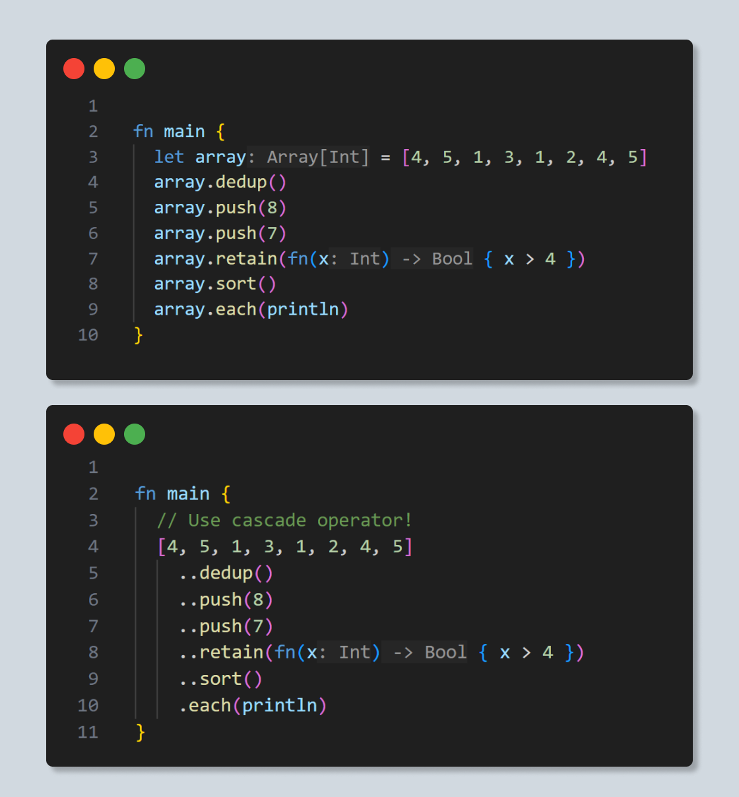
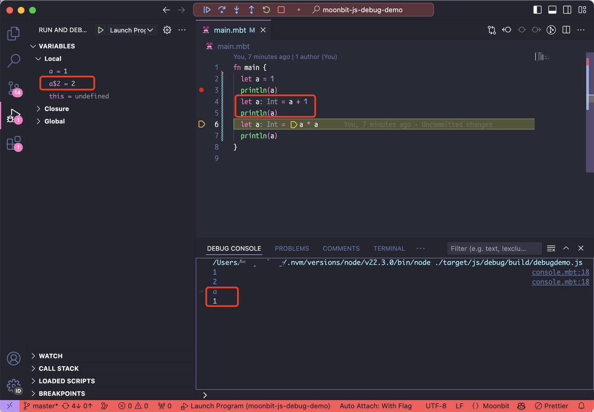
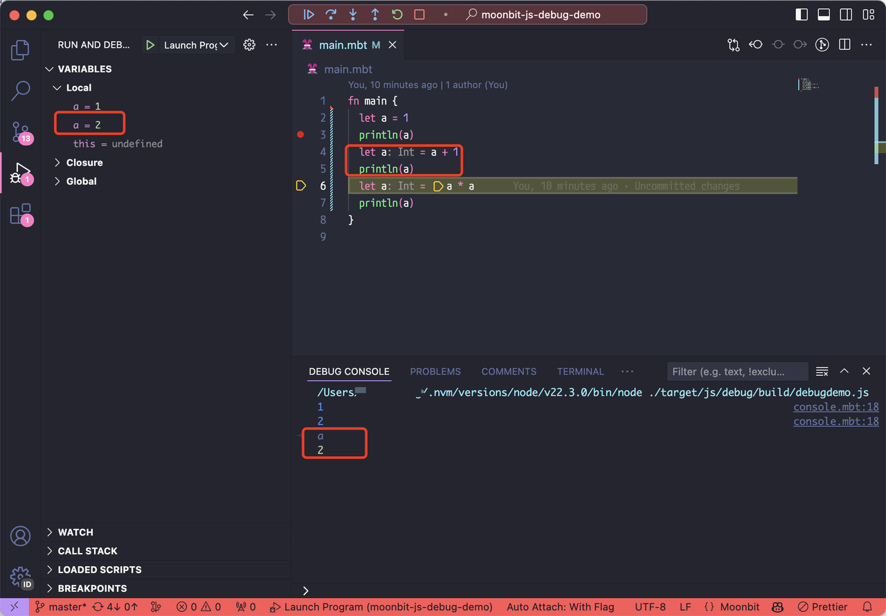

# weekly 2024-07-15

## MoonBit 更新

- **新增级联运算符**（cascade operator）：MoonBit 引入了 “..” 操作符，能够优雅地对可变 API 进行链式调用，同时保持可变 API 签名的整洁（依然返回 Unit）。

如图例，为了避免重复键入上图中的`array`, 和区分不可变与可变操作，MoonBit引入了级联运算符。对于一个类型中的所有返回`Unit`的方法，可以使用`..`将这些方法的调用串联起来，而不需要专门修改这些方法的返回类型。 `array..push(5)..sort()`相当于依次调用了可变操作`array.push(5)`和`array.sort()`, 最终返回`array`。



- 正式移除了`@package.Type::[...]`的语法。推荐使用`@package.of([...])`作为替代。

- 现在`--target js`下调试模式生成的sourcemap支持`names`表。因此使用 devtools 或 vscode 进行调试时，局部变量会显示为原变量名，还可以在Debug console中使用原变量名访问它。这极大的改进了调试体验。

Before:


After:


- 数组支持展开语法 (spread syntax)，可以在数组构造时，将任何支持`iter()`方法的对象表达式在语法层面展开成一组 `Iter[_]` 对象。

  数组表达式：

```moonbit
let u1 = [1, 2, 3]
let u2 = [5, 6, 7]

fn main {
  let v = [..u1, 4, ..u2, 8]
  println(v)
}

// [1, 2, 3, 4, 5, 6, 7, 8]
```

  Map表达式（返回键值对）：

```moonbit
  let map : @sorted_map.T[Int,String] = @sorted_map.of([(3, "c"), (2, "b"), (1, "a")])

fn main {
  let v = [..map, (4, "d")]
  println(v)
}

// [(1, a), (2, b), (3, c), (4, d)]
```

- 支持了和C语言类似的位运算符（`^`, `&`, `|`, `<<`, `>>`），优先级同C一致。同时为了避免歧义，当表达式同时存在几个运算符并且不容易区分优先级时，formatter会插入额外的括号以改善可读性。

- 支持重载整数字面量。在已知类型时，`Int` 以外的类型的字面量可以省略 `U`、`L` 等特殊标记：

```moonbit
fn main {
  let uint : UInt = 42
  let int64 : Int64 = 42
  let double : Double = 42
}
```

## 标准库(moonbitlang/core)更新

- Hash Trait 即将更新为如下形式。

```moonbit
trait Hash {
   hash_iter(Self, Hasher) -> Unit
   hash(Self) -> Int
}

impl Hash with hash(self) {
   let hasher = Hasher::new()
   hasher.hash_iter(self)
   hasher.finalize()
}
```

## 构建系统更新

### 测试机制调整说明

为优化黑盒测试的开发体验，moon 现支持自动将以 `_bbtest.mbt` 结尾的源代码文件封装为黑盒测试，moon 在编译 `*_bbtest.mbt` 时会自动将其所在的包作为依赖。为了更好地开发和测试 MoonBit 项目，接下来将对 MoonBit 项目的测试机制进行调整。

### Background

目前一个 MoonBit 项目中可以有三种类型的测试：白盒测试（white box test）、黑盒测试（black box test）、内部测试（inline test）。

- 白盒测试：写在 `*_test.mbt` 中，构建系统会把当前包中的 `*.mbt` 和 `*_test.mbt` 一起打包编译，因此在 `*_test.mbt` 中可以访问当前包的私有成员，这些测试可以使用 `moon.pkg.json` 中 `import` 和 `test-import` 字段中的依赖。`test-import` 只在白盒测试中用到，不会打包到最终的构建产物中。

- 黑盒测试：写在 `*_bbtest.mbt` 中，构建系统会在编译 `*_bbtest.mbt` 时会自动将其所在的包作为依赖，`*_bbtest.mbt`只能访问其所在包的公开成员（即模拟外部用户在使用这个包时的视角），这些测试可以使用 `moon.pkg.json` 中的 `bbtest-import` 字段中的依赖（以及其所在包，不需要显式写在`bbtest-import` 字段中）。`bbtest-import` 只在黑盒测试中用到，不会打包到最终的构建产物中。

- 内部测试：可以直接写在 `*.mbt`（注意这里的 `*.mbt` 不包含上面提到的 `*_test.mbt`与 `*_bbtest.mbt`）中，可以访问当前包的私有成员，这些测试只使用 `moon.pkg.json` 中 `import` 字段中的依赖。

### Change

一些命名上的调整：当前的`*_test.mbt`（白盒测试）后续将调整为`*_wbtest.mbt`,`*_bbtest.mbt`（黑盒测试）将调整为 `*_test.mbt`，鼓励大家写黑盒测试。

## 工具链更新

- moonfmt改进

  - 现在当源码中存在语法错误时，格式化会忽略相关的代码，此时仍然能够执行代码格式化。

  - 当表达式同时存在几个运算符并且不容易区分优先级时，格式化会插入额外的括号以改善可读性。

- IDE 增加对黑盒测试（`*_bbtest.mbt`）的支持
