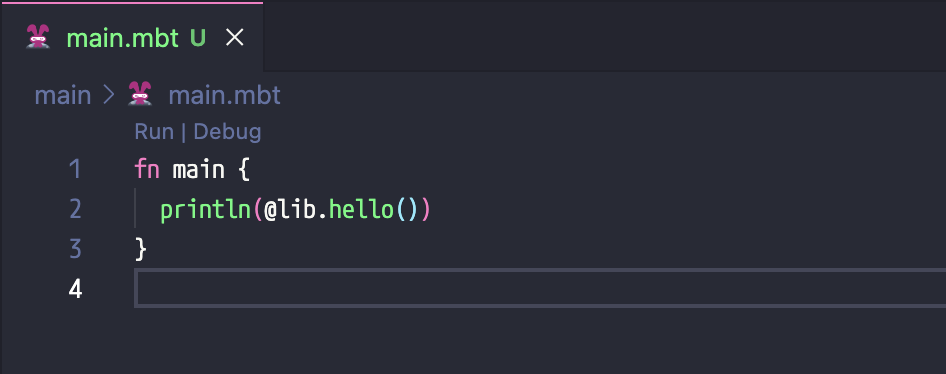
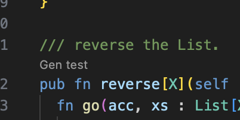
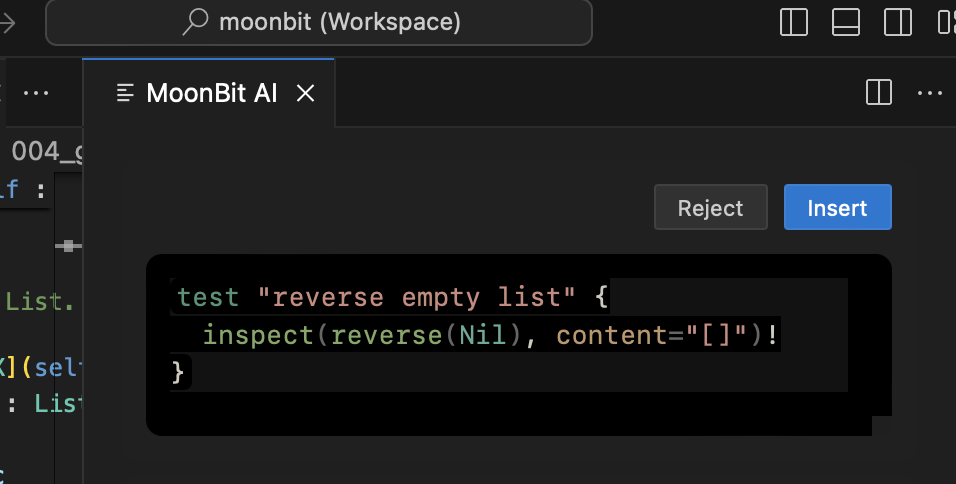

# weekly 2024-07-22

## MoonBit 更新

- 【breaking change】错误处理的语法从`f(x)!` 改为了 `f!(x)`，这样做以便于后续 IDE 在补全的过程中将函数名称和 `!` 一起进行补全，并且对 `f!` 进行特殊的渲染

- 【breaking change】local 函数如果可能返回错误类型，则必须对其进行标注，比如：

```moonbit
fn toplevel() -> Unit!String {
  fn local1() -> Unit!String { raise "err" }  // local function
  fn local2() -> _!_ { raise "err" }          // local function
  apply!(fn (_x) -> Int!String { raise "err" }, 42) |> ignore // anonymous function
}

fn apply(f: (Int) -> Int!String, x: Int) -> Int!String {
  f!(x)
}
```

同时，提供了 `fn!` 和 `fn local!()` 语法用于标注该函数可能返回错误，并让编译器对返回的错误类型进行推导，其中前者用于矩阵函数和匿名函数，后者用于普通的 local 函数，比如：

```moonbit
fn toplevel() -> Unit!String {
  fn local!() { raise "err" }                    // local function
  apply!(fn! (_x) { raise "err" }, 42) |> ignore // anonymous function
  apply!(fn! { _ => raise "err" }, 42) |> ignore // matrix function
}
```

- 完善了 `try` 表达式的功能，目前完整的 `try` 表达式的使用方式如下：

```moonbit
fn test_try() -> Unit {
  fn f() -> Int!String {
    raise "err"
  }
  try {
    println("this is try body")
    f!()
  } except {
    err => println(err)
  } else {
    val => println(val)
  }
}
```

其中 `except` 关键字用于处理 `try body` 返回错误的情况，`else` 关键字用于处理 `try body` 正常返回的情况，同时改语法有如下几种简化情况：

  - 如果 `else` 分支中不需要对返回值进行任何处理，则 `else` 分支可以缺省

  - `try body` 可以是一个简单的表达式

  - `except` 关键字可以缺省

比如下述程序所示：

```moonbit
fn test_try() -> Result[Int, String] {
  fn f() -> Int!String {
    raise "err"
  }
  try Ok(f!()) { err => Err(err) }
}
```

- 对模式匹配也添加了整数字面量的重载支持：

```moonbit
fn is_42(x : Double) -> Bool {
  match x {
    42 => true
    _ => false
  }
 }
```

- 【即将到来的 breaking change】Map pattern **将会在本周**更改`{ "key" : value }`中的语义匹配。

原本的 map pattern 中，`{ "key" : value }` 里，`value` 的类型为 `Option[_]`，无论 `"key"` 是否存在都会匹配。接下来，pattern 中 `{ "key": value }` 的语义会修改为匹配 `"key"` 存在的情况，`value` 也会直接匹配 `"key"` 的实际内容。如果想要同时匹配 `"key"` 存在/不存在的情况，需要使用一个 `{ "key"? : value_or_none }` 的新写法，其中 `value_or_none` 的类型为 `Option[_]`

- 【即将到来的 breaking change】显式实现 trait 的旧语法 `fn Trait::method(...)` 将会在本周被移除，现有代码应当改用语法 `impl Trait for SelfType with method(...)`。未来 `fn Trait::method(...)` 这一语法会被用于直接给 trait object 类型定义方法

## MoonBit IDE 更新

- 现在 main 函数上将提供 Run | Debug 的 Codelens，便于快捷运行和调试程序。目前快捷调试仅支持 JavaScript 后端。



- 现在顶层函数支持通过 Codelens 调用 AI 生成测试。不过目前这个功能尚在开发，并不稳定。

  1. 点击 “Gen test” 按钮。

  

  2. 右边会出现一个新的窗口显示生成好的测试。

  

  3. 点击 “Reject” 来去掉不希望的测试，点击 “insert” 将测试插入到源文件中。

## 标准库(moonbitlang/core)更新

- 修改了 `Show` trait 的定义，使其有更正确的行为。新的 `Show` trait 的定义如下：

```moonbit
pub trait Show {
  // `output` 函数用于实现复合类型的 `Show`。
  // 它把 `Self` 的一个字符串表示写入到一个 `Logger` 中
  output(Self, Logger) -> Unit
  // `to_string` 是给 `Show` 的用户使用的，
  // 它可以用于字符串插值和 `println` 等。
  // `to_string` 有一个使用 `output` 的默认实现。
  // 有些类型，如 `String`，会自行重载 `to_string` 以修改其行为
  to_string(Self) -> String
}
```

  新的 `Show` 解决了 `String` 的实现行为不正确的问题。过去，如果一个复合类型中有 `String`，那么它的 `Show` 的实现不会对这个 `String` 进行 escape，这会导致错误的结果。另一方面，我们希望当 `String` 直接被用于字符串插值和 `println` 时，不需要 escape。新的 `Show` 定义及 core 中的实现能够同时满足上述需求。

  对于 `Show` 的实现者，需要注意以下几点：

  - 应当实现 `output` 方法，而不是 `to_string` 方法

  - 在递归调用子结构（如结构体的字段）的 `Show` 实现时，应当使用 `Show::output(..., logger)`，而不是 `to_string`

  - `Show::to_string` 的默认实现不是指一个方法 ，因此无法使用 . 调用。如果想支持 `.to_string()` 这样的写法，可以添加一个如下的辅助定义：

```moonbit
pub fn to_string(self : ...) -> String {
  Show::to_string(self)
}
```

- 【即将到来的 breaking change】`Show` trait 的定义修改后，`Debug` trait 的功能已经完全被 `Show` trait 覆盖了。因此，`Debug` trait 已经被弃用，并且会在近期被删除。

- 数据结构类型名称被改为了 `T`, 修改样例如下

```moonbit
// old
// let m : @hashmap.HashMap[Int, Int] = @hashmap.new()

// new
let m : @hashmap.T[Int, Int] = @hashmap.new()
```

以下数据结构类型均被修改为 `T`

- deque
- hashmap
- hashset
- immut/array
- immut/hashmap
- immut/hashset
- immut/list
- immut/priority_queue
- immut/sorted_map
- immut/sorted_set
- queue
- priorityqueue
- rational
- sorted_map
- sorted_set

## 构建系统更新

- 调整了构建过程中的输出，现在只会在某条命令执行失败的情况下会打印出该命令

- `moon check|build|test|bundle` 的 `--target` 之前只支持三种选项 `wasm|wasm-gc|js`，修改后支持同时指定多个后端并行执行。支持选项变更为 `wasm|wasm-gc|js|all`，并且可以用逗号任意组合。添加 `--serial` 选项将不同后端之间的并行执行变为串行执行，但是同一后端内部仍为并发执行。使用样例：

  - `moon test --target all`执行全部后端的测试

  - `moon test --target js,wasm` 执行 `js,wasm` 后端的测试

  - `moon test --target js,wasm --serial`等价于按顺序执行 `moon test --target js; moon test --target wasm`

- `moon.pkg.json` 中 `["link"]["wasm"|"wasm-gc"]` 中添加与内存相关的 `heap-start-address` 与 `import-memory` 配置

```json
{
  "link": {
    "wasm": {
      "heap-start-address": 65536,
      "import-memory": {
        "module": "xxx",
        "name": "yyy"
      }
    }
  }
}
```

- `moon new` 默认协议修改为 Apache-2.0
