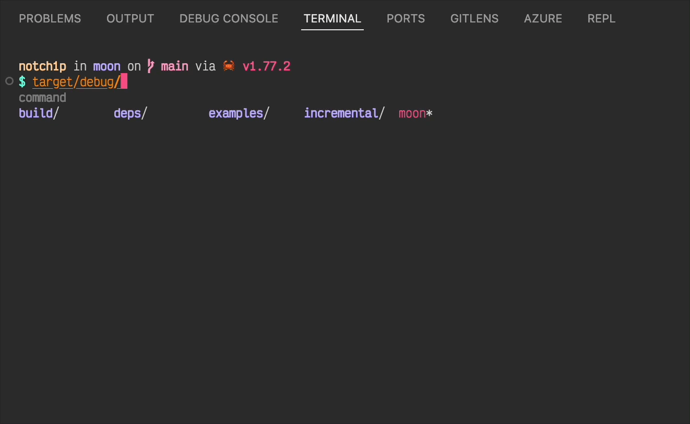

# weekly 2024-07-29

## MoonBit 更新

- `f(x)!!` 修改为 `f?(x)`，用于捕获函数调用中可能出现的错误，并返回 Result 类型

```moonbit
fn div(x: Int, y: Int) -> Int!String {
  if y == 0 {
    raise "division by zero"
  }
  x / y
}

fn main {
  let a = div?(10, 2)
  println(a) // Ok(5)
}
```

- 新增 json 字面量支持。数字、字符串、数组和字典字面量为 json 类型提供了重载，可以在知道需要一个 json 类型时用于构建/匹配 json：

```moonbit
fn json_process(x : @json.JsonValue) -> Double {
  match x {
    {
      "outer": {
        "middle": {
          "inner": [
            { "x": Number(x) },
            { "y": Number(y) }
          ]
        }
      }
    } => x + y
    _ => 0
  }
}

fn main {
  let x : @json.JsonValue = {
    "outer": { "middle": { "inner": [{ "x": 42 }, { "y": 24 }] } },
    "another_field": "string value",
  }
  json_process(x) |> println
}
```

- 新增 `derive(Hash)` 支持，可以自动为类型定义生成 `Hash` trait 的实现：

```moonbit
enum MyType {
  C1
  C2(Int)
} derive(Eq, Hash)

fn main {
  let m = {}..set(C1, 1)..set(C2(1), 2)..set(C2(2), 3)
  println(m[C1]) // Some(1)
  println(m[C2(1)]) // Some(2)
  println(m[C2(3)]) // None
}
```

- Js 后端生成代码移除对 TextDecoder 的依赖

## 标准库更新

- 多个函数签名更改

  - `Array::new_with_index`-> `Array::makei`

  - `FixedArray::new`/`FixedArray::new_with_index`-> `FixedArray::makei`

  - `FixedArray::empty` -> `FixedArray::new`

- 移除了 `Debug` trait

## 构建系统更新

- 支持运行单个 .mbt 文件（不在某个包中），用法：`moon run xx.mbt`（默认链接标准库，便于运行一些代码片段，xx.mbt 中需要有 main 函数）

- moon 支持 shell-completion

  - 使用示例：Zsh

Zsh 在启动时会自动读取 `$FPATH` 下的所有脚本，可以把补全脚本放在 `$FPATH` 下的任何一个路径中。

为了方便管理，我们新建一个专门放置补全的路径 `$ZSH/completions` 并加到 `$FPATH` 中

```bash
mkdir $ZSH/completions
echo "FPATH+=$ZSH/completions" >> ~/.zshrc
# Zsh 的 shell completion 文件名通常以下划线开头
moon shell-completion > $ZSH/completions/_moon # 一般不需要显式指明 shell 类型，自动读取 $SHELL

. ~/.zshrc # 重载即可使用，或 omz reload
```

如果希望保持 portability，可以直接把下面这行写进 `.zshrc` ：

```bash
eval "$(moon shell-completion --shell=zsh)"
```



达到上图的效果还需要安装 `zsh-autocomplete` `zsh-autosuggestions` 两个插件。

## 工具链更新

- moonfmt 修复 array spread 格式化后被加上花括号的问题；调整了括号推断的模式匹配，避免使用 wildcard

- VS Code 现在支持自动对函数生成测试，包括黑盒测试（以 `_test.mbt` 结尾） 和白盒测试（单元测试）

- 支持单个 .mbt 文件的 Run | Debug 按钮
