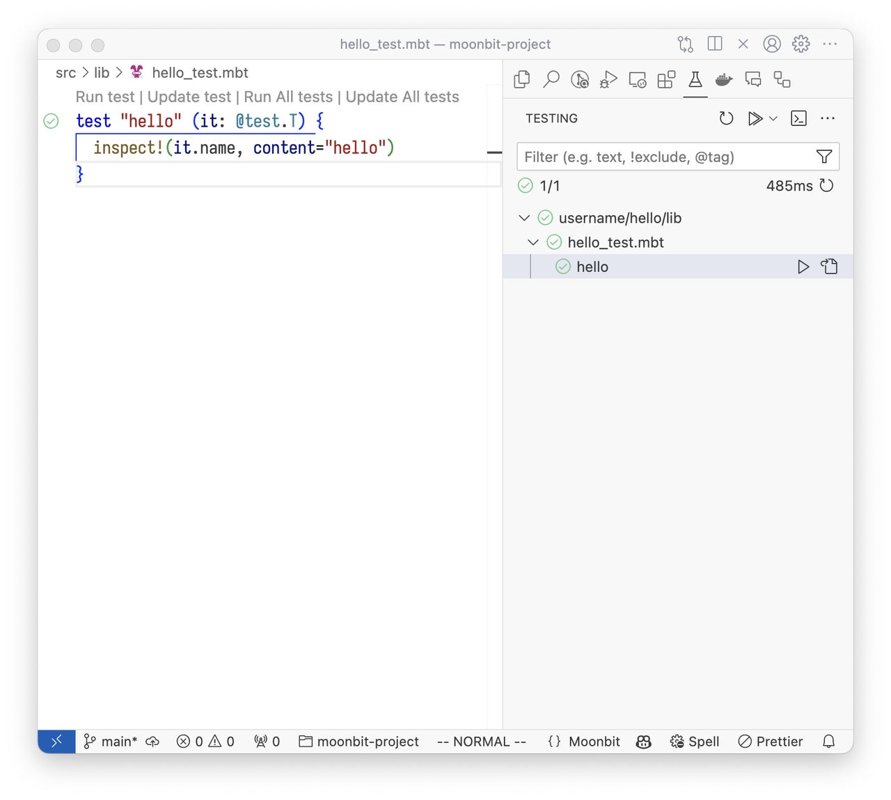
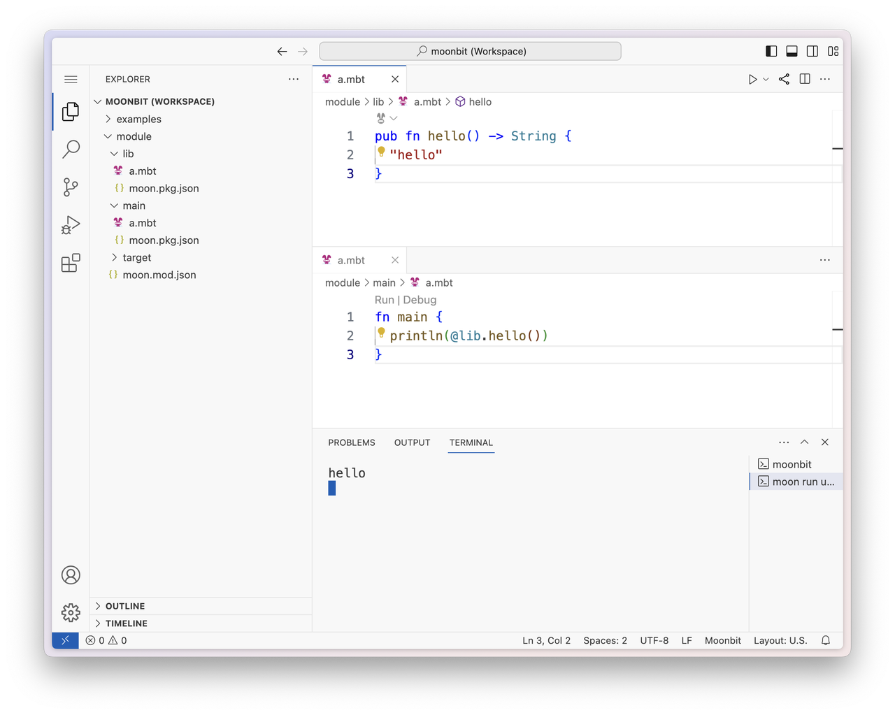

# weekly 2024-08-19

## MoonBit 更新

- 8月18日，MoonBit AI 云原生开发平台 Pre-beta 版本正式发布！MoonBit beta 预览版比大部分主流语言更早推出现代化泛型、精准错误处理和高效迭代器等重要特性，在云计算、边缘计算、人工智能和教育等领域快速实现落地应用。欢迎查看[最新博客](https://www.moonbitlang.cn/blog/beta-preview)，了解关于更多 pre-beta 版本的技术突破和创新应用

- 改进错误类型打印，可以让实现了 Show 的错误类型在被用作 Error 类型的时候也可以打印出更细致的信息，比如：

```typescript
type! MyErr String derive(Show)
fn f() -> Unit! { raise MyErr("err") }
fn main {
  println(f?()) // 输出 Err(MyErr("err"))
}
```

- test block 新增参数支持，参数的类型必须是 `@test.T`

```moonbit
test "hello" (it: @test.T) {
  inspect!(it.name, content="hello")
}
```

## 构建系统更新

- 修复当设置了 moon.mod.json 中的 source 字段时，moon info 写 mbti 文件路径不正确的问题

## 标准库更新

- `array` 和 `fixedarray` 增加 `last` 函数

- `test` 包内常见的函数移动到了 `builtin`，旧的函数被弃用

- `iter` 增加 `last`、`head`、`intersperse` 方法

## IDE 更新

- 支持 vscode test explorer



- 在线 IDE 支持多包编辑。在 [try.moonbitlang.cn](https://try.moonbitlang.cn) 上可以像本地一样开发有包之间依赖的MoonBit模块，比如图中main包依赖了lib包。



## 其他更新

- 文档地址迁移，文档的网站迁移到 [https://docs.moonbitlang.cn](https://docs.moonbitlang.cn)

- 随着 MoonBit 进入 beta 预览版，语言特性趋于稳定，今后更新公告将调整为两周一次
