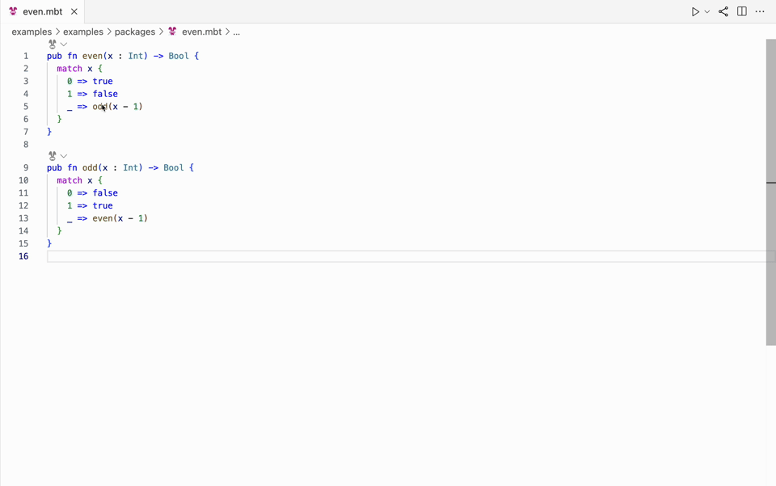
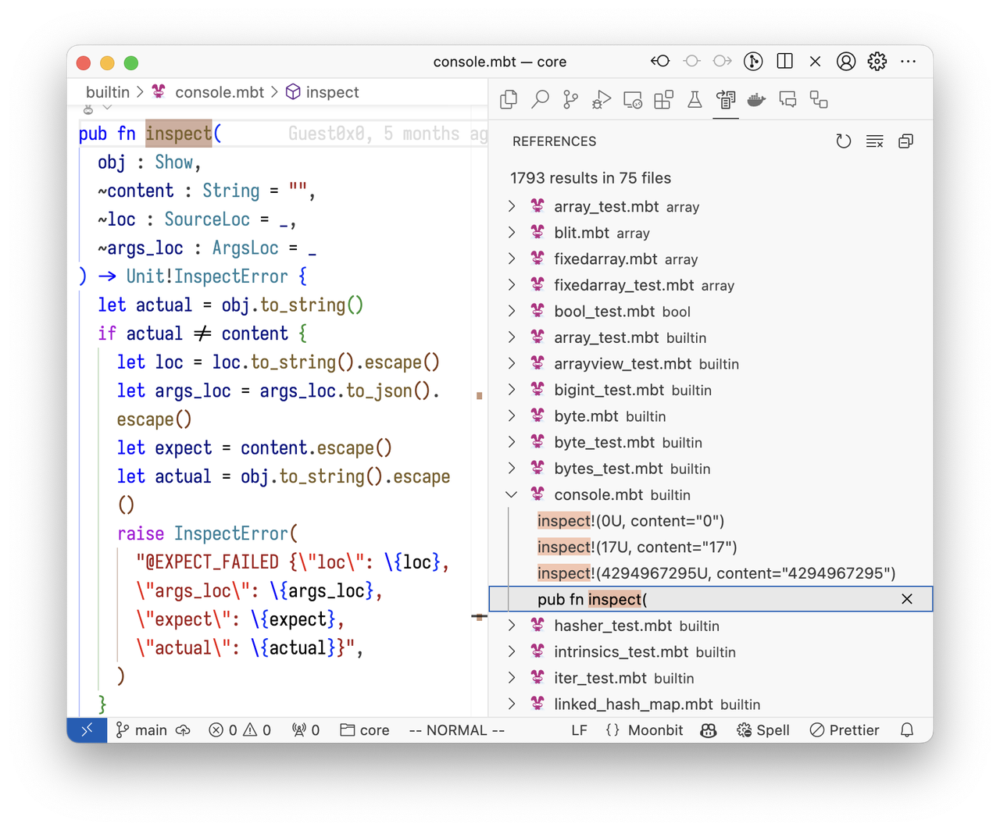
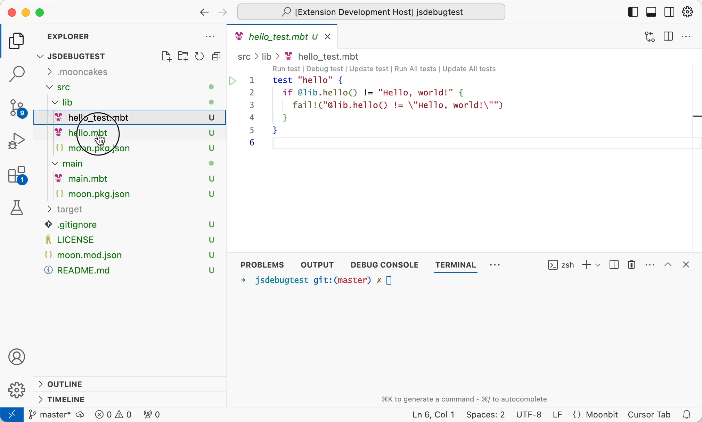

# weekly 2024-09-03

## MoonBit 更新

- Breaking change: string interpolation的语法从`\()`改为`\{}`，在`\{}`中支持了更多类型的表达式，例如：

```moonbit
fn add(i: Int) -> Int {
  i + 1
}

fn main {
  println("\{add(2)}") // cannot invoke function in \() before
}
```

- 支持了一种新的 optional argument，可以由编译器自动插入 `Some` 构造器。类型为 `Option` 的可选参数是一种很常见的场景，默认的参数为 `None`，显式传递的参数使用 `Some` 构造器创建，例如：

```moonbit
fn image(~width: Option? = None, ~height: Option? = None, ~src: String) -> Unit
```

  之前，在 MoonBit 中，使用这种默认参数时，需要调用者手动插入大量 Some 构造器，很不方便：

```moonbit
image(width=Some(300), height=Some(300), src="img.png")
```

  为此，MoonBit 引入了一种新的 optional argument 的语法 `~label? : T`（这一语法和 map pattern 中的 `?` 有类似的含义）：

```moonbit
fn image(~width?: Int, ~height?: Int, ~src: String) -> Unit
```

  此时`width` 和 `height` 是optional argument，默认值为None，它们在函数体内的类型为`Int?`。当调用 image 时，如果需要给 `width` 和 `height` 提供值，调用者无需手动插入 `Some`，编译器会自动插入：

```moonbit
image(width=300, height=300, src="img.png")
```

  如果有直接传递一个类型为`Int?`的值给 `image` 的需求，则可以使用下面的语法：

```moonbit
fn image_with_fixed_height(~width? : Int, ~src : String) -> Unit {
  // `~width?` 是 `width?=width` 的简写
  image(~width?, height=300, src="img.png")
 }
```

- 新增 range 操作符的支持。有两个 range 操作符，`..<` 不包含其上界，`..=` 包含其上界。Range 操作符可以用于简化 `for` 循环：

```moonbit
fn main {
  for i in 1..<10 {
    println(i)
  }
}
```

  目前 range 操作符只支持内建的 `Int`/`UInt`/`Int64`/`UInt64` 类型，且只能在 `for .. in` 循环中使用。未来可能会放宽这些限制

- 新增`<expr>._`作为访问newtype的语法，之前`<expr>.0`的语法将在未来被弃用，目前旧语法会触发警告。这一修改的目的是，在使用 newtype 包裹一个 `struct` 或 tuple 类型时，可以把 newtype 上对字段的访问自动转发到被包裹的类型上，简化 newtype 的使用

- 实现 `trait` 时，新增实现的一致性检查，所有 `impl` 必须有相同的签名：

```moonbit
trait MyTrait {
  f1(Self) -> Unit
  f2(Self) -> Unit
}

// 这里的两个 `impl` 的签名不一致，`f2` 的实现更一般，
// 但由于 `impl` 只能用来实现指定的 trait,`f2` 的一般性是没有意义的。
// 同一个 trait +  同一个而理性的所有 `impl` 的签名应当保持一致
impl[X : Show] MyTrait for Array[X] with f1(self) { .. }
impl[X] MyTrait for Array[X] with f2(self) { ... }
```

## 标准库更新

- 废弃原有的名字为`xx_exn`的函数，重命名为`unsafe_xx`。例如：`unsafe_pop`、`unsafe_nth`、`unsafe_peek`

- Breaking change: 将浮点数转为字符串的操作修改为符合 ECMAScript 标准。

- 将`op_as_view`的类型从

```moonbit
fn op_as_view[T](self : Array[T], ~start : Int, ~end : Int) -> ArrayView[T]
```

  改成了

```moonbit
fn op_as_view[T](self : Array[T], ~start : Int, ~end? : Int) -> ArrayView[T]
```

  这样 `Iter` 也可以实现 `op_as_view` 方法，进而可以使用切片语法。例如：

```moonbit
fn main {
  let it: Iter[Int] = [1, 2, 3, 4].iter()[1:2] // slice syntax on iter

  for x in it {
    println(x)  // 2
  }
}
```

  得益于新的 optional argument 语法 `~end? : Int`，这一改动是完全向后兼容的：过去的所有调用 `op_as_view` 的方式依然可用且语义不变。

- 将`Int::to_uint`与`UInt::to_int`重命名为`Int::reinterpret_as_uint`与`UInt::reinterpret_as_int`

- 删除`BigInt::lsr`（因为名称与实际操作不符合），并对`BigInt`进行了Bug修复与性能提升

## 工具链更新

- Breaking change: `moon {build,check,test,run}` 的**文字版**诊断信息输出（如打印的 error 和 warning 详情）从 stdout 移动到了 stderr，以保证 `moon {test,run}` 时 stdout 的输出不被多余信息污染。如果你的工具依赖 stdout 的文本格式诊断信息输出，请相对应地更新你的代码。

  **JSON 模式的输出不受影响。**

- MoonBit AI 支持批量生成测试和文档。



- 支持快照测试，用法与 `inspect!` 类似，只不过会将结果写到文件，而不是更新当前文件。例如，当执行 `moon test -u` 时，以下测试块会在当前包的目录下的 `__snapshot__` 文件夹中生成 001.txt 文件，文件内容为 `...\n`。

```sql
 test (it : @test.T) {
    it.write(".")
    it.writeln("..")
    it.snapshot!(filename="001.txt")
}
```

注意，快照测试会忽略 LF 和 CRLF 的差异。

- `moon build` 之前只支持构建`moon.pkg.json`中包含 `is-main` 为 `true` 或者 `link` 为 `true|object` 的包的项目。现在放宽了这个限制，即使没有这两个字段，也会进行构建，只不过最终没有链接成 `wasm/js` 的 步骤，每个包只会生成一个 `core` 文件。

- `moon fmt` 支持增量格式化。第一次执行 `moon fmt` 时会格式化所有 `.mbt` 文件，后续只会格式化有变化的文件。

## IDE更新

- 支持了项目级别的go to references，例如在`core`里对`inspect`使用go to references：



可以看到`core`中所有调用`inspect`的地方都被找到了

- test block 增加快捷调试功能，现在可以方便的通过 test block 的 codelens 进入调试


