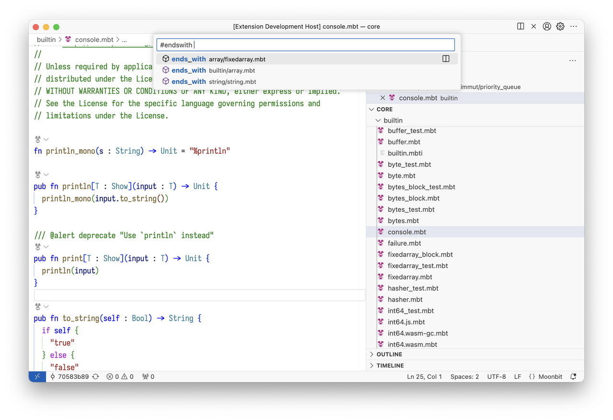

# weekly 2024-09-18

## MoonBit更新

- `type` 支持将字段访问传递到内部的类型

    ```moonbit
    struct UnderlyingType {
      field1 : Int
      field2 : Bool
    }

    type Newtype UnderlyingType

    fn main {
      let newtype = Newtype({ field1: 100, field2: true })
      println(newtype.field1) // 100
      println(newtype.field2) // true
    }
    ```

    原先要操作`newtype`内的`UnderlyingType`的字段`field1`，必须以`newtype._.field1`形式访问。简化后，对`Newtype`的字段访问将自动传递到`UnderlyingType`：可以直接书写`newtype.field1`访问`UnderlyingType`内的field1。

- 支持自定义类型通过 derive 实现 `ToJson` 和 `FromJson` trait

    `derive(ToJson)` 会自动为类型生成相关实现。输出的json格式符合自动生成的`FromJson`的要求。

    ```moonbit
    struct Record {
      field1 : Int
      field2 : Enum
    } derive(Show, ToJson, FromJson)

    enum Enum {
      Constr1(Int, Bool?)
      Constr2
    } derive(Show, ToJson, FromJson)

    fn main {
      let record = { field1: 20, field2: Constr1(5, Some(true)) }
      println(record.to_json().stringify())
      // output: {"field1":20,"field2":{"$tag":"Constr1","0":5,"1":true}}
      let json = record.to_json()
      try {
        let record : Record = @json.from_json!(json)
        println(record)
        // output: {field1: 20, field2: Constr1(5, Some(true))}
      } catch {
        @json.JsonDecodeError(err) => println(err)
      }
    }
    ```

- 卫语句（guard statement）

    卫语句有`guard`和`guard let`两种形式，用于保证不变量和消除模式匹配带来的缩进。

    ```moonbit
    fn init {
      guard invariant else { otherwise }
      continue_part
    }
    ```

    `guard`中的`invariant`是类型为`Bool`的表达式。当`invariant`为真时，对`continue_part`求值并返回结果；当`invariant`为假时，对`otherwise`求值并返回求值结果，跳过余下的`continue_part`。`else { otherwise }`部分是可选的，省略时，当`invariant`为假，程序终止。

    ```moonbit
    fn init {
      guard let ok_pattern = expr1 else {
        fail_pattern1 => expr2
        fail_pattern2 => expr3
      }
      continue_part
    }
    ```

    guard let 与 guard 类似，支持额外的模式匹配。当`expr1`可以被`ok_pattern`匹配时，执行`continue_part`；否则尝试匹配 else 内的分支。else 部分省略或者没有匹配的分支时程序终止。`ok_pattern`可以引入新的绑定，它的作用域是整个`continue_part`。一个例子：

    ```moonbit
    fn f(map : Map[String,Int]) -> Int!Error {
      guard let Some(x) = map["key1"] else {
        None => fail!("key1 not found")
      }
      x + 1
    }
    ```

- moonfmt调整

    对于不在语句的上下文中使用的`if`、`match`、`loop`、`while`、`for`、`try` 表达式，格式化后会自动加上括号。 **我们将在下一周调整`if`、`match`、`loop`、`while`、`for`、`try`和中缀表达式的优先级**，这是一个破坏性的变更。调整后，前者这些表达式不再能够直接出现在语法上要求是中缀表达式的位置。例如，下面的代码未来都是不合法的：

    ```moonbit
    if if cond {a} else {b} {v} else {d}
    match match expr { ... } { ... }
    let a = expr1 + expr2 + if a {b} else {c} + expr3
    guard if a {b} else {c} else { d }
    ```

    调整后，原先的代码需要额外的括号：

    ```moonbit
    if (if cond {a} else {b}) {v} else {d}
    match (match expr { ... }) { ... }
    let a = expr1 + expr2 + (if a {b} else {c}) + expr3
    guard (if a {b} else {c}) else { d }
    ```

    我们更建议使用`let x = y`对`if`、`match`等表达式的中间结果引入新的绑定，来改善代码的可读性，这不会引入额外的开销。例如：

    ```moonbit
    // 不建议的用法
    match (match expr { ... }) + (if a {b} else {c}) + expr { ... }
    // 建议的用法
    let r1 = match expr { ... }
    let r2 = if a {b} else {c}
    match r1 + r2 + expr {
      ...
    }
    ```

    除此之外，对于 `.land()`, `lor()`, `shl()`, `op_shr` 等函数，格式化后会自动变为中缀运算符 `&`, `|`, `<<`, `>>`。

## IDE更新

- 支持项目全局的符号搜索

- 修复重命名时会把包名覆盖的问题
- 优化插件自动执行 moon check 的逻辑
- 增加关键字和 Bool 字面量的补全
- 适配构建系统的条件编译，同时兼容原来的文件名后缀区分后端的方式(x.wasm.mbt, x.js.mbt)

## 构建系统更新

- 支持构建图可视化，在 `moon check｜build|test` 后传递 --build-graph，完成编译后会在对应的构建目录中生成此次构建图的 .dot 文件
- `moon.pkg.json` 添加 `targets` 字段，用于编写条件编译表达式，条件编译的粒度为文件。条件编译表达式中支持三种逻辑操作符 `and`，`or` 和 `not`，其中 `or` 可以省略不写，例如 `["or", "wasm", "wasm-gc"]`可简写为 `["wasm", "wasm-gc"]`。条件表达式中具体的条件分为后端和优化等级。其中后端包括：`"wasm"`, `"wasm-gc"` 和 `"js"`。优化等级包括： `"debug"` 和 `"release"`。条件表达式支持嵌套。此外，如果一个文件未出现在 `"targets"` 中，默认在所有条件下都会编译。

    写法样例

    ```json
    {
        "targets": {
            "only_js.mbt": ["js"],
            "not_js.mbt": ["not", "js"],
            "only_debug.mbt": ["and", "debug"],
            "js_and_release.mbt": ["and", "js", "release"],
            "js_only_test.mbt": ["js"],
            "complex.mbt": ["or", ["and", "wasm", "release"], ["and", "js", "debug"]]
        }
    }
    ```

- `moon.pkg.json` 添加 `pre-build` 字段用于配置构建的前序命令，其描述的命令会在执行`moon check｜build|test`之前执行。其中 `pre-build` 是一个数组，数组中的每个元素是一个对象，对象中包含 `input` `output` `command` 三个字段，`input` 和 `output` 可以是字符串或者字符串数组，`command` 是字符串，`command` 中可以使用任意命令行命令，以及 `$input` `$output` 变量，分别代表输入文件、输出文件，如果是数组默认使用空格分割。目前内置了一个特殊命令 `:embed`，用于将文件转换为MoonBit源码，`-text` 参数用于嵌入文本文件，`-binary` 用于嵌入二进制文件，`-text` 为默认值，可省略不写。`-name` 用于指定生成的变量名，默认值为 `resource`。命令的执行目录为当前 `moon.pkg.json` 所在目录。

写法样例：

`moon.pkg.json`

```json
{
  "pre-build": [
    {
      "input": "a.txt",
      "output": "a.mbt",
      "command": ":embed -i $input -o $output"
    }
  ]
}
```

如果 `a.txt` 的内容为

```json
hello,
world
```

执行  `moon build` 后，在此 `moon.pkg.json`所在目录下生成如下 `a.mbt` 文件

```json
let resource : String =
  #|hello,
  #|world
  #|
```

- `moon test --target all` 添加`[wasm]` 等后端后缀，显示效果如下

    ```json
    $ moon test --target all
    Total tests: 0, passed: 0, failed: 0. [wasm]
    Total tests: 0, passed: 0, failed: 0. [wasm-gc]
    Total tests: 0, passed: 0, failed: 0. [js]
    ```
