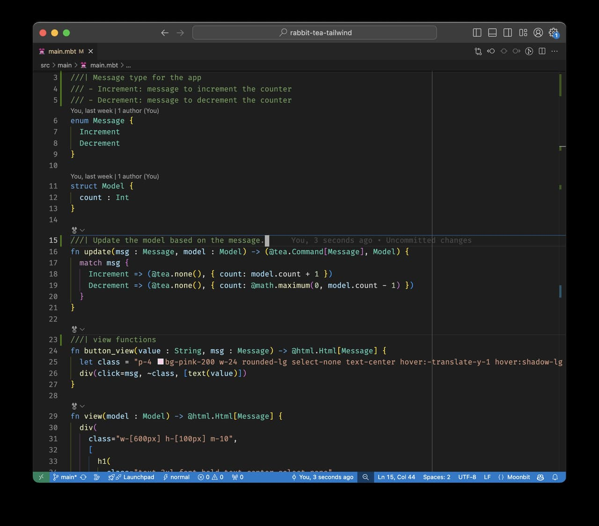
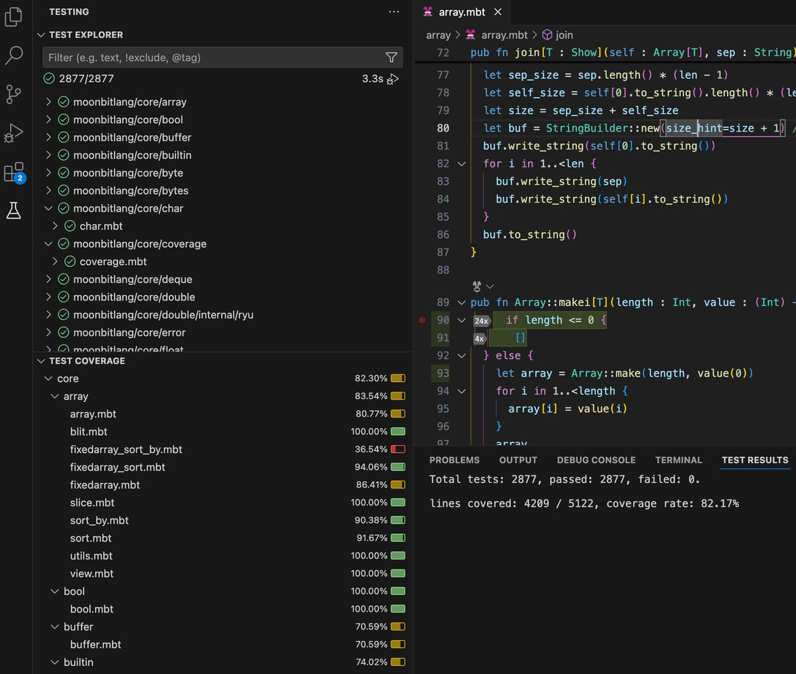
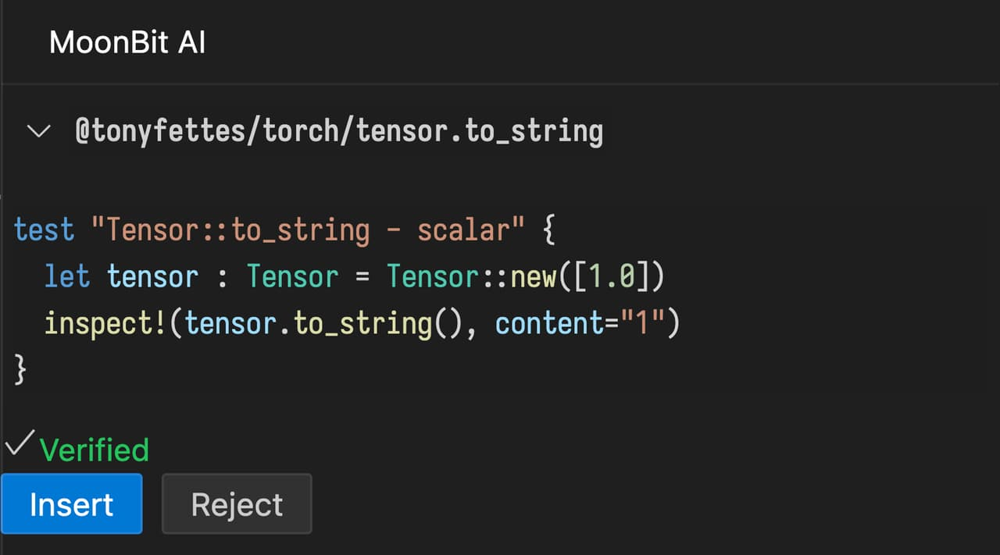

# 2024-11-04

## MoonBit更新

- 增加了编译期常量的支持。常量的名字以大写字母开头，用语法 `const C = ...` 声明。常量的类型必须是内建的数字类型或 `String`。常量可以当作普通的值使用，也可以用于模式匹配。常量的值目前只能是字面量：

```moonbit
const MIN_INT = 0x1000_0000
const MAX_INT = 0x7fff_ffff

fn classify_int(x : Int) -> Unit {
  match x {
    MIN_INT => println("smallest int")
    MAX_INT => println("largest int")
    _ => println("other int")
  }
}

fn main {
  classify_int(MIN_INT) // smallest int
  classify_int(MAX_INT) // largest int
  classify_int(42) // other int
}
```

- 改进了 unused warning，增加了一系列功能：

1. 增加了 `enum` 的参数未被使用的检测

```moonbit
enum E {
  // 现在编译器会提示 y 未被使用
  C(~x : Int, ~y : Int)
}

fn f(x : E) -> Unit {
  match x {
    C(~x, ..) => println(x)
  }
}

fn main {
  f(C(x=1, y=2))
}
```

2. 增加了函数的默认参数的默认值未被使用的检测（默认关闭）

```moonbit
// f 是一个私有函数，而且每次调用它时，调用者都显式给 x 提供了值。
// 如果开启了警告 32（默认关闭），编译器会提示 x 的默认值未被使用
fn f(~x : Int = 0) -> Unit {
  println(x)
}

fn main {
  f(x=1)
}
```

- 支持从其他包中直接导入函数，直接导入的函数在使用时，不需要 `@pkg.` 的前缀，使用方式需要通过在 `moon.pkg.json` 配置文件中，通过 `"value"` 字段声明，比如下面这个示例：

```json
{
  "import": [
    {
      "path": "moonbitlang/pkg",
      "alias": "pkg",
      "value": ["foo", "bar"]
    },
  ]
}
```

  这里例子中，在 `moon.pkg.json` 中声明了从 `moonbitlang/pkg` 导入 `foo` 和 `bar` 两个函数，从而在使用这两个函数的时候可以直接对其进行调用，而不需要再写 `@pkg.foo` 或者 `@pkg.bar`

- 现在 `BigInt` 类型在 JavaScript 后端下会编译到原生的 `BigInt`，对 `BigInt` 的 pattern matching 也会编译为高效的 switch 语句。

- 实验性功能：现在 JavaScript 后端会根据 `moon.pkg.json` 中指定的[导出函数](https://docs.moonbitlang.cn/ffi-and-wasm-host/#exported-functions)配置来生成 `.d.ts` 文件，用于改进在 TypeScript/JavaScript 侧使用 MoonBit 生成的 JavaScript 代码的体验。（目前复杂类型的导出还在设计中，现阶段生成为 TS 的 `any` 类型）

## IDE更新

- block-line 标记支持

  增加对顶层注释`///`中的特殊标记block-line`///|`的支持。block-line用于分割顶层的代码块，使用它可以提升代码的可读性和维护性。通过在顶层代码块之间添加标记，IDE能够更清晰地展示代码结构。



  通过`moon fmt --block-style`可以自动在每个顶层成员之前添加这样的标记。未来基于block-line的增量式代码解析和类型检查将进一步提高LSP的反应速度和可用性，提升开发效率。

- 在线 IDE 现已支持访问 GitHuB 仓库，

1. 打开 GitHub 中的 MoonBit 项目
2. 将 github.com 更改为 `try.moonbitlang.com`

- test explorer 中支持 test coverage 可视化。



- AI添加了`/doc-pub`命令来为公开函数生成文档。

- 修复了`/doc`命令会覆盖pragmas的问题。

- patch 功能现在能够验证生成出来的 test case 是否正确。



## 构建系统

- `moon check` ⽀持指定包，指定后会 check 当前包和它的依赖；用法: `moon check /path/to/pkg`。

## MoonBit Markdown 库

- 已开源 MoonBit Markdown 库，项目现位于 [moonbit-community/cmark](https://github.com/moonbit-community/cmark) 仓库中，并已上传 [mooncakes.io](https://mooncakes.io/) 以供社区下载和使用。
