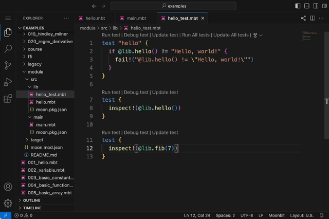
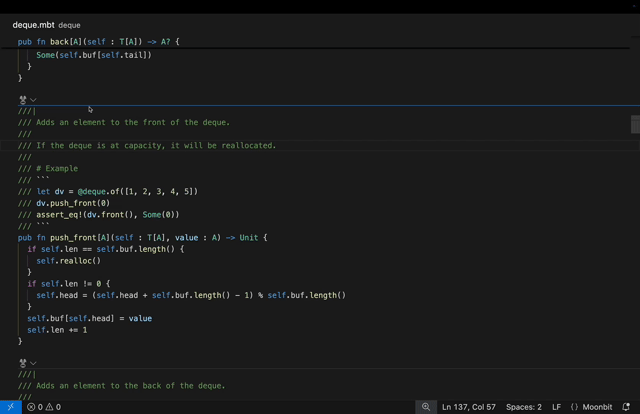
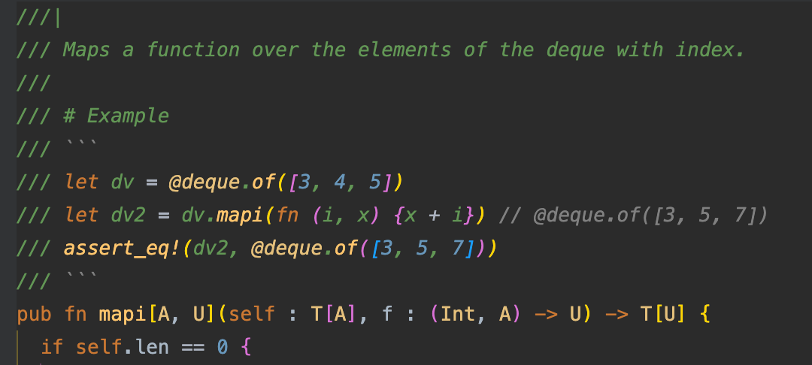

# 2024-12-02

## MoonBit更新

- **添加了 range pattern 的支持，可以在模式匹配中匹配一个区间的整数值和字符。**

Range pattern 的语法为 `a..<b`（不包含上界 `b`）或 `a..=b`（包含上界 `b`）。上下界可以是字面量、用 `const` 声明的常量，或是 `_`，表示在这一侧没有约束：

```moonbit
const Zero = 0
fn sign(x : Int) -> Int {
  match x {
    _..<Zero => -1
    Zero => 0
    Zero..<_ => 1
  }
}

fn classify_char(c : Char) -> String {
  match c {
    'a'..='z' => "lowercase"
    'A'..='Z' => "uppercase"
    '0'..='9' => "digit"
    _ => "other"
  }
}
```

- **允许用 `x.f(...)` 的语法调用 `trait` 的实现**

```moonbit
trait I {
  f(Self) -> Unit
}

type MyType Int
impl I for MyType with f(self) { println(self._) }

fn main {
  let my : MyType = 42
  my.f()// 输出 42
}
```

假设 `x` 的类型是 `T`，那么目前 `x.f(...)` 语法的解析规则如下：

1. 如果 `T` 有方法 `f`，调用方法 `T::f`
2. 如果在 `T` 所在的包内有 `trait` 实现 `impl SomeTrait for T with f`，那么调用 `SomeTrait::f`。如果有多个满足要求的 `f`，编译器会报一个歧义的错误
3. 如果上述两条规则都没有找到 `f`，编译器会在当前包内搜索 `impl SomeTrait for T with f`。注意这一条规则只在当前包内适用，假如 `T` 不是当前包定义的，外部就无法用 `.` 调用 `T` 在当前包的 impl

这些规则在增加了 MoonBit 的 `.` 语法的灵活性的同时，维持了语义的清晰性和较好的重构安全性。解析 `x.f(...)` 时只会搜索 `x` 的类型 `T` 所在的包和当前包，而不是所有被引入的依赖。这保证了引入新的依赖不会使现有代码出错或改变行为。

- **新增trait alias**

没有引入新的语法，trait alias 的写法和 type alias 一样：

```swift
typealias MyShow = Show
impl MyShow for MyType with ...
```

## IDE更新

- **[Web IDE](https://try.moonbitlang.cn) 新增更新 inspect 测试的功能。**


- **MoonBit AI 支持在已生成的代码中进行修改**，修改后的代码会自动进行语法和类型检查。


- 修复文档注释中 markdown 代码块的高亮显示问题。

## 构建系统更新

- `moon check`支持传递 warn list。

- `moon test`支持运行项目文档注释中的测试。
  - 用法：`moon test --doc`，运行当前项目文档注释中的所有测试；
  - 测试必须标注在两行 ``` 之间, 如：


- `moon fmt` 修复关于 local 函数、return 表达式的格式化。

- `moon fmt` 修复数组下标语法附近的注释在格式化后错位的问题。

- `moon fmt` 默认启用 `-block-style`。

## 文档更新

- 文档现已上线 [readthedocs.io](https://moonbit-docs.readthedocs.io/en/latest/)。
