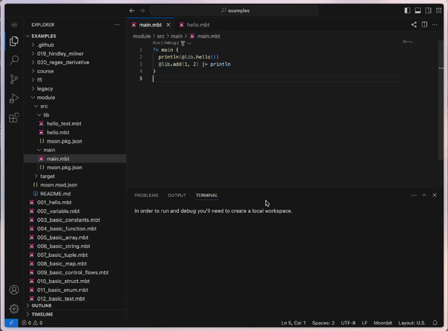
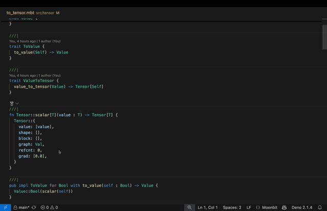

# 2024/12/16

## MoonBit更新

- Trait object 语法由原来的直接写 `Trait` 变更为 `&Trait` （旧语法已deprecate）。这一改动是为了让 trait object 类型和 trait 本身在语法上区分开，以避免混淆。在所有涉及 trait object 的场合，包括类型标注、为 trait object 定义方法（`fn &Trait::method(...)`）和创建 trait object（`... as &Trait`）都要进行修改。

- 新增了 local types 语言特性，目前支持在一个 toplevel function 中的顶部声明只在当前 toplevel function 中可见的 struct/enum/newtype，并且可以通过 derive 来为这些 local types 添加新的方法，比如：

```SQL
fn toplevel[T: Show](x: T) -> Unit {
  enum LocalEnum {
    A(T)
    B(Int)
  } derive(Show)
  struct LocalStruct {
    a: (String, T)
  } derive(Show)
  type LocalNewtype T derive(Show)
  ...
}
```

注意 local type 可以使用当前 toplevel function 中的泛型参数，但自身不可以引入额外的泛型参数，local type 可以使用 derive 生成相关方法，但不能额外定义其他新的方法，local type 暂不支持声明 error 类型。

## IDE更新

- 修复一些 LSP 相关的 bug。
  - 错误类型在 hover 的时候，定义的类型和 payload 的类型会连在⼀起；
  - 修复把⼀个单文件加到 module 里(在同级文件夹下创建moon.pkg.json)再移出(将 moon.pkg.json 删除)后，LSP 对该文件不提供服务的问题；
  - 修复了 test-import-all 配置时好时坏的问题；
  - 修复 LSP 奇怪 inlay hint 的 bug。

- 给 LSP 的 formatter 开启了 block-line 的选项

- LSP 支持 warn-list 的配置。

- 优化了 web IDE 的 debug 体验，用户打开 devtools 后点击 debug 会直接停在 main 函数上。



- 允许 doctest 中用 test {} 封装，支持更新 inspect 以及 panic test

```moonbit
/// ```
/// test "panic test xxx" {
/// panic()
/// }
/// ```
```

- MoonBit AI 实现了生成时候切换模型，中止，重试的功能。



## 构建系统更新

- `moon run` 跑测试时的参数传递调整，支持直接传递 --stack-size 调整 v8 栈大小。

- 【breaking】黑盒测试过程中会自动导入被测试的包中的 public definition，比如在测试 `@json` 这个包的黑盒测试中再使用 `@json` 这个包里的函数或者类型时，就无须再写上 `@json` 前缀，而是可以直接使用。如果需要关闭这个特性，则需要在 moon.pkg.json 中写明 `"test-import-all": false`。

## 文档更新

- [Web IDE](https://try.moonbitlang.cn) 上的教程迁移到了新的页面 [tour](https://tour.moonbitlang.com)，相应地修改和添加了一些内容。查看[tour 代码仓库](https://github.com/moonbitlang/moonbit-docs/tree/main/moonbit-tour)。
