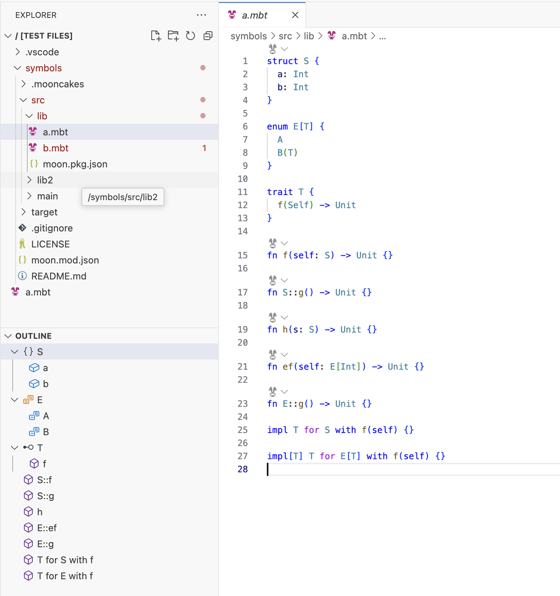
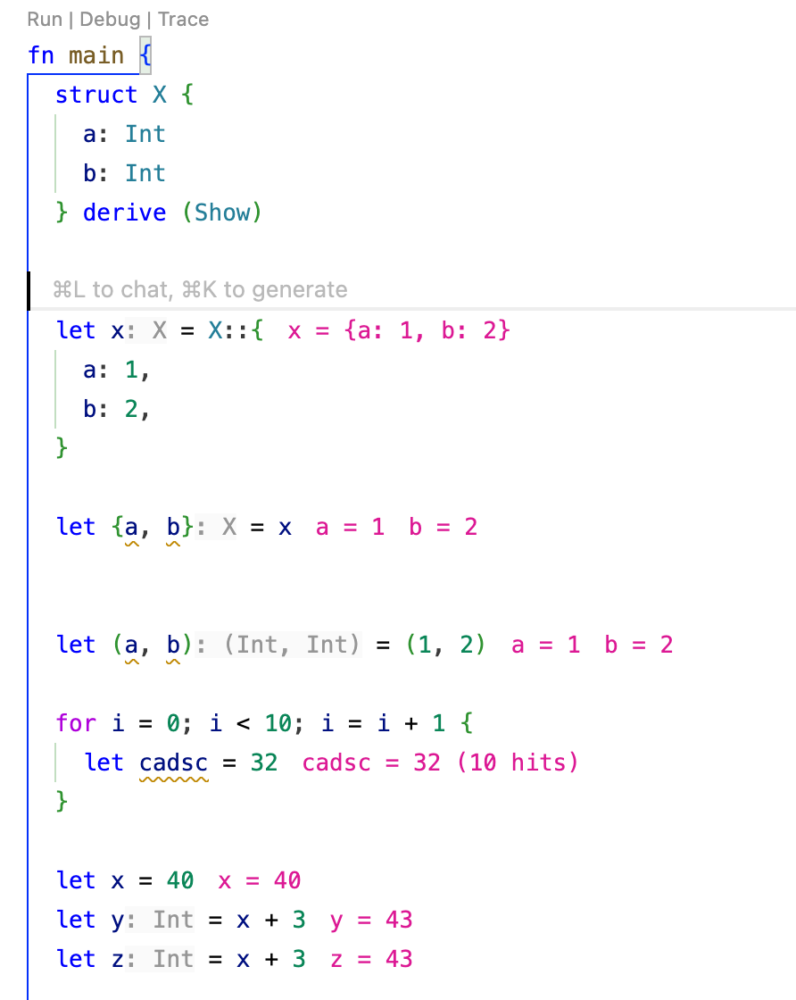

# 2024-12-30

## 语言更新

- 新增labeled loop语法，可在多层循环中直接跳转到指定的某一层，label使用 `~` 作为后缀

```moonbit
fn f[A](xs : ArrayView[A], ys : Iter[Int]) -> @immut/list.T[(Int, A)] {
  l1~: loop 0, xs, @immut/list.Nil {
    _, [], acc => acc
    i, [x, .. as rest], acc =>
      for j in ys {
        if j == i {
          continue l1~ i + 1, rest, @immut/list.Cons((j, x), acc)
        }
        if j + i == 7 {
          break l1~ acc
        }
      } else {
        continue i - 1, rest, acc
      }
  }
}
```

- 新增discard argument, 以单个下划线命名的函数参数会被丢弃，同一函数内可以丢弃多个参数。Discard argument 只支持位置参数，暂不支持命名参数。

```moonbit
fn positional(a : Int, b : Int) -> Int {
  a + b
}

fn discard_positional(_: Int, _: Int) -> Int {
  1
}
```

- `pub` 的语义正式从完全公开切换为只读，同时 `pub(readonly)` 语法被 deprecate。如果想要声明一个完全公开的 `type`/`struct`/`enum`，需要写 `pub(all)`，如果想要声明一个完全公开（外部可以实现）的 `trait`，需要写 `pub(open)`。这一改动已提前通过 warning 的形式进行预告，之前使用 pub 会报 warning。如果已经按照 warning 将 `pub` 改为 `pub(all)`/`pub(open)`，本次只需将 `pub(readonly)` 改为 `pub` 即可完成迁移。`moon fmt` 能自动完成 `pub(readonly) -> pub` 的迁移。

- 未来，`trait` 找不到实现时 `fallback` 到方法的行为 **有可能** 被移除。我们鼓励新代码使用显式的 `impl Trait for Type` 语法而非方法来实现 trait。在无歧义时，`impl Trait for Type with method(...)` 也可以使用 dot syntax 调用，因此使用显式 `impl` 不会损失使用的便利性。

- 移除了带标签参数旧的前缀语法。

- 移除了用于获取 newtype 内容的旧语法 `.0`。同时如果一个 newtype 内的类型是 tuple，现在 `.0`、`.1` 这些 index access 能自动转发到 newtype 内的 tuple，例如：

```moonbit
type Tuple (Int, String)

fn main {
  let t = (4, "2")
  println(t.0) // 4
  println(t.1) // 2
}
```

- 为 `derive(FromJson)` 和 `derive(ToJson)` 加入了参数支持，可以控制类型序列化和反序列化过程的具体行为和数据布局。具体修改见 [Docs > Language > Deriving](https://docs.moonbitlang.com/zh-cn/latest/language/derive.html#deriving-traits)。

  目前可以对字段进行重命名和调整 enum 的序列化格式。JSON 序列化与反序列化过程的具体行为在未来可能会进行优化而发生改变。

```moonbit
enum UntaggedEnum {
  C1(Int)
  C2(String)
} derive(ToJson(repr(untagged)), Show)
// { "0": 123 }, { "0": "str" }

enum InternallyTaggedEnum {
  C1(Int)
  C2(String)
} derive(ToJson(repr(tag="t")), Show)
// { "t": "C1", "0": 123 }

enum ExternallyTaggedEnum {
  C1(Int)
  C2(String)
} derive(ToJson(repr(ext_tagged)), Show)
// { "C1": { "0": 123 } }

enum AdjacentlyTaggedEnum {
  C1(Int)
  C2(String)
} derive(ToJson(repr(tag="t", contents="c")), Show)
// { "t": "C1", "c": { "0": 123 } }

struct FieldRenameAllCamel {
  my_field : Int
} derive(ToJson(rename_all="camelCase", repr(tag="t")), Show)
// { "t": "fieldRenameAllCamel", "myField": 42 }

struct FieldRenameAllScreamingSnake {
  my_field : Int
} derive(ToJson(rename_all="SCREAMING_SNAKE_CASE", repr(tag="t")), Show)
// { "t": "FIELD_RENAME_ALL_SCREAMING_SNAKE", "MY_FIELD": 42 }
```

## IDE更新

- 增加了对于loop label的gotodef/gotoref/rename 等功能的IDE 支持。

- Document symbol现在在IDE中会以有层级的方式显示，效果如下：


- 修复了白盒测试有关类型重命名的bug。

- 新增了在会造成重复的情况下自动省略 parameter inlay hints 的功能。

- IDE增加值追踪功能，点击 main 函数上面的 Trace codelen 后启用，再次点击后关闭；

  - 对于循环体内的变量，只显示最新的值以及 hit 次数。
  

## 构建系统更新

- moon新增 `--no-strip` 参数，可在 release 构建模式下保留符号信息

## 文档更新

- 修复了 MoonBit Tour 在切换页面时 theme 无法保持的问题

- [MoonBit Tour](https://tour.moonbitlang.com/)增加 range、range pattern 和 newtype 小节
