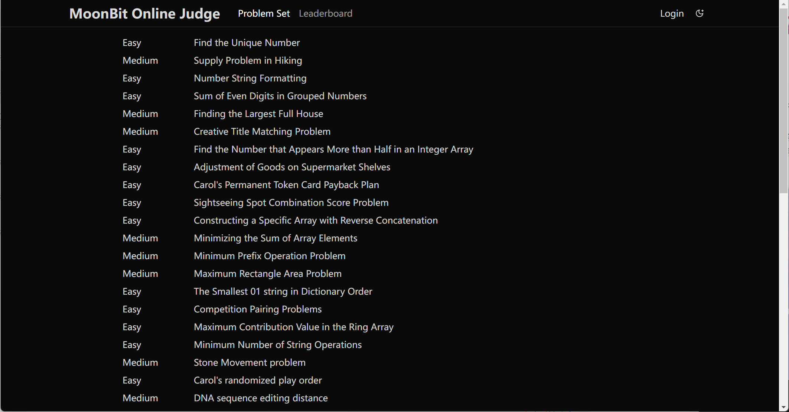

import Command from "./command.webm"
import Workspace from "./workspace.webm"

# 2025-01-13

## 语言更新

- 实验性的异步支持。我们添加了实验性的异步编程支持。可以用 `async fn ...` 声明异步函数，用 `f!!(...)` 调用异步函数。同时 MoonBit 提供了一些原语用于中断控制流。更多信息见 [docs/async-experimental](https://docs.moonbitlang.cn/language/async-experimental.html)

  目前异步标准库和事件循环仍在开发中，因此如果要使用异步编程功能，复用 JavaScript 后端的事件循环与 Promise API 会更轻松。目前异步编程相关功能的设计都是实验性质的，未来可能会根据反馈发生不兼容改动。我们欢迎并感激对异步编程功能的试用和反馈。

- 在本周稍后，我们将对方法的语义进行一次大的调整，以简化方法相关的规则。目前，MoonBit 对方法的调用语法的规则是：

  - 方法可以用 `fn f(self : T, ..)` 或 `fn T::f(..)` 的形式声明

  - 第一个参数为 `Self` 的方法，可以用 `xx.f(..)` 的形式调用

  - 如果没有歧义，可以用 `f(..)` 的形式直接调用方法
  但上述最后一条规则比较混沌，且缺乏用户控制。此外，调用语法（`f(..)` 和声明语法（`T::f(..)`）之间缺乏一致性。接下来，我们将对方法的语义进行调整：

  - 方法可以用 `fn f(self : T, ..)` 的形式声明。这种方法既可以用 `xx.f(..)` 的形式调用，也可以当成普通函数调用（`f(..)`）。这种方法和普通函数处于同一个命名空间，不能重名

  - 方法也可以用 `fn T::f(..)` 的形式声明。这种方法可以用 `xx.f(..)` 的形式调用，也可以用 `T::f(..)` 的全名形式调用，但不能当作普通函数用 `f(..)` 的形式调用。这种方法可以和普通函数重名

  这一设计背后的直觉是：所有 `fn f(..)` 形式的定义都是普通函数，而所有 `fn T::f(..)` 形式的定义都会被放在 `T` 代表的一个小命名空间内。

  对于第一个参数不是 `Self` 的方法，例如 `new`，如果希望用 `new(..)` 的形式直接调用，可以将其直接定义为一个普通函数。在新的语义下，我们预期的库作者的 API 设计思路是：

  - 如果某个函数在当前包内没有歧义，就用 `fn f(..)` 的形式定义它。如果希望用 `xx.f(..)` 的方式调用它，就把第一个参数命名为 `self`；

  - 如果某个函数在当前包内有歧义，就把它定义成 `fn T::f(..)`，放进一个小命名空间里，来规避歧义。调用者必须用 `T::f(..)` 或 `xx.f(..)` 的形式来调用。

- 更多的alert支持，包括：

  - ⽀持对类型的使⽤触发 alert；

  - ⽀持对具体的constructor的使⽤触发 alert。

- 对 ArrayView/BytesView/StringView 的构造和模式匹配进行了一些改进：

  - 允许了取 view 操作使⽤负数下标，比如：

```moonbit
fn main {
  let arr = [1, 2, 3, 4, 5]
  let arr_view = arr[-4: -1]
  println(arr_view) // [2, 3, 4]
  let arr_view_view = arr_view[-2:-1]
  println(arr_view_view) // [3]
}
```
  - ⽀持了对 Bytesview 的模式匹配，并且允许 pattern ⾥⾯出现 byte literal，比如：

```moonbit
fn f(bs: BytesView) -> Option[(Byte, BytesView)] {
  match bs {
    [b'a' ..= b'z' as b, .. bs]  => Some((b, bs))
    _ => None
  }
}

///|
fn main {
  let s = b"hello"[:]
  let r = f(s)
  println(r) // Some((b'\x68', b"\x65\x6c\x6c\x6f"))
}
```

  - 在 array pattern ⾥⾯允许省略 `as` 关键字，可以写成 `[a, .. rest, b]`，上面的例子中已经出现了这种用法，同时 `[a, .. as rest, b]` 这种写法也会继续支持，不过 formatter 会自动把中间的 `as` 关键字省略掉。

## IDE 更新

- 新增 toggle multi-line string 的 command。

<video autoPlay loop muted playsInline src={Command} style={{width: '100%'}}></video>

- Workspace symbols 增加了更多的信息，便于搜索某个具体的函数和类型。

<video autoPlay loop muted playsInline src={Workspace} style={{width: '100%'}}></video>

## 构建系统更新

- 修复 doc test 更新多行字符串测试结果的 bug。

## 文档更新

- [MoonBit Tour](https://tour.moonbitlang.com) 支持 debug codelens，默认开启值追踪。

- [Moonbit OJ](https://oj.moonbitlang.com) 用户可以在 oj 平台上刷题并兑换奖品。



## 标准库更新

- 改变了 `Int64` 与 `JSON` 转换的行为。原本通过 Double 转换会损失精度，现改为通过字符串保存。
