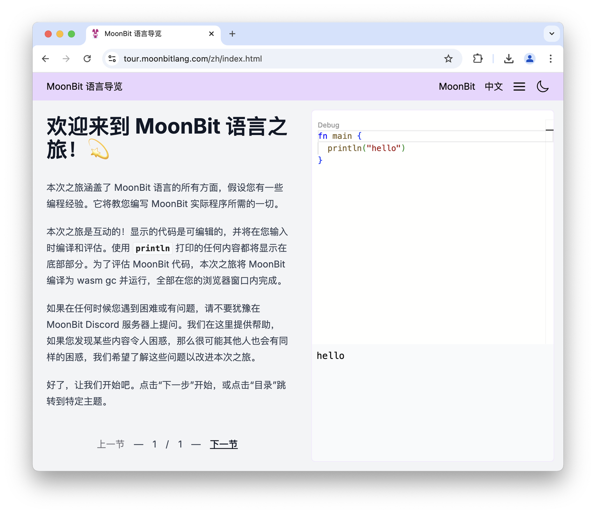

import Enabled from "./enabled.webm"

# 2025-02-24

## MoonBit 更新

### String 模式匹配增强

- 支持在 Array pattern 中使用字符串字面量

    在类型为 `String` 的 Array pattern 中可以通过` .. `操作符来匹配一段字符串：

```moonbit
let str = "https://try.moonbitlang.com"
match str {
  [.."https://", ..path] => println(path)
  [.."http://", ..path] => println(path)
  _ => println("unexpected protocol")
}
```

  这相当于下面代码的简化版本：

```moonbit
 let str = "https://try.moonbitlang.com"
 match str {
   ['h', 't', 't', 'p', 's', ':', '/', '/', .. path] => println(path)
   ['h', 't', 't', 'p', ':', '/', '/', .. path] => println(path)
   _ => println("unexpected protocol")
 }
```

- 支持在 Array pattern 中使用 `const` 常量

```moonbit
const HTTP = "http://"
const HTTPS = "https://"

///|
fn main {
  let str = "https://try.moonbitlang.com"
  match str {
    [..HTTP, .. path] => println(path)
    [..HTTPS, .. path] => println(path)
    _ => println("unexpected protocol")
  }
}
```

### while 的条件中支持使用 is 表达式

```moonbit
fn main {
  let queue = @queue.of([1,2,3])
  while queue.pop() is Some(n) {
    println(n)
  }
}
// 输出：
// 1
// 2
// 3
```

### 数组字面量重载支持String类型

数组字面量重载支持String类型。

### C FFI 处理的 Breaking Change

[BREAKING CHANGE] C FFI 中，所有 MoonBit 对象改为指向第一个字段而非对象头。在 MoonBit 原生后端中，为了支持垃圾回收，每个对象都有一个对象头（定义在 `moonbit.h` 中）。之前，原生后端中，所有 MoonBit 对象都是一个指向对象头的指针。但这意味着在绑定 C FFI 时，很多函数都需要写一些 C wrapper 来跳过对象头、获取实际的数据。为了改善 C FFI 的体验，我们将所有 MoonBit 对象改为指向对象头尾部、第一个字段开始位置的指针。这样一来，在绑定 C FFI 时，就无需显式处理对象头了。例如，现在在 C FFI 中，可以直接用 `Bytes` 来表示 `const char*` 或 `void*`，用 `FixedArray[T]` 来表示 `T*`，无需再写 C wrapper 了。

不过，这一改动是对 C FFI 的 breaking change：现有的、跳过对象头的 C wrapper 需要进行适配。因此，使用了 C FFI 的库或程序应当在本次编译器更新后进行修改。

### 新增 `FuncRef[T]` 类型用于 FFI

`moonbitlang/builtin` 中新增了一个特殊类型 `FuncRef[T]`，表示类型为 `T` 的、无捕获的函数。该类型的用途是绑定一些需要传递回调函数的 FFI，例如 Unix signal handler。创建 `FuncRef[T]` 的方式是：在预期类型为 `FuncRef` 的地方写一个无捕获的匿名函数即可。`FuncRef[T]` 是用于绑定 FFI 的，因此它无法直接被调用。

### 外部类型语法更新

用于 FFI 的外部类型的语法改为 `extern type T`：之前，如果要在 MoonBit 里定义一个外部类型，语法是 `type T`。接下来，我们将把定义外部类型的语法改为更显式的 `extern type T`。旧的 `type T` 语法被 deprecate，编译器会对旧语法发出警告。本次语法迁移可以使用 `moon fmt` 自动完成。

未来旧的 `type T` 语法彻底移除后，我们将把 `type T` 语法另外用作其他用途。`extern type T` 表示的是一个完全外部的对象，MoonBit 的垃圾回收系统对它不会做任何处理。而未来 `type T` 将表示一些来自外部、但有正常 MoonBit 对象结构、会被垃圾回收处理的对象。例如有自定义 finalizer 的、来自 FFI 的对象。

### 移除旧的 Trait 对象语法

移除了旧的trait object语法。之前编译器已经对旧的 trait object 语法汇报了 warning，现在旧的 trait object 语法 `Trait` 正式被移除，trait object 类型应当写成 `&Trait`。

## 构建系统更新

- `moon info` 支持使用`--package`参数来指定要处理的包

- `moon.pkg.json`配置文件增加`supported-targets`字段，用于指定当前包所支持的后端（若若设置则默认支持所有后端）。当尝试在不支持的后端中构建这个包或者依赖包支持的后端与当前包不一致时，构建系统将报错。

- `moon.pkg.json`增加`native-stub`字段，用于声明这个包中需要一起构建并链接的.c文件。

## IDE 更新

- 新增IDE安装器。对于 windows 桌面端，我们打包了集成moonbit插件的 IDE 安装器，可以通过 [https://cli.moonbitlang.cn/vscode/latest/win32-x64-user.exe](https://cli.moonbitlang.cn/vscode/latest/win32-x64-user.exe) 下载并安装开发环境。

- MoonBit 交互式教程 [https://tour.moonbitlang.com](https://tour.moonbitlang.com) 增加了中文版本



- 语言服务支持处理markdown中的moonbit代码。需要在markdown在最开始配置

```YAML
---
moonbit: true
---
```

才会生效。

<video autoPlay loop muted playsInline src={Enabled} style={{width: '100%'}}></video>