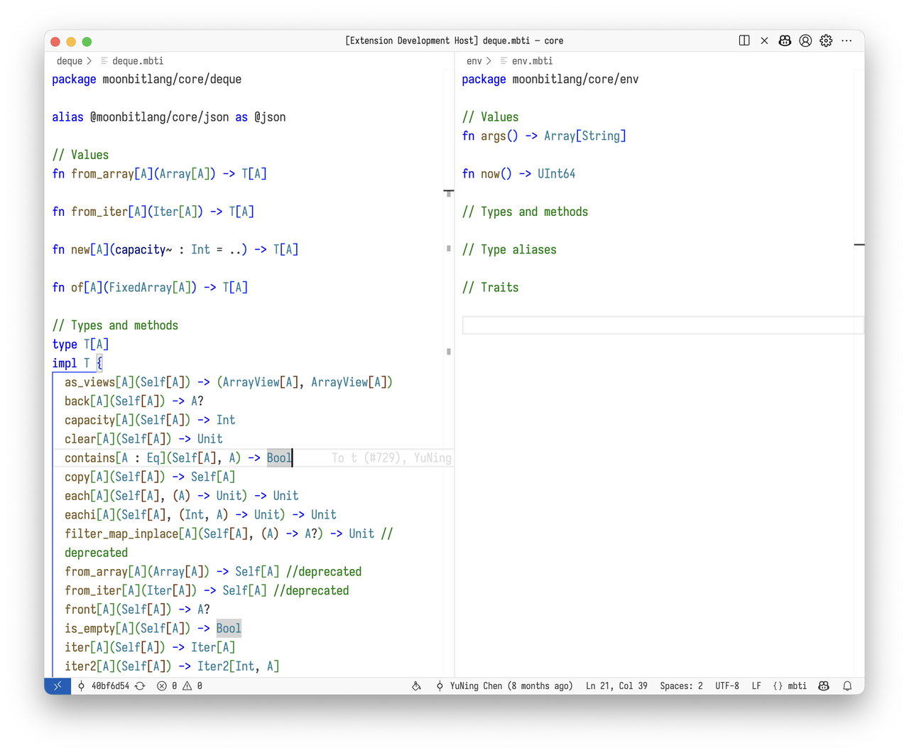
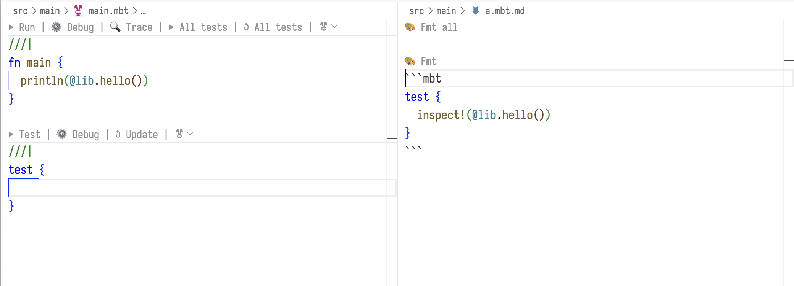

# 2025-03-24

## 语言更新

### `Bytes` 现在可以使用 array pattern 进行模式匹配

```moonbit
fn main {
  let bytes : Bytes = "Hello, world!";
  match bytes {
    [..b"Hello", ..] => {
      println("Starts with \"Hello\"");
    }
    _ => {
      println("Doesn't start with \"Hello\"");
    }
  }
}
```

### 字符字面量使用为 `Int` 和 `Byte` 值

现在字符（`Char`）字面量可以在接受一个 `Int` 值的地方被使用，语义是该字符对应的 Unicode code point 。同时，字符字面量也可以在接受一个 `Byte` 值的地方被使用，并且如果对应的 Unicode code point 超过 `Byte` 对应的范围会报错。

```moonbit
fn main {
  let a : Int = 'a';
  println(a) // 97
  let b : Byte = 'a';
  println(b) // b'\x61'
  let c : Byte = '🎉';
  //             ^^^ Error: Char literal '🎉' for Byte is out of range.
}
```

### 调整字符串字面量和 Bytes 字面量中的转义序列

由于`\x..`，`\o..`等转义在不同上下文中（如`String`类型或`Bytes`类型）的解释存在二义性，我们进行了一些调整：

- 在类型为`String`的位置使用的字符串字面量中，`\xFF` ，`\o377` 这两种转义被弃用。建议使用含义更明确的`\u00FF`或`\u{FF}`。`Bytes`字面量和重载到`Bytes`类型的字符串字面量不受影响，例如：

```moonbit
let bytes1 : Bytes = "\xFF\o377" // ok
let bytes2 = b"\xFF\o377"        // ok, bytes2 == bytes1
let str : String = "\xFF\o377"   // warning: deprecated escape sequences
```

- 弃用了对 UTF-16 surrogate pair 的支持，例如`\uD835\uDD04` 。对于超出BMP code points的字符，使用`\u{...}`。

- 弃用了`Bytes`字面量`b"..."`或重载到`Bytes`类型的字符串字面量 `"..."` 中的unicode转义序列

```moonbit
let bytes1 = b"\u4E2D"          // deprecated, use b"\xE4\xB8\xAD" instead
let bytes2 = ("\u4E2D" : Bytes) // use ("\xE4\xB8\xAD" : Bytes) instead
```

### `trait` 运算符重载

现在运算符重载不再是通过给类型上加上 `op_add`/`op_mul`/... 等方法来实现，而是通过实现 `Add`/`Mul`等标准库（core）里面的特性（`trait`）来实现。以下是一张运算符和特性的对应表：

| 运算符 | 特性（`Trait`）|
| ------ | ------------- |
| `==` | `Eq` |
| `+` | `Add` |
| `-` | `Sub` |
| `*` | `Mul` |
| `/` | `Div` |
| `-`（前缀）| `Neg` |
| `%` | `Mod` |
| `&` | `BitAnd` |
| `\|` | `BitOr` |
| `^` | `BitXOr` |
| `<<` | `Shl` |
| `>>` | `Shr` |

如果你的代码有自定义运算符重载，那么应当将其从方法定义改为对应 `trait` 的 `impl`。未来，继续使用方法来重载运算符将会导致警告。在我们正式移除用方法实现 `trait` 的行为之后，用方法来重载运算符将导致编译错误。

如果你的代码中定义了一些包含运算符的 `trait`，那么应当 `trait` 中的运算符改为对运算符对应的 `trait` 的 super trait 声明。例如：

```moonbit
trait Number {
  op_add(Self, Self) -> Self
  op_mul(Self, Self) -> Self
  literal(Int) -> Self
}
```

  应该被修改为：

```moonbit
trait Number : Add + Mul {
  literal(Int) -> Self
}
```

### 增加函数别名

语法为 `fnalias <old_fn_name> as <new_fn_name>`。函数别名可以帮助用户更加方便地使用包里面的函数，也有助于在包级别的重构中对于函数在包之间移动的处理。

```moonbit
fnalias @hashmap.new // 等价于 fnalias @hashmap.new as new

fn f() -> Int {
  new().length()
}

fnalias f as g

fn main {
  println("f: \{f()}")
  println("g: \{g()}")
}
```

`fnalias` 也支持批量导入的语法 `fnalias @pkg.(f1s as g1, f2 as g2, ..)`

### 增加批量导入 `typealias/traitalias` 的语法

- 可以通过 `typealias @pkg.(A, B, C)` 来批量导入类型。

- 可以通过 `traitalias @pkg.(D, E, F)` 来批量导入特性（`trait`）。

  比如，在 `lib` 包中有两个类型定义 `A` 和 `B`，各自有一个 `new` 方法。那么，在另一个包中就可以通过以下代码来将 `@lib.A` 和 `@lib.B` 别名为当前包中的 `A` 和 `B`：

```moonbit
typealias @lib.(A, B)

fn main {
  println(A::new())
  println(B::new())
}
```

### 正式移除 `type T` 语法定义外部类型

正式移除了用 `type T` 语法定义外部类型的语义，绑定外部类型需要使用 `extern type T`。`type T` 语法本身并未被移除，而是获得了不同的语义。`extern type T` 语法定义的类型是完全外部的类型，不参与 MoonBit 的垃圾回收。而 `type T` 语法定义的类型是普通的 MoonBit 类型，会参与垃圾回收。`type T` 的新语义配合本周新增的 C FFI external object 功能，可以实现对 FFI 外部的对象进行动态的管理和释放的效果。

### C 侧的 FFI 可自定义析构函数（finalizer）

C 侧的 FFI 增加了自定义析构函数（finalizer）的功能。通过在 C 侧调用 `moonbit_make_external_object`，C 的 FFI 作者可以注册一个自定义的析构函数，用以释放和该对象相关的资源。以下是一个例子：

```moonbit
// MoonBit侧
type Greeting // 注意：不是 extern type

extern "c" fn Greeting::new() -> Greeting = "greeting_new"

fn main {
  ignore(Greeting::new())
}
```

```C
// C侧
#include "moonbit.h" // 记得将 $MOON_HOME/include 添加到 C 编译器的包括目录列表中
#include <stdlib.h>
#include <stdio.h>

char message[] = "Hello, World!";

struct greeting {
  char *data;
};

void greeting_delete(void *object) {
  fprintf(stderr, "greeting_delete\n");
  free(((struct greeting*)object)->data);
  // 不需要在这里释放 object 自身， object 自身会由 MoonBit 的引用计数系统释放。
}

struct greeting *greeting_new(void) {
  char *data = malloc(sizeof(message));
  /* moonbit_make_external_object(
       void (*func_ptr)(void*),
       int32_t size
     )
     其中：
     - `func_ptr` 是一个函数指针，它负责释放对象中存储的资源
     - `size` 是对象中的自定义数据的大小，单位是 byte
     `moonbit_make_external_object` 会分配一个大小为
     `size + sizeof(func_ptr)` 的 MoonBit 对象，并返回指向其数据的指针。
     `func_ptr` 会被存储在对象的末尾，
     因此返回值可以直接当成指向自定义数据的指针使用。
     如果有其他接受 `struct greeting*` 的 C API，
     可以直接将 MoonBit 中类型为 `Greeting` 的值传递给它们，无需进行转换
  */
  struct greeting *greeting =
      moonbit_make_external_object(&greeting_delete, sizeof(struct greeting));
  greeting->data = data;
  return greeting;
}
```

### LLVM 后端已初步实现在调试器中打印局部变量值的功能

开发者使用 `gdb`、`lldb` 等调试工具时，可以查看基础数据类型（整型、浮点型）的局部变量值。针对字符串、数组及各类复合类型等其他数据结构的支持功能目前正在积极开发中。

## 构建系统更新

- 我们在 Windows 平台上面的 bleeding 版本工具链提供了对 LLVM 后端的支持。Windows 用户可以如下方式来安装 bleeding 版本的工具链：

```PowerShell
$env:MOONBIT_INSTALL_VERSION = "bleeding"; irm https://cli.moonbitlang.com/install/powershell.ps1 | iex
```

- 现在发布的工具链会有对应的 `dev` 版本。`dev` 版本保留了更多的调试信息，能够更好地帮我们诊断编译器出现的问题和错误。可以通过如下方式安装 `dev` 版本的工具链：

```PowerShell
# Unix (Linux or macOS)
curl https://cli.moonbitlang.com/install/unix.sh | MOONBIT_INSTALL_DEV=1 bash
# Windows (PowerShell)
$env:MOONBIT_INSTALL_DEV = 1; irm https://cli.moonbitlang.com/install/powershell.ps1 | iex
# moon
moon upgrade --dev
```

注意，目前`dev`版本的工具链并不支持 LLVM 后端。

- 支持测试开启了 MoonBit 支持的 Markdown 文件。这些 Markdown 中的测试代码会作为黑盒测试运行。

```bash
moon test --md
```

## IDE更新

- IDE 中支持了 `mbti` 文件的语法高亮。



- 为 IDE 中的 Codelens 增添了 emoji ：



- 以 `*.mbt.md` 后缀的 Markdown 文件会开启 MoonBit LSP 支持（包括错误信息、补全等）。
