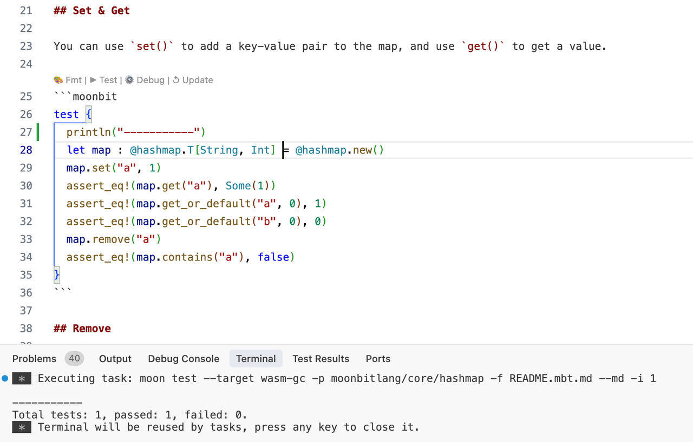
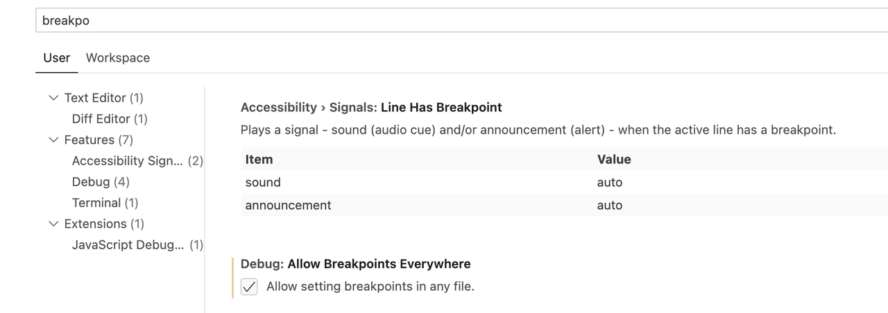

# 2025-04-07

## 语言更新

### `wasm` 后端：支持将 `extern type t` 存储到数据结构中

现在 `wasm` 后端支持将 `extern type t` 存储到数组等数据结构中。在FFI边界（导入/导出函数的签名）上，`extern type T` 依然会被编译成wasm的 `externref` 类型。

### C FFI支持 `borrow`

C FFI支持 `borrow`。现在，你可以通过在 `extern "c"` 的函数上方指定 `#borrow(args, ...)` 来修改C FFI对指定参数的生命管理方式，其中 `arg` 是C FFI的参数名字的一个子集。默认情况下，C FFI需要负责把参数释放掉，这意味着，绑定C FFI时，往往需要写一个辅助函数来释放掉参数：

```moonbit
fn open(path : Bytes, flags : Int, mode : Int) -> Int = "open"
```

```c
int open_wrapper(moonbit_bytes_t path, int flags, int mode) {
  int rc = open(path, flags, mode);
  moonbit_decref(path)
  return rc;
}
```

使用 `borrow` attribute，我们可以指示MoonBit对C FFI函数调用不生成引用计数指令，从而不用再写辅助函数，可以直接绑定C库中的函数：

```moonbit
#borrow(path)
fn open(path : Bytes, flags : Int, mode : Int) -> Int = "open"
```

由于 `#borrow` 标记，MoonBit会自动在调用完 `open` 后释放掉 `path`。

### `type` 和 `trait` 支持了 `#deprecated` attribute

`type` 和 `trait` 支持了 `#deprecated` attribute。我们下次发布将移除旧的pragmas机制，建议使用attribute替代：

```moonbit
/// the @alert pragmas is deprecated
/// @alert deprecated "message"
fn f() -> Unit {...}

/// use attribute #deprecated instead
#deprecated("message")
fn f() -> Unit {...}
```

### 对于FFI的extern函数的声明进行后端一致性检查

对于FFI的extern函数的声明添加了后端一致性的检查，例如下列函数会在非Native后端构建的时候报错。

```moonbit
extern "c" fn open(path : Bytes, flags : Int, mode : Int) -> Int = "open"
```

## 工具链更新

1. 从本周开始，工具链的发布从周一改到周四。

2. 修复了test explorer的bug，并新增了对 `.mbt.md` 的测试和调试支持：



  另外，可以通过开启以下设置来允许在Markdown文件中设置断点：Settings > Debug: Allow Breakpoint Everywhere



3. `moon info --package` 支持模糊匹配包名。

