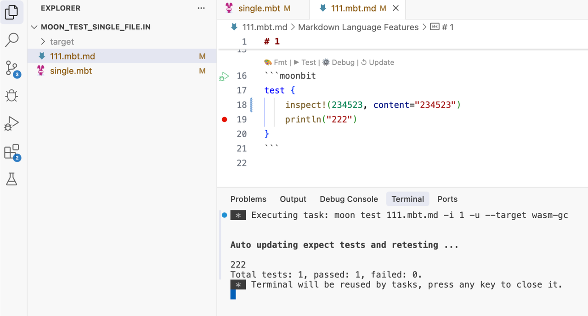

# 2025-05-19

## 语言更新

### `x..f(..)` 的语义即将发生改变，在 ./.. 调用链末尾的最后一个 .. 以后会自动丢弃它的值。因此，下面的代码：

```moonbit
impl[X : Show, Y : Show] Show for (X, Y) with output(self, logger) {
  logger
  ..write_string("(")
  ..write_object(self.0)
  ..write_string(", ")
  ..write_object(self.1)
  // 原本，这里必须写 `.`，否则整个 `.` 链的类型是 `&Logger`，不符合预期类型 `Unit`
  .write_string(")")
}
```
**以后可以简化成**
```moonbit
impl[X : Show, Y : Show] Show for (X, Y) with output(self, logger) {
  logger
  ..write_string("(")
  ..write_object(self.0)
  ..write_string(", ")
  ..write_object(self.1)
  // 以后可以直接一路 `..` 到底了
  ..write_string(")")
}
```
但这也意味着直接使用 `x..f() `的值的用法将会被废弃，需要显式保存`x`。例如，下面的代码：
```moonbit
let arr = []..push(1)..push(2)
```
需要改写成：
```moonbit
let arr = []
arr..push(1)..push(2)
```
### 枚举构造器和结构体的字段支持单独的文档注释，在补全时会显示相应的文档。


```moonbit
///| Location enum
struct Location {
  /// X coordinate
  x : Int
  /// y coordinate
  y : Int
}

///| Variant enum
enum Variant {
  /// Stirng constructor
  String(String)
  /// Number constructor
  Number(Double)
}
```

### `@bytes.View` 和 `@string.View` 在 C 和 wasm1 后端现在会被编译成值类型，这意味着这两个类型不会引入内存分配，性能有较大提升


## 工具链更新
- vscode 插件支持semantic token, 会对有effect的函数(会抛出异常的函数, 异步函数)调用使用不同的样式高亮.

- 构建系统支持 virtual package 特性，通过将一个 package 声明为虚拟包，定义好一套接口，用户可选择具体使用哪一份实现，如不指定则使用该虚拟包的默认实现。通过这项特性，给分离接口与实现带来较大灵活性。注意：目前这项特性处于实验性状态。详情请查看：[MoonBit 新特性：Virtual Package 虚拟包机制](https://mp.weixin.qq.com/s?__biz=Mzk0MTQ3MDU4Mg==&mid=2247503872&idx=1&sn=3df2bbff61bddc08bd4ddfa47a64092e&chksm=c36f17a52ee24e4492e1db4814f59393458b3305d4854bbddce72bb858a863d33436f9aadee9&scene=0&xtrack=1&version=4.1.20.70286&platform=mac#rd)

- 支持对于单个 .mbt 和 .mbt.md 文件的 test 和 debug codelen

  


