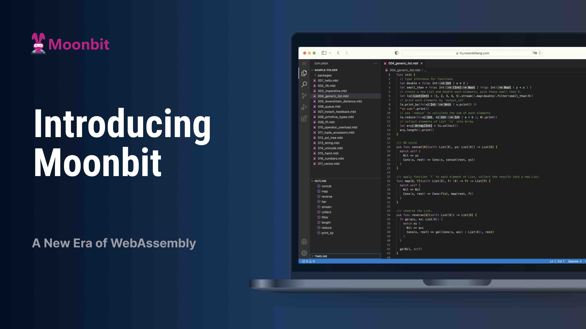

import Tabs from '@theme/Tabs'
import TabItem from '@theme/TabItem'

# MoonBit: 面向 WebAssembly 的快速、简洁、用户友好的语言



<!--truncate-->

WebAssembly（Wasm）作为一种跨平台指令集架构（ISA），在云计算和边缘计算中越来越重要，这主要归功于他的效率、安全、简洁和开放的标准。然而，它的真正潜力仍未被充分挖掘。像 Rust 和 C/C++ 这样的低级 Wasm 语言学习起来具有挑战性，并且可能因其长时间的编译时间而使开发者感到缓慢。另一方面，像 Golang 这样的高级语言生成的代码效率低下且庞大，无法充分利用 Wasm 的速度和紧凑性的关键优势。

Moonbit 旨在成为解决所有这些挑战性问题的 Wasm 优先语言。它的构建和运行速度快，生成紧凑的 Wasm 输出，使用起来像 Golang 一样简单，并且没有现有选项的遗留问题。结合 Wasm 的自然效率、安全性和紧凑性，Moonbit 有望实现 Wasm 对云计算和边缘计算的长期承诺。

Moonbit 的领导者是张宏波和他的经验丰富的团队，他们在语言设计和开发方面拥有十多年的专业经验。张宏波为多种编程语言做出了贡献，包括 OCaml、ReScript（原 ReasonML/BuckleScript）和 Flow。他是 Rescript 语言工具链关键组件的首席架构师，包括其闪电般的编译器、标准库和构建系统。

Moonbit 也受到 Golang 和 Rust 的影响。它整合了 Golang 的简单性，特别是在其包系统中，以及 Rust 的表现力，包括强大的[模式匹配](https://en.wikipedia.org/wiki/Pattern_matching)、[类型推断](https://en.wikipedia.org/wiki/Type_inference#:~:text=Type%20inference%20refers%20to%20the,of%20computer%20science%20and%20linguistics.)、泛型和类似 trait 的特设多态性。Moonbit 的容错类型系统设计用于速度、并行性和增量检查，以提供[最佳的 IDE 支持](https://try.moonbitlang.com)。

## Moonbit 的主要关注点

### 快速 - _快速构建和运行_

Moonbit 旨在在*整个栈*中都快速，包括开发性能和运行时性能。

Moonbit 是为多级中间表示（IR）上的全程序优化而设计的，这种方法改善了内存布局，以最小化缓存未命中，并提供了数据和控制流分析的优越环境。这超越了大多数现有的链接时间优化（LTO）结构，通过促进全面理解程序的结构，实现更有效的优化。在多级 IR 上优化还允许识别和删除在较低级别看不到的高级冗余。

快速的构建性能，特别是 IDE 功能，对于开发者体验至关重要。与 ReScript 和 Rust 不同，Moonbit 允许函数级并行语义分析。由于它在这个粒度上的增量重分析，Moonbit 能够处理庞大的单仓库，并提供毫秒级的响应时间，显著提高 IDE 的可扩展性。

### 紧凑 - _微小的 Wasm 输出_

Moonbit 专为有效的死代码消除而设计。它省略了妨碍这种分析的语言特性，且有一个结构化的标准库，便于死代码的移除。通过全程序优化，Moonbit 大幅减少了最终代码的大小，提高了安全性并减少了攻击漏洞。这也确保了在 serverless 计算环境中的快速启动。

### 用户友好 - _学习简单，使用方便_

Moonbit 通过自动内存管理使编程变得更容易，这使得它与 Rust 区别开来。与 Golang 不同，它避免了像指针或左值这样的风险元素。它还提供了丰富的安全特性，包括模式匹配、代数数据类型和特设多态性，以支持面向数据的编程。

Beyond a language, Moonbit also serves as a platform, providing an extensive toolset even at its early stage. This includes a high-speed build tool, a package manager, a compiler, an IDE, and a unique, container-free Cloud IDE with offline capabilities, accessible from any location with a browser, distinguishing it from conventional Cloud IDEs.

除了一种语言，Moonbit 也作为一个平台，即使在早期阶段也提供了广泛的工具集。这包括一个高速构建工具、包管理器、编译器、IDE、以及一个独特的无需容器的云 IDE，具有离线功能，可以从任何位置通过浏览器访问，这使其区别于传统的云 IDE。

## 一点 MoonBit 的体验

MoonBit 的优点可以通过一个简单的 Fibonacci 示例来说明。下面是在三种语言（MoonBit、Go 和 Rust）中实现的 fib 函数：

```mdx-code-block
<Tabs>
<TabItem value='MoonBit'>
```

```moonbit
fn fib(num : Int) -> Int {
  fn aux(n, acc1, acc2) {
    match n {
      0 => acc1
      1 => acc2
      _ => aux(n - 1, acc2, acc1 + acc2)
    }
  }

  aux(num, 0, 1)
}
```

```mdx-code-block
</TabItem>
<TabItem value='Go'>
```

```go
func fib(n int) int {
  var aux func(n, acc1, acc2 int) int
  aux = func(n, acc1, acc2 int) int {
    switch n {
    case 0:
      return acc1
    case 1:
      return acc2
    default:
      return aux(n-1, acc2, acc1 + acc2)
    }
  }
  return aux(n, 0, 1)
}
```

```mdx-code-block
</TabItem>
<TabItem value='Rust'>
```

```rust
fn fib(n: i32) -> i32 {
  fn aux(n: i32, acc1: i32, acc2: i32) -> i32 {
    match n {
      0 => acc1,
      1 => acc2,
      _ => aux(n - 1, acc2, acc1 + acc2),
    }
  }
  aux(n, 0, 1)
}
```

```mdx-code-block
</TabItem>
</Tabs>
```

我们在 [github](https://moonbitlang.github.io/moonbit-docs/benchmark/fibonacci/) 上提供的基准测试结果如下。

<figure style={{ position: 'relative', height: '300px', margin: 0 }}>
  <div
    style={{ position: 'absolute', height: '100%', width: '85%', left: '5%' }}
  >
    <div
      style={{
        position: 'absolute',
        left: 0,
        top: 0,
        width: '1px',
        bottom: 0,
        background: 'rgba(127,127,127,0.25)'
      }}
    ></div>
    <div
      style={{
        position: 'absolute',
        right: '100%',
        fontSize: 'small',
        marginRight: '6px',
        top: '8px',
        writingMode: 'vertical-rl'
      }}
    >
      计算时间
    </div>
    <div
      style={{
        position: 'absolute',
        right: '100%',
        fontSize: 'small',
        marginRight: '6px',
        top: '108px',
        writingMode: 'vertical-rl'
      }}
    >
      编译大小
    </div>
    <div
      style={{
        position: 'absolute',
        right: '100%',
        fontSize: 'small',
        marginRight: '6px',
        top: '208px',
        writingMode: 'vertical-rl'
      }}
    >
      编译速度
    </div>
    <div
      style={{
        position: 'absolute',
        left: 0,
        height: '18px',
        width: '2.73%',
        background: '#E66465',
        top: 0
      }}
    ></div>
    <div
      style={{
        position: 'absolute',
        left: 0,
        height: '18px',
        width: '2.43%',
        background: '#FFCF00',
        top: '24px'
      }}
    ></div>
    <div
      style={{
        position: 'absolute',
        left: 0,
        height: '18px',
        width: '97.8%',
        background: '#0E38E1',
        top: '48px'
      }}
    ></div>
    <div
      style={{
        position: 'absolute',
        fontSize: 'small',
        left: '2.73%',
        marginLeft: '3px',
        top: '-3px',
        fontWeight: 600
      }}
    >
      177.9 ms
    </div>
    <div
      style={{
        position: 'absolute',
        fontSize: 'small',
        left: '2.43%',
        marginLeft: '3px',
        top: '22px'
      }}
    >
      160.8 ms
    </div>
    <div
      style={{
        position: 'absolute',
        fontSize: 'small',
        left: '97.8%',
        marginLeft: '3px',
        top: '46px',
        width: '15%',
        overflow: 'hidden',
        whiteSpace: 'nowrap'
      }}
    >
      6357.8 ms
    </div>
    <div
      style={{
        position: 'absolute',
        fontSize: '12px',
        right: '0px',
        marginLeft: '3px',
        top: '68px',
        whiteSpace: 'nowrap',
        fontStyle: 'italic'
      }}
    >
      计算 fib(46) 10000000 次的时间
    </div>
    <div
      style={{
        position: 'absolute',
        left: 0,
        height: '18px',
        width: '0.5%',
        background: '#E66465',
        top: '100px'
      }}
    ></div>
    <div
      style={{
        position: 'absolute',
        left: 0,
        height: '18px',
        width: '1%',
        background: '#FFCF00',
        top: '124px'
      }}
    ></div>
    <div
      style={{
        position: 'absolute',
        left: 0,
        height: '18px',
        width: '96.5%',
        background: '#0E38E1',
        top: '148px'
      }}
    ></div>
    <div
      style={{
        position: 'absolute',
        fontSize: 'small',
        marginLeft: '3px',
        left: '0.5%',
        top: '98px',
        fontWeight: 600
      }}
    >
      253 bytes
    </div>
    <div
      style={{
        position: 'absolute',
        fontSize: 'small',
        marginLeft: '3px',
        left: '1%',
        top: '122px'
      }}
    >
      498 bytes
    </div>
    <div
      style={{
        position: 'absolute',
        fontSize: 'small',
        marginLeft: '3px',
        left: '96.5%',
        top: '146px',
        width: '15%'
      }}
    >
      1447712 bytes
    </div>
    <div
      style={{
        position: 'absolute',
        fontSize: '12px',
        right: '0px',
        marginLeft: '3px',
        top: '168px',
        whiteSpace: 'nowrap',
        fontStyle: 'italic'
      }}
    >
      生成 wasm 文件的大小
    </div>
    <div
      style={{
        position: 'absolute',
        left: 0,
        height: '18px',
        width: '10%',
        background: '#e66465',
        top: '200px'
      }}
    ></div>
    <div
      style={{
        position: 'absolute',
        left: 0,
        height: '18px',
        width: '90%',
        background: '#FFCF00',
        top: '224px'
      }}
    ></div>
    <div
      style={{
        position: 'absolute',
        left: 0,
        height: '18px',
        width: '25%',
        background: '#0E38E1',
        top: '248px'
      }}
    ></div>
    <div
      style={{
        position: 'absolute',
        fontSize: 'small',
        marginLeft: '3px',
        left: '10%',
        top: '198px',
        fontWeight: '600'
      }}
    >
      1.06 s
    </div>
    <div
      style={{
        position: 'absolute',
        fontSize: 'small',
        marginLeft: '3px',
        left: '90%',
        top: '222px'
      }}
    >
      9.01 s
    </div>
    <div
      style={{
        position: 'absolute',
        fontSize: 'small',
        marginLeft: '3px',
        left: '25%',
        top: '246px'
      }}
    >
      2.56 s
    </div>
    <div
      style={{
        position: 'absolute',
        fontSize: '12px',
        right: '2px',
        marginLeft: '3px',
        top: '268px',
        whiteSpace: 'nowrap',
        fontStyle: 'italic'
      }}
    >
      编译 626 个包所需的时间
    </div>
  </div>
</figure>
<figcaption
  style={{ textAlign: 'center', marginBottom: '20px', color: '#222' }}
>
  <p style={{ margin: 0, color: 'var(--ifm-font-color-base)' }}>
    🟥 MoonBit 🟨 Rust 🟦 Go
  </p>
</figcaption>

从上述例子中，我们可以看到 MoonBit 有以下优点：

- 更好的本地类型推断：MoonBit 推断出了本地函数 `aux` 的类型
- 紧凑的 wasm 大小：MoonBit 生成了最小的 wasm 输出
- 良好的性能：比 go 快，与 rust 平分秋色
- 用户友好：MoonBit 像 Go 一样支持递归闭包，这在 Rust 中非常难以实现；MoonBit 还像 Rust 一样支持模式匹配，这比 Go 的 switch case 功能强大得多。

## 当前状态和路线图

[Moonbit](https://moonbitlang.com/) 是一个快速发展的目标，但你可以使用我们的[在线 IDE](http://try.moonbitlang.com)，或下载 [CLI 工具](/download)进行尝试。文档托管在 [github](https://github.com/moonbitlang/moonbit-docs) 上，也可以使用[vscode 扩展](https://marketplace.visualstudio.com/items?itemName=moonbit.moonbit-lang)。

过去整个语言工具链的开发，可能需要数年甚至十年的时间。现在通过我们积累的经验和从 Moonbit 成立之初就建立的专门的才华横溢的团队，已经得到了简化。我们预计 Moonbit 将在 2024 年第二季度末达到 beta 状态，这表明该阶段相对稳定，bug 最少，并具有强大的外部函数接口（FFI）用于与 Wasm 宿主交互。我们将在达到 beta 质量后公开源代码。我们的战略计划涉及 Wasm 2.0 的 Wasm GC 集成和我们自研的遵从 Wasm 的提议的 Wasm 1.0 GC。

## 社区和早期反馈

欢迎在我们的[论坛](https://discuss.moonbitlang.com/)上发表问题，加入我们的 [discord](https://discord.gg/CVFRavvRav) 或关注我们的 [Twitter 账户](https://x.com/moonbitlang)。
