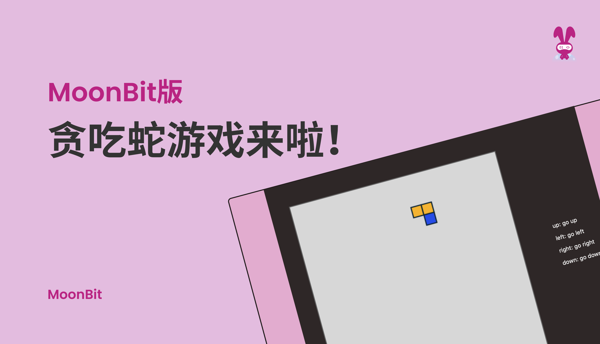
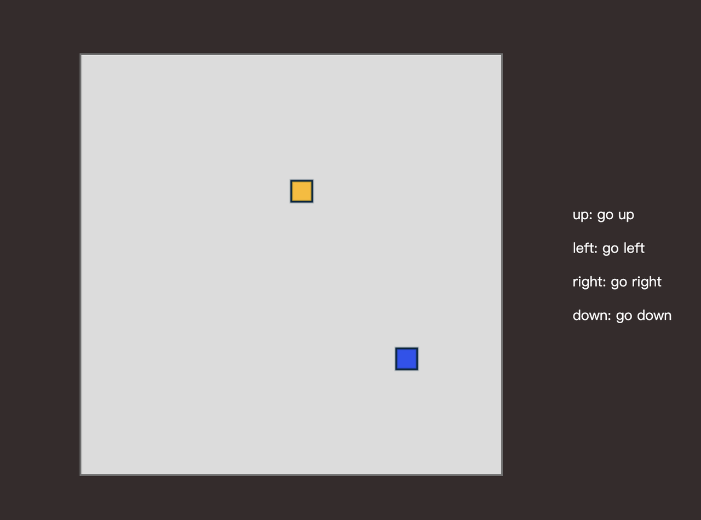

# Snake：MoonBit版贪吃蛇来了！



<!--truncate-->

## 什么是贪吃蛇？

**贪吃蛇**（Snake）是起源于1976年的街机游戏 Blockade。此类游戏在1990年代由于一些具有小型屏幕的移动电话的引入而再度流行起来，在现在的手机上基本都可安装此小游戏。版本亦有所不同。

在游戏中，玩家操控一条细长的直线（俗称蛇或虫），它会不停前进，玩家只能操控蛇的头部朝向（上下左右），一路拾起触碰到之物（或称作“豆”），并要避免触碰到自身或者其他障碍物。每次贪吃蛇吃掉一个食物，它的身体便增长一些。吃掉一些食物后会使蛇的移动速度逐渐加快，让游戏的难度渐渐变大。游戏设计大致分为四面都有墙(都不可穿越)以及某部分的墙可以穿越，以及四面墙都可以穿越的模式。有些游戏碰到自己身体也不会死掉，例如蛇蛇食颜色、贪吃蛇进化论等等。本文将介绍如何用MoonBit实现贪吃蛇，完整的代码：https://github.com/moonbitlang/moonbit-docs/tree/main/examples/snake

如果你想尝试一下，可以点击此处进行尝试：[https://www.moonbitlang.cn/gallery/snake/](https://www.moonbitlang.cn/gallery/snake/)。

## 如何用MoonBit实现贪吃蛇

用`struct GameState`来创建整个游戏：

```moonbit
struct GameState{
  mut grid:  Array[Int]
  mut body:  List[Position]
  mut dir:   Direction
}

```

用`grid`来初始化每个格子的颜色：

```moonbit
0 0 0 0 0 0
0 2 0 1 0 0
0 0 0 0 0 0

```

`0`代表普通格子，`1`代表蛇的身体，`2`代表食物

初始化后的游戏界面：



### 生成食物

```moonbit
fn random() -> Double = "Math" "random"
fn floor(i: Double) -> Int = "Math" "floor"

fn generate_Food(self: GameState){
  while true {
    let i : Int = floor(random() * 20.0)
    let j : Int = floor(random() * 20.0)

    if(self.grid[j * grid_col_count + i] == grid_num(Default)){
      self.setGridType({x: i, y: j}, Food)
      return
    }
  }
}

```

首先通过两个外部引用函数随机生成新食物的横坐标和纵坐标，然后通过`grid_num`来判断新生成的坐标是否可以放置，最后通过`setGridType`方法来设置为食物。

### 控制蛇行进

```moonbit
pub fn tran_step(self : GameState, a : Int){
  let mut action : Direction = Default
  match a {
    1 => action = Up
    2 => action = Down
    3 => action = Left
    4 => action = Right
    _ => action = Default
  }

  self.step(action)
}

pub fn step(self : GameState, action : Direction) {

  match action {
    // move up
    Up =>{
      if length(self.body) == 1{
        self.dir = Up
      }else{
        if self.dir == Left || self.dir == Right || self.dir == Up{
          self.dir = Up
        }else{
          self.dir = self.dir
        }
      }

      }

    // move down
    Down =>{
      if length(self.body) == 1{
        self.dir = Down
      }else{
        if self.dir == Left || self.dir == Right || self.dir == Down{
          self.dir = Down
        }else{
          self.dir = self.dir
        }
      }

      }

    // move left
    Left =>{
      if length(self.body) == 1{
        self.dir = Left
      }else{
        if self.dir == Up || self.dir == Left || self.dir == Down{
          self.dir = Left
        }else{
          self.dir = self.dir
        }
      }

      }

    // move right
    Right =>{
      if length(self.body) == 1{
        self.dir = Right
      }else{
        if self.dir == Up || self.dir == Right || self.dir == Down{
          self.dir = Right
        }else{
          self.dir = self.dir
        }
      }
      }

    _ =>{
      self.dir = self.dir
      }

  }

  self.go_step()
}
```

首先，`step`方法识别外部键盘的响应并对应不同的方向改变。然后，调用`go_step`方法完成蛇的移动

```moonbit
fn go_step(self: GameState, prev: Direction){
  if (prev == Down && self.dir == Up ) || (prev == Up && self.dir == Down ) || (prev == Left && self.dir == Right ) || (prev == Right && self.dir == Left ){
    self.dir = prev
  }else {
    self.dir = self.dir
  }
  let head : Position = get_head(self.body)
  let newHead : Position = {x: head.x , y: head.y }

  newHead.x = dir_posi(self.dir).x + newHead.x
  newHead.y = dir_posi(self.dir).y + newHead.y

  newHead.x = (newHead.x + grid_col_count) % grid_col_count
  newHead.y = (newHead.y + grid_col_count) % grid_col_count

  if self.grid[newHead.y * grid_col_count + newHead.x] == 1{
    initialize(self)
    return
  }else if self.grid[newHead.y * grid_col_count + newHead.x] == 2{

    self.setGridType(newHead, Body)
    self.body = Cons(newHead, self.body)
    generate_Food(self)
  }else {

    self.setGridType(newHead, Body)
    self.body = Cons(newHead, self.body)
    self.setGridType(get_tail(self.body), Default)
    self.body = delete_tail(self.body)
  }

}

```

首先，通过`tran_step`方法识别外部键盘的响应并对应不同的输入方向指令。
其次，通过`step`方法来过滤输入方向是否合法。游戏规定蛇无法转向180度，但在蛇身长度为1时，蛇可以上下左右自由移动。
最后，调用`go_step`方法完成蛇的移动。

```moonbit
fn go_step(self: GameState){
  let head : Position = get_head(self.body)
  let newHead : Position = {x: head.x , y: head.y }

  newHead.x = dir_posi(self.dir).x + newHead.x
  newHead.y = dir_posi(self.dir).y + newHead.y

  newHead.x = (newHead.x + grid_col_count) % grid_col_count
  newHead.y = (newHead.y + grid_col_count) % grid_col_count

  if self.grid[newHead.y * grid_col_count + newHead.x] == 1{

    initialize(self)
    return
  }else if self.grid[newHead.y * grid_col_count + newHead.x] == 2{

    self.setGridType(newHead, Body)
    self.body = Cons(newHead, self.body)
    generate_Food(self)
  }else {

    self.setGridType(newHead, Body)
    self.body = Cons(newHead, self.body)
    self.setGridType(get_tail(self.body), Default)
    self.body = delete_tail(self.body)
  }
}
```

在`go_step`方法中，首先通过`self.dir`的`Position`获得新头的位置，其次判断新头的位置是普通格子，蛇的身体还是食物。

- 如果为普通格子，则将新头设置为蛇身，删除蛇原本的尾巴
- 如果为蛇的身体，本轮游戏结束，重新initialize整场游戏
- 如果为食物，则吃掉这个食物，并把食物的位置设置成蛇身

## 通过外部引用画图

声明外部函数引用

```moonbit
type Canvas_ctx

fn set_stroke_color(self : Canvas_ctx, color : Int) = "canvas" "set_stroke_color"

fn set_line_width(self : Canvas_ctx, width : Double) = "canvas" "set_line_width"

fn stroke_rect(self : Canvas_ctx, x : Int, y : Int, width : Int, height : Int) = "canvas" "stroke_rect"

fn fill_rect(self : Canvas_ctx, x : Int, y : Int, width : Int, height : Int) = "canvas" "fill_rect"

fn set_fill_style(self : Canvas_ctx, color : Int) = "canvas" "set_fill_style"

```

然后进行画图

```moonbit
pub fn draw(canvas : Canvas_ctx, snake : GameState) {
  let mut c = 0

  // draw backgroud
  while c < grid_col_count {
    canvas.set_fill_style(0)
    canvas.fill_rect(c, 0, 1, grid_row_count)
    c = c + 1
  }

  draw_piece(canvas, snake.grid, (0, 0))
}

pub fn draw_piece(canvas : Canvas_ctx, matrix : Array[Int],
        offset : (Int, Int)) {

  let mut r = 0
  let mut c = 0
  let mut c0 = 0
  while c < matrix.length() {
    if matrix[c] == 0 {
      c = c + 1
      continue
    }
    c0 = c % grid_col_count
    r = c / grid_col_count
    canvas.set_fill_style(matrix[c] + 1)
    canvas.fill_rect( offset.0 + c0, r, 1, 1)
    canvas.set_stroke_color(1)
    canvas.set_line_width(0.1)
    canvas.stroke_rect( c0, r, 1, 1)
    c = c + 1
  }
}

```

## JavaScript 键盘监听与画面更新

```moonbit
window.addEventListener("keydown", (e) => {
  if (!requestAnimationFrameId) return
  switch (e.key) {
    case "ArrowLeft": {
        snake_step(snake, 3)
        snake_draw(context, snake)
        break
    }
    case "ArrowRight": {

        snake_step(snake, 4)
        snake_draw(context, snake)
        break
    }
    case "ArrowDown": {

        snake_step(snake, 2)
        snake_draw(context, snake)
        break
    }
    case "ArrowUp": {

        snake_step(snake, 1)
        snake_draw(context, snake)
        break
    }

  }
})

```

`update`画面，调用`snake_step`和`snake_draw`方法

```moonbit
function update(time = 0) {
  const deltaTime = time - lastTime
  dropCounter += deltaTime
  if (dropCounter > dropInterval) {
    snake_step(snake, 5);
    dropCounter = 0
  }
  lastTime = time
  snake_draw(context, snake)
  requestAnimationFrameId = requestAnimationFrame(update)
}

```
