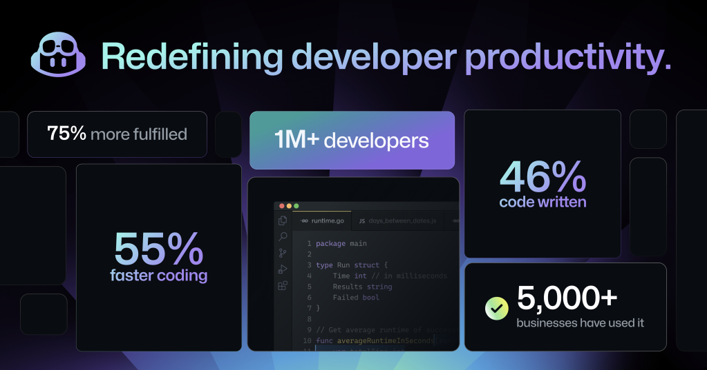
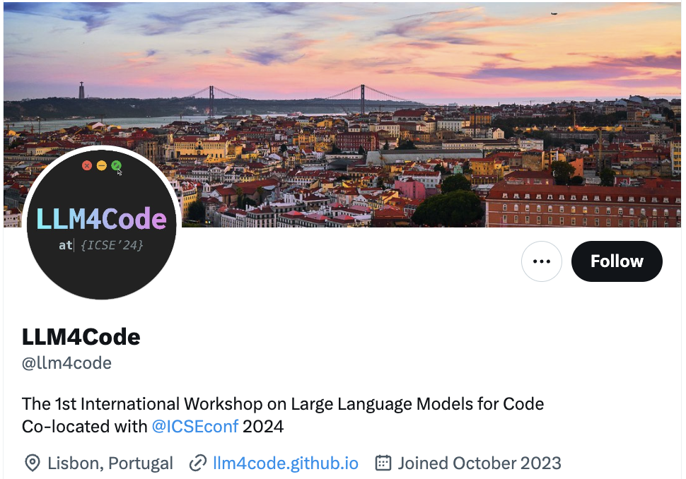
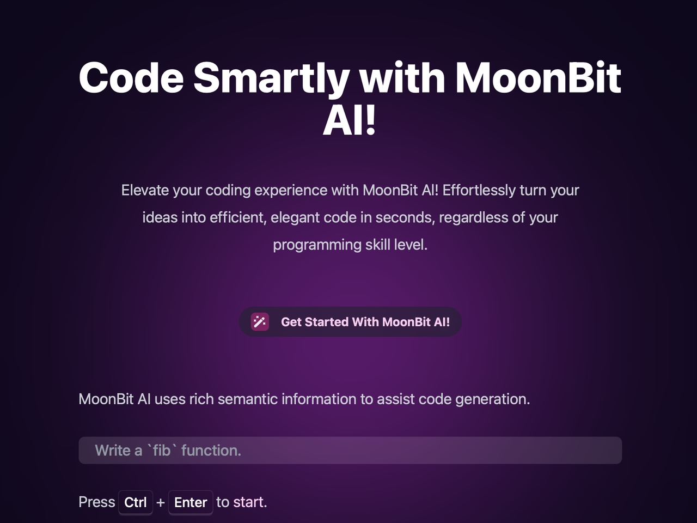
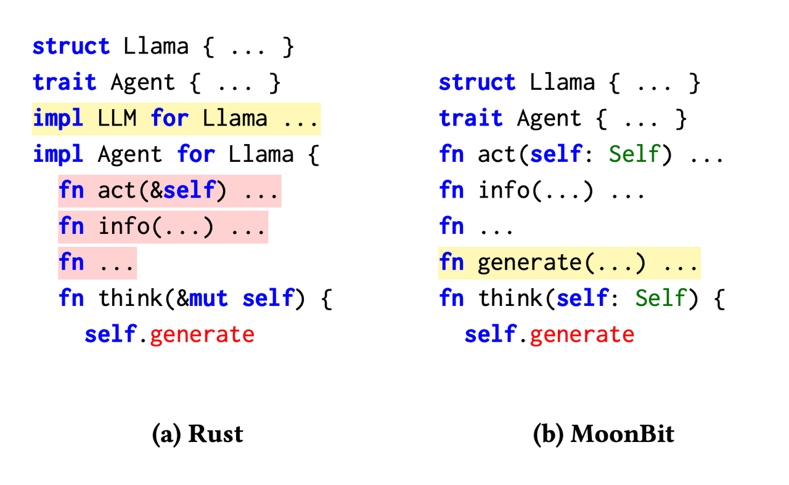
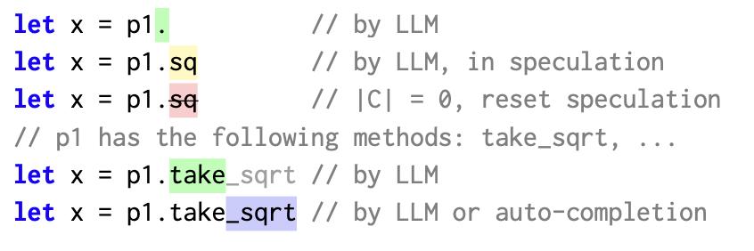
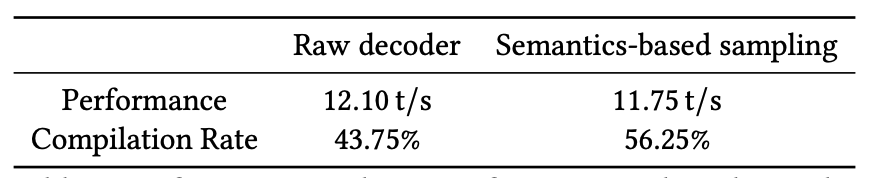

import aiVideo from './ai.mp4'

# Sora横空出世！AI将如何撬动未来？

<!--truncate-->

近日，OpenAI 发布首个视频生成“Sora”模型，该模型通过接收文字指令，即可生成60秒的短视频。

而在2022年末，同样是OpenAI发布的AI语言模型ChatGPT，简化了文本撰写、创意构思以及代码校验等任务。用户仅需输入一个指令，ChatGPT便能生成图片、文字或代码等多种形式的内容。

这一系列的进展不仅仅是技术上的突破，它们预示着一场全面的AI革命的到来，影响范围远超从前。AI技术的应用已经拓展到聊天机器人、绘图、音乐创作、代码生成、视频生成等领域，每一次迭代和升级都引起了全球的关注和热议。

在编程领域，AI的崛起，如ChatGPT和Github Copilot，正在改变开发者获取信息和编写代码的方式。在Andrej Karpathy的博客《Software 2.0》中，他探讨了人工智能如何改变软件开发方式：“Software 2.0代表着我们可以用大量的数据和算力来解决以前需要大量人力和成本来解决的复杂问题。” AI 编码助手则是上述的具体实现。

资料图片来源：Github

> 调查数据显示，AI编码工具不仅提高了整体生产力，还带来了技能提升的机会。75%的开发者表示在使用GitHub Copilot时感到更加充实，在具体的生产数据方面，Copilot能够完成高达46%的代码，帮助开发人员将编程速度提高了 55%。

## 大模型给已有的开发工作“降本增效”

未来的编码工作流程将呈现全新的面貌：AI 编码工具将可以大量生成短期的软件和测试解决方案，不再追求长期的可重复利用性，由于生产过程的高效自动化，未来的推理成本、推理延迟性都将大幅降低。另一方面，工程发展好坏并非在理论上有挑战，而是在工程实践中的持续优化和迭代，这主要体现在未来代码大模型将被提炼成中小型模型，从而实现在边缘设备运行的可能性。

> 在代码训练推理领域，实际上并不需要前后的历史知识和上下需要索引人文典故，可以预见的将来大模型会逐渐蒸馏成一个中小型模型，可能是70个亿的参数、10个亿参数或者100亿参数，这种规模就已经非常有效果了。

相对较小的模型让在边缘设备、个人电脑上的大模型运行成为可能。此外，硬件架构的升级让消费级硬件能够运行更大规模的模型，目前强大的Mac Pro等已经可以承载数百亿参数的模型。随着这种参数量化的发展，更多模型将能在边缘设备上运行，这是功能上的进步，并不涉及理论上的难点。这种发展在未来几年内将变得更加普遍。

同时**随着生成式 AI 的发展，编程语言之间的差异变得不再那么明显。随之带来的是编程语言的学习门槛降低。** 目前学习一门新的编程语言，其中一个关键点在于掌握其生态系统，包括语法和库的使用。举个例子，区分成熟的 Java 工程师和专业的 Java 工程师的主要因素之一是对各种库的熟悉程度和使用直觉。

未来，生成式AI的存在可能极大地简化这一过程。例如，当需要进行 JSON 解析时，生成式 AI 可以自动推荐合适的库。这就像有一个助手在一旁，不仅帮助选择合适的工具，还可以解释不熟悉的代码片段。因此，学习新语言将变得更加直观和简单。

这种变化预示着未来编程的重点可能会从对工具的关注转移到提供端到端体验上，开发者可以更加专注于创意和解决方案的实现，而不是编码的具体细节。

## 面向未来：MoonBit——为AI原生应用打造的编程语言

正是在这样的背景下，MoonBit应运而生。MoonBit在2022年10月推出，此时恰逢ChatGPT刚刚问世。MoonBit平台的出现不仅仅作为一种编程语言，更是提供一个完整的开发工具链，包括IDE、编译器、构建系统、包管理器等。我们处在一个特殊的位置，有机会去重新构想整个编程语言工具链该如何与AI更好地协作，开启了编程与AI结合的新篇章。

在不断的探索中，我们的努力得到了学术界的认可。最近，MoonBit团队的研究论文「MoonBit: Explore the Design of an AI-Friendly Programming Language」已经荣幸地被LLM4Code 2024接收！

同时，我们在[ai.moonbitlang.com](https://ai.moonbitlang.com)上设计了一个简单的MoonBit AI demo，非常欢迎你来尝试！我们也非常期待你的反馈，可以随时通过我们的[论坛](https://taolun.moonbitlang.cn)等渠道进行反馈。

让我们看看下面的视频，更具体地了解使用MoonBit AI进行端到端开发的体验是什么样子：

<video controls src={aiVideo} style={{width: '100%'}}></video>

从上面的视频可以看到，不同于ChatGPT，MoonBit AI可以实现从需求设定到代码实现，再到运行调试的无缝衔接，确保编程过程更加流畅高效。用户可以实时修改MoonBit AI生成的代码，获得即时反馈。同时，MoonBit AI重视用户体验，为大家提供一个更加便捷易用的用户界面。无论你是编程新手还是资深的开发者，都能轻松上手。

在文章接下来的部分，我们主要将讨论两个主要方面：

1. MoonBit如何设计成一种出色的、对AI友好的编程语言
2. 是什么驱动了MoonBit AI

### **平坦化设计，适配Transformer架构**

MoonBit作为AI时代的开发平台，设计强调清晰和简单，特别强调在顶层（toplevel）和局部（local）定义之间的清晰区分。MoonBit还采用了结构化接口实现（structural interface implementation），在这种方式中，一个类型通过实现其方法来实现一个接口，因此消除了额外嵌套代码块的必要性。

现有的大模型基本都基于自回归的 Transformer 架构。这意味着随着上下文窗口增长，生成单个 token 的复杂度呈 n² 上升。也就是说，大模型的推理会越来越慢。一个没有嵌套的编程语言有着较好的可读性，同时也能够在各个层级（RAG，decoder correction，backtrack）做到 KV 缓存友好，实现更高的推理速度。

让我们一起来看一个例子：

在图1(a)中所示的例子中，一名程序员正在为类型Llama实现特性Agent中的方法think。他们发现类型Llama缺少在特性LLM中定义的generation方法。由于他们处于一个嵌套代码块中，需要回到顶层来为类型Llama实现特性LLM。然而，在大型语言模型（LLMs）的上下文中，修改几个函数之前的提示会导致相关KV缓存段的无效，这在图中以红色突出显示。经过这样的修改，所有这些函数都要重新评估，这不仅浪费了计算资源，更关键的是，延长了输出的延迟时间。

相比之下，如图1(b)所示，MoonBit允许程序员和大型语言模型（LLMs）线性地开发他们的程序，无需频繁地来回跳转。通过结构化接口，实现接口的函数不限于特定的代码块。这允许几乎线性地生成接口及其各自的实现，从而有效地最大化利用KV缓存。

图1

### 快速实时的语义补全

MoonBit AI由两种定制的采样算法驱动：局部采样和全局采样。局部采样使用AI生成的代码进行实时调整，以确保代码遵循语法规范，而全局采样进一步验证代码的语义正确性。随着大型语言模型（LLM）生成新的token，MoonBit采样器将从局部和全局收集并利用信息，以确保每个生成的token不仅在语法上正确，而且没有明显的类型错误。这种方法提供了更可靠、更准确的代码生成，减少了后续调试和错误纠正的需要。

例如，当LLM编写程序时，它可能会生成一个不好的token。我们维护一个推测缓冲区来存储最后一个token。一旦token由LLM完成，我们将检查token是否有效。如果有效，我们接受它并将其提交给用户，如果不有效，我们就回溯并重试。为了防止LLM重复同样的错误，我们将告知LLM可能的继续操作，以做出更好的选择。

我们的实验显示，MoonBit采样器在编译率方面取得了显著提高，性能损失仅约3%。

## 当然，这只是个开始！

我们目前正在搭建一个包管理器，这对于收集额外数据以微调模型至关重要。未来，我们将持续增强MoonBit AI能力，包括加入代码辅助、审查、问答界面、测试生成和验证机制等功能。同时，我们正计划开发一个快速解释器，在运行时提供实时反馈。这将进一步提高AI生成代码的可靠性。

欢迎持续关注MoonBit AI的进展！
