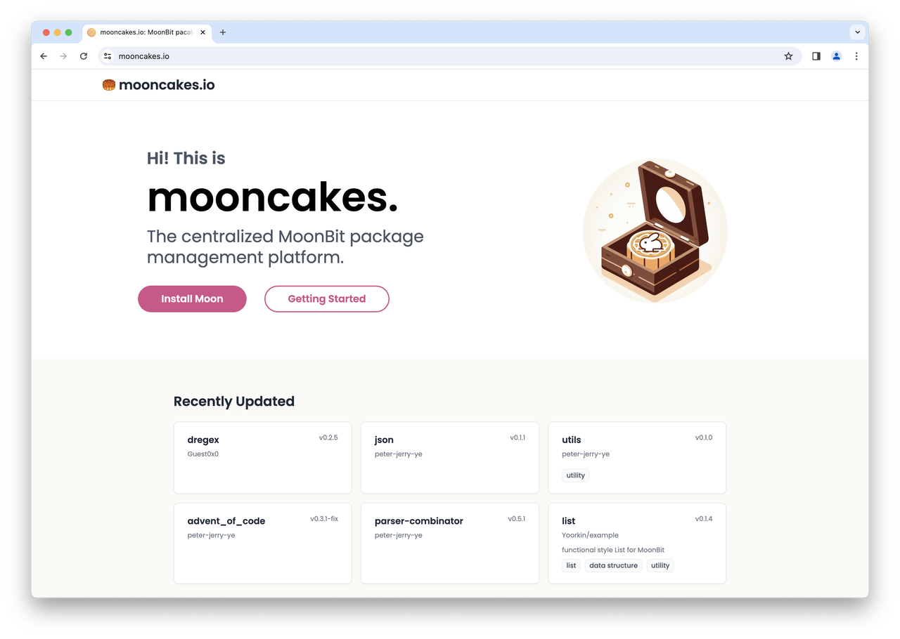

# 【新功能上线】mooncakes.io：新一代的MoonBit包管理平台来啦！！

今天，我们很高兴地宣布：mooncakes.io (MoonBit的包管理和共享平台)正式上线！与此同时，我们还推出了Moondoc，它用于记录mooncakes.io内各种包和库，确保开发者可以轻松使用各种资源。

MoonBit最大的价值在于生态，更多的人更早的参与进来可以帮助我们一起完善MoonBit平台，一起分享它的成长。虽然还处于非常早期的阶段，还有很多地方需要完善，但是我们想第一时间分享给大家！

接下来，让我们一起深入了解 mooncakes.io 的独特之处。

<!--truncate-->

## mooncakes.io：中心化的MoonBit包管理平台

mooncakes.io 是一个中心化的MoonBit包管理。在这里，用户可以轻松上传分享、使用以及探索各种MoonBit模块。

为此，MoonBit的构建系统`moon`集成了与 mooncakes.io 进行交互的命令，让用户可以免去手动下载和配置依赖的困扰。与其他大多数包管理器不同，MoonBit的依赖解析使用与Go类似的最小版本选择算法，可以精确地确定需要构建哪些依赖，不会隐式地升级新版本，从而为开发者打造稳定可重现的构建体验。

mooncakes.io 托管了所有用户发布的MoonBit模块，这些模块也可以称之为“月饼”。用户发布到 mooncakes.io 的内容以模块为最小单位，每个模块下可以有多个包。每个用户在 mooncakes.io 有自己独立的命名空间，用户上传的模块的名称格式为 `<username>/<package_name>`。在 mooncakes.io 发布的模块版本根据语义化版本2.0.0定义，月兔将根据兼容性解析具体的版本。

除此之外，mooncakes.io 还是一个文档托管平台，当用户成功发布一个模块之后，`mooncakes.io` 会自动构建该模块的文档页面。我们希望这样一个中心化平台能为用户提供简单、一致的使用体验。

为进一步增强用户体验，我们还提供与 mooncakes.io 深度整合的工具链。

## 与 mooncakes.io 深度整合的工具链

1. MoonBit的构建系统 `moon` 集成了与 mooncakes.io 进行交互的命令

`moon login`：登录到 mooncakes.io

`moon register`：在mooncakes.io上注册账号

`moon publish`：发布一个包到 mooncakes.io。其中版本号格式按照语义化版本2.0.0进行校验，对于同一个模块，每次发布的版本号必须单调递增。

`moon add`：添加一个依赖。例如 `moon add Yoorkin/example/list@0.1.2`，如果不指定版本 `moon add Yoorkin/example/list` 将会添加最新版本。构建系统会执行依赖解析，找到所有需要依赖的模块及其版本，然后从 mooncakes.io 下载相关模块到当前模块，同时自动更新 `moon.mod.json`。

`moon remove`：移除一个依赖

`moon tree`：以树状结构列出所有依赖

`moon update`：更新本地索引。索引中记录了 mooncakes.io 上所有的包的版本及其依赖信息。索引文件使用 `git` 进行管理，因此在完成第一次更新之后，后续的 `moon update` 便可只进行增量更新，这需要您的环境中有 `git` 命令。

`moon install`：按照 `moon.mod.json` 中 `deps` 字段自动安装所有依赖。

1. `moondoc`文档生成工具

`moondoc` 是一个从MoonBit项目收集文档注释并生成文档信息的命令行工具。在生成文档时，`moondoc`不仅分析顶层声明中的类型信息，还提供指向相应类型文档的链接。

用户可以在任何顶层的`fn`、`let`、`enum`、`trait`等结构前添加以`///`开头的文档注释，这些注释遵循Markdown格式。如下图所示：

当文档在mooncakes.io上被自动构建后，用户点击顶层签名中的类型，例如`self`参数带下划线的类型`Stack`，便可以跳转到`Stack`类型的文档。如下图所示：

构建系统 `moon` 中已经集成了用于本地文档生成的命令 `moon doc`以及用于文档预览的命令 `moon doc --serve`。

所有依赖管理、模块上传、文档的构建和预览都可以通过构建系统 `moon`完成。

## 详细文档

关于如何使用包管理的更多信息，请参阅文档**。**

如果你想了解更多关于如何使用mooncakes.io的信息，请参阅文档：[https://www.moonbitlang.com/docs/package-manage-tour](https://www.moonbitlang.com/docs/package-manage-tour)

## 我们期待你的反馈和贡献！😊

[mooncakes.io](http://mooncakes.io)的发布是推动MoonBit生态系统向前发展的关键一步，但这只是一个新的开始。接下来，我们会不断优化与改进[mooncakes.io](http://mooncakes.io)，以提供给用户更友好的体验。我们期待你的试用与反馈，你的建议是我们不断前行的动力，帮助我们不断地完善与改进。

同时，我们诚邀所有对MoonBit感兴趣的用户加入这个充满活力的社区。无论你是上传自己开发的包，还是为现有的包提供改进和建议，你的每一次贡献都将对[mooncakes.io](http://mooncakes.io)的生态系统产生积极影响。

快来开启你的mooncakes.io之旅，共同构建一个不断成长的社区！

## 更多问题？

如果你有任何建议或反馈，欢迎到[MoonBit论坛](https://discuss.moonbitlang.cn/)进行反馈，我们期待与你一起共同塑造MoonBit的未来。

---

### 准备好探索MoonBit了吗？

[下载 MoonBit](https://marketplace.visualstudio.com/search?term=moonbit&target=VSCode&category=All%20categories&sortBy=Relevance)，开启 MoonBit 语言新体验
