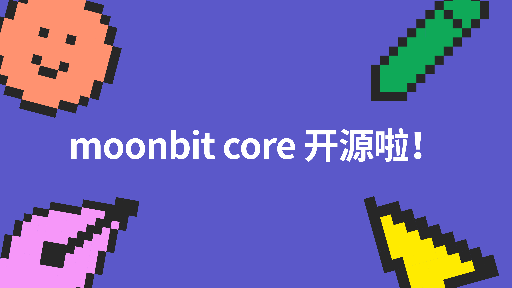
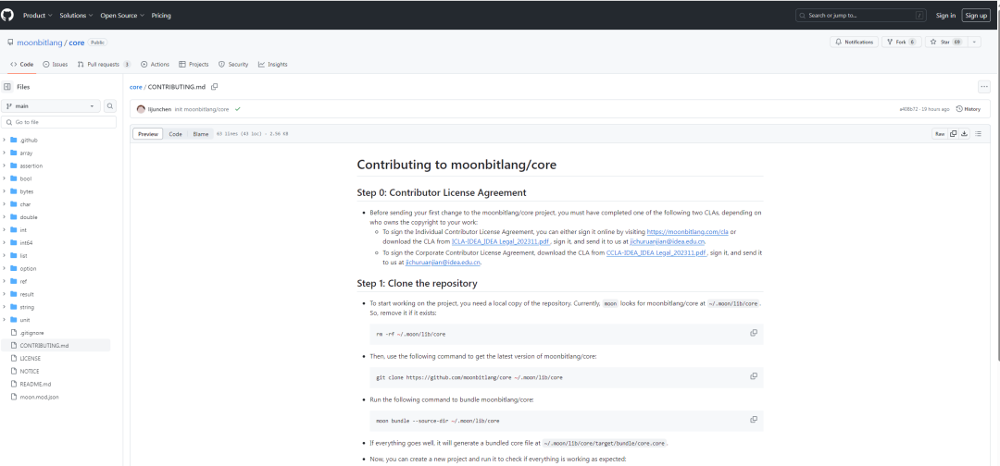

import aiVideo from './ai.mp4'

# 国人自主研发的编程语言 MoonBit Core 开源啦！

<!--truncate-->

## **MoonBit Core （MoonBit标准库）现已开源！**

目前，大多数人在编程时使用的是国外开发的 C、Java、Python 等编程语言。国产编程语言少之又少，特别是如果这门编程语言进行了开源，那所有个人和企业等都可以免费享受到这项「技术红利」！

敢为人先，总需要有人担当，虽然 MoonBit 刚起步不久，但目标却是星辰大海，MoonBit 诚邀优秀开发者，一起推动应用开发进程，引领科技进步！

**开源链接：** https://github.com/moonbitlang/core/blob/main/CONTRIBUTING.md

**开源协议：** Apache License 2.0

## **MoonBit 介绍**

国内首个工业级编程语言及其配套工具链MoonBit（https://www.moonbitlang.cn/）是由粤港澳大湾区数字经济研究院（福田）- 基础软件中心打造的AI原生的编程语言以及开发者平台。通过创新框架在程序语言界形成后发优势，在编译速度、运行速度、体积大小上已成功领先传统语言。

数据来源：https://github.com/MoonBitlang/MoonBit-docs/tree/main/benchmark/fibonacci

MoonBit 在 2022 年 10 月推出，那时恰逢 ChatGPT 刚刚问世。**MoonBit 平台的出现不仅仅作为一种编程语言，更提供一个完整的开发工具链，包括 IDE、编译器、构建系统、包管理器等。** 现在MoonBit处在一个特殊的位置，有机会去重新构想整个编程语言工具链该如何与AI更好地协作，力图开启编程与AI结合的新篇章！

<video controls src={aiVideo} style={{width: '100%'}}></video>

MoonBit AI 与 ChatGPT的对比

项目发起人张宏波现任 IDEA 基础软件中心首席科学家、MoonBit 平台负责人，是通用程序语言 ReScript 的作者，程序语言 OCaml 前核心开发人员。本科毕业于清华大学电子系，在美国宾夕法尼亚大学读博期间受 Bloomberg 邀请，从事函数式语言编译器的开发工作。

**张宏波主导的 ReScript 语言，目前仍是唯一一个由中国人制作的、在国际范围内有重要影响力的通用程序语言。** 该语言项目始于其个人兴趣，后广泛被世界各地的程序员采用。除英语外，ReScript 官方文档已被翻译成中文、韩语、葡萄牙语等多国语言版本。

当下 MoonBit 的开发即将进入 Beta 阶段，除了已优化的 WebAssembly 后端之外，还在积极开发更多的后端，从而将 MoonBit 推广给更广泛的受众。

为了进一步确保语言特性的稳定性，MoonBit 已搭建一套能够支持核心库开发的基础设施。MoonBit 语言希望可以在用户反馈的基础上不断地完善功能，因此 MoonBit 语言决定开源核心！

## **开源后的设想**

MoonBit 开源后，希望培育起生态系统，并着重扩展标准库。标准库范围广泛，包括高质量的数据结构、哈希算法、数学库、测试框架等等。MoonBit 的愿景远不止于成为另一门程序设计语言，而是旨在构建一个全方位的开发生态系统。

**开源核心仅仅是我们的第一步，未来 MoonBit 将逐步开源更多令人振奋的内容！**

---

### 准备好探索MoonBit了吗？

[下载 MoonBit](https://marketplace.visualstudio.com/search?term=moonbit&target=VSCode&category=All%20categories&sortBy=Relevance)，开启 MoonBit 语言新体验
