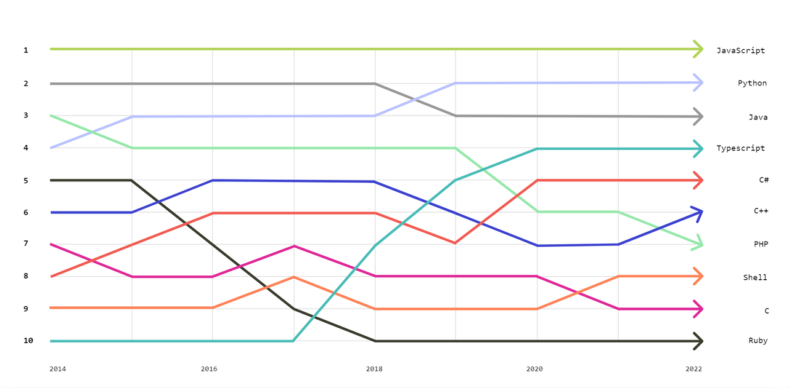
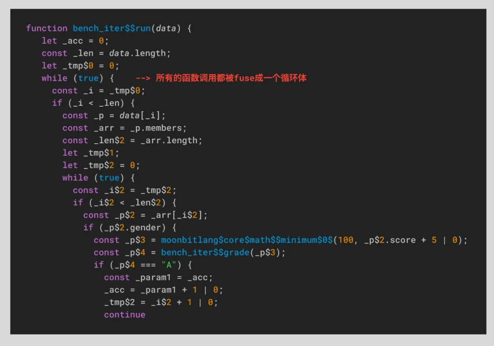
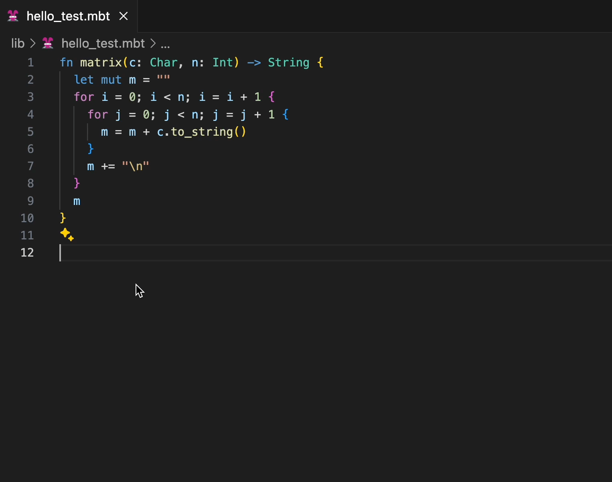

# IDEA研究院编程语言MoonBit发布JavaScript后端，速度提升25倍

从登顶HackerNews到走红日本社区，IDEA研究院MoonBit编程语言宣布重要更新：在率先通过支持WASM并显现显著优势后，将推出支持JavaScript后端的版本。

MoonBit诞生于2022年，**是专为云计算及边缘计算设计的AI云原生编程语言及开发者平台。** 作为一门诞生于AI与云原生的浪潮之中的编程语言，MoonBit汲取了多种语言的精华，特别是融合了Rust和Go的设计理念，使其不仅简洁易用，还具备强大的类型系统来增强容错性。同时MoonBit融合传统IDE智能与大模型智能，实现了智能代码生成的调整和修正。

MoonBit平台为WebAssembly提供了原生支持，在运行速度和代码体积方面领先于传统编程语言。随着团队能力的发展，MoonBit也扩展其支持到更多的后端，**目前已新增对JavaScript的支持并带来前所未有的性能提升，在JS后端实现了超出Json5近8倍性能的优势。**

## **为什么要支持JS：全球最大的开发者社区**

根据GitHub发布的“编程语言”流行度排行榜【1】，JavaScript占据榜首位置，它是目前就业市场和应用开发领域中最受欢迎和流行的编程语言之一。JavaScript拥有全球最大的开发生态，因此，大多数编程语言都支持 JavaScript后端。**MoonBit支持JavaScript，也意味着MoonBit进入了更加大众化开发者的生态**，是在软件开发领域和应用场景全覆盖的一次重要演进。



JavaScript常年高居编程语言流行度排行榜第一名。（数据来源：[https://octoverse.github.com/2022/top-programming-languages](https://octoverse.github.com/2022/top-programming-languages)）

但在当前编程环境中，市面上的大部分alt-js language都不如原生性能。根据以往的基准测试，一些编译后的代码比原生JavaScript的体积大几乎350倍。尽管ReScript/ReasonML在编译到JavaScript上显示出一定优势（其开发者也是MoonBit平台的负责人），但其性能与原生JavaScript仍存在一定差距。因此，对于开发者而言，**如果转译后的语言仅仅在可维护性上有少许提高，却以牺牲大量的体积和性能为代价，那么大多数情况下，原生JavaScript仍然是用户首选。**


数据来源：[https://unsafeperform.io/blog/2022-07-02-a_small_benchmark_for_functional_languages_targeting_web_browsers/](https://unsafeperform.io/blog/2022-07-02-a_small_benchmark_for_functional_languages_targeting_web_browsers/)

为此，**基于当前已有的alt-js language性能问题，MoonBit支持将代码编译到JavaScript后端，并在性能上显著超越原生JavaScript。**

## **基准结果：生成代码执行速度超出 JS 近 25 倍**

根据最新的JavaScript提案【2】— Iterator Helpers（迭代器助手），JavaScript能够原生支持无需中间数组的迭代操作。MoonBit也同步引入了相同的功能，进一步强化了在现代JavaScript开发环境中的适用性和效率。

我们先来看一个常见的例子：在处理大量学生成绩数据时，传统JavaScript代码通常需通过多个步骤处理数据，例如首先遍历1000个学生的成绩，将成绩转换为等级，然后按A、B、C、D、E排序，并筛选出A等级的学生，最后计算A等级学生的数量。这种方法虽直观，但由于需要生成多个中间数组，会导致性能问题。MoonBit在与原生支持迭代器助手的JavaScript进行比较后，**编写出来的JavaScript代码显示，MoonBit的执行速度比使用原生迭代器助手快了25倍。**

JS Iterator Helpers代码：

```jsx
export function run(data) {
  return data
    .values()
    .flatMap((c) => c.members)
    .filter((it) => it.gender)
    .map((it) => Math.min(100, it.score + 5))
    .map((it) => grade(it))
    .filter((it) => it === 'A')
    .reduce((acc, _) => acc + 1, 0)
}
```

MoonBit代码

```moonbit
pub fn task(data: Array[ClassRecord]) -> Int {
  data.as_iter()
    .flat_map(fn { it => it.members.as_iter() })
    .filter(fn { it => it.gender })
    .map(fn { it => @math.minimum(100, it.score + 5) })
    .map(fn { it => grade(it) })
    .filter(fn { it => it == "A" })
    .fold(fn { acc, _ => acc + 1 }, 0)
}

```

MoonBit引入了类似于Rust中的零成本抽象 —— Iter类型，这是一个针对常见数据处理场景进行特殊优化的库。此类型的设计利用了MoonBit的高级抽象能力，同时确保不引入任何额外的运行时开销。通过使用Iter，可以将多个处理步骤合并为一个连贯的流程，显著减少中间数组的生成，从而提高性能。**MoonBit的实现使得开发者能够编写逻辑清晰且高效的代码，无需担心性能损耗。**

这种实现方式优化了数据处理过程，尤其适合于需要处理大量数据或执行复杂数据转换的应用程序。**使用Iter类型，开发者可以更方便地构建高效且易于维护的系统，充分发挥MoonBit的性能优势。**


Benchmark来源：https://github.com/moonbit-community/benchmark-202404.git

►**生成代码执行速度：**我们将MoonBit生成的代码的执行速度与JS进行对比，快了超过25倍。这种方法不仅简化了代码，还提升了处理效率，允许开发者专注于业务逻辑而非性能优化，减少开发者的心智负担。

►**一秒内执行测试任务的次数：**MoonBit的性能是原生JavaScript的25倍，这意味着MoonBit在每秒内能执行的操作（Ops/Sec）远超原生JavaScript。


以下是使用MoonBit进行优化后的代码示例及其编译结果：



Iter代码MoonBit生成的JS

## **MoonBit JS vs. JSON5：性能快近8倍**

最新的性能测试结果显示，MoonBit Core标准库移植了npm上top 0.1%的Json5库，经过MoonBit编译之后的JS，比Json5库快接近8倍。**计算任务执行效率的性能提升意味着 MoonBit能够在相同的时间内执行更多的解析任务，**极大地提高了数据处理效率。


Benchmark 来源：https://github.com/moonbit-community/benchmark-202404.git

### **为什么MoonBit比Json5的运行速度快？**

之所以能取得这样的性能优势，**关键在于MoonBit在处理数据时做了优化：将字符串直接转换为整数进行处理。** 由于JavaScript本身没有字符类型，字符在JS中也是以字符串形式存在的，这意味着任何字符操作，实际上都是在字符串层面上进行，自然比直接操作整数要慢。

此外，**MoonBit利用编译技术优化了代码处理过程。** 例如，在编译过程中，字符常量会被转换为它们的Unicode codepoint值。这样在执行时就可以直接利用这些预编译的整数值，而不是在运行时动态处理字符。同样，对于switch语句，整数的switch操作可以编译成更快的指令，而字符串的switch操作效率就相当于一连串的if判断，速度会慢很多。MoonBit还引入了多项与JS无关的通用优化技术，如常量折叠、尾递归转换为循环、可选字符（Option[Char]）的解包优化以及迭代器融合（Iter fusion），从而提高了整体编译和运行效率。

除了这些已经实现的优化，MoonBit团队仍在不断探索新的改进方式。例如，未来的优化计划包括将整型数组（Array[Int]）编译到Int32Array，等等。为了确保性能的持续提升并防止性能回退，**MoonBit已建立了一套监测机制，对新的更改进行严格的性能评估。**

除了运行性能，MoonBit在编译性能上也表现出色，能够无需等待响应，即时编译至JS。MoonBit JS复用MoonBit的IDE以及整套工具，借鉴以往IDE的架构经验。MoonBit在语言设计之初充分考虑了IDE、构建系统、语言设计的协同，**实现类型检查和推断的高度并行化和增量化。**

## **开箱即用的工具链支持**

此前有很多语言长时间内都未能支持sourcemap调试功能。**MoonBit不仅支持JavaScript代码，且目前所有的工具链都支持开箱即用**。

### **►完善的sourcemap支持，友好的调试支持**

去年，MoonBit推出了调试器（Debugger）功能，这是相对于其他语言通常在成熟阶段才拥有的。即便跟编译性能与运行性能相近的ReScript相比，MoonBit已提供sourcemap支持，而ReScript在这方面迟迟没有提供支持。目前，该功能已支持源码映射、基于源码设置断点、输出sourcemap等，在浏览器中进行源码调试。**这项功能的推出不仅减轻了开发者在代码调试方面的负担，还显著提升了开发和调试的流畅性。**

MoonBit的sourcemap和调试支持优化开发者的调试体验，确保JavaScript代码的生成尽可能贴近源码，变量名和字段名保持一致，便于使用浏览器的DevTools进行源码检查和调试。


Repo地址：https://github.com/moonbit-community/moonbit-js-debug-demo.git

### **►本地 test codelens 的全新支持**

此外，MoonBit IDE支持本地环境的test codelens，且本地环境已支持expect test的自动更新。相较于此前用户需要手动编写命令行的版本，现在只需要点击「Run Test | Update Test」即可完成毫秒级的编译，**几乎无需等待响应，大幅提升了测试的效率。**



功能的具体效果展示

如果你想自己尝试一下，可以复制点击：
[https://github.com/moonbit-community/benchmark-202404/tree/master/bench_json5](https://github.com/moonbit-community/benchmark-202404/tree/master/bench_json5)

## **MoonBit 初获国际认可**

MoonBit在2023年8月18日首发后，在国内外社区引发了热烈的讨论，**并在发布不到一天的时间内登顶硅谷知名科技社区HackerNews头版头条。**


MoonBit登顶HackerNews头版头条

随着开源计划的逐步推进，MoonBit在今年3月首次开放标准库后，迅速获得了社区的广泛认可和积极响应。标准库开源至今，MoonBit收到了超过501次添加新功能的记录，并且收到261次请求将改动合并到主代码库中。其中80%的提交已被成功合并，这些贡献来自于40多位代码提交者，不仅包括具有丰富开发经验的专业人士，也有国内外的高中在读学生。值得一提的是，这些学生提交的代码质量堪比资深开发者。


MoonBit标准库代码贡献

此外，今年4月，技术爱好者开发者@mizchi在日本著名的开发者社区zenn.dev上发表了一篇关于MoonBit的详细介绍文章，**该文章引发热议并迅速攀升至热门榜首。**文章通过MoonBit与其他编程语言的对比和实际体验，进一步加深社区对MoonBit优势的认识，使得该平台获得了新一轮的正面评价和关注。


日本开发者社区对MoonBit的评价（点击大图）

## **未来展望**

截至今日，MoonBit已经通过支持WebAssembly和JavaScript来完善其生态系统，并在行业内达到领先水平。在未来，MoonBit计划扩展到更多后端平台，如Native和JVM，并开发自有的运行时及云端部署环境，进一步强化其工具链支持。MoonBit平台不仅仅是一种编程语言，它还提供了一个全面的开发工具链，包括集成开发环境（IDE）、编译器、构建系统和包管理器等，**为开发者提供了一站式的软件开发解决方案。**


MoonBit本年计划“剧透”

附录：

【1】：https://octoverse.github.com/2022/top-programming-languages

【2】：https://github.com/tc39/proposal-iterator-helpers
