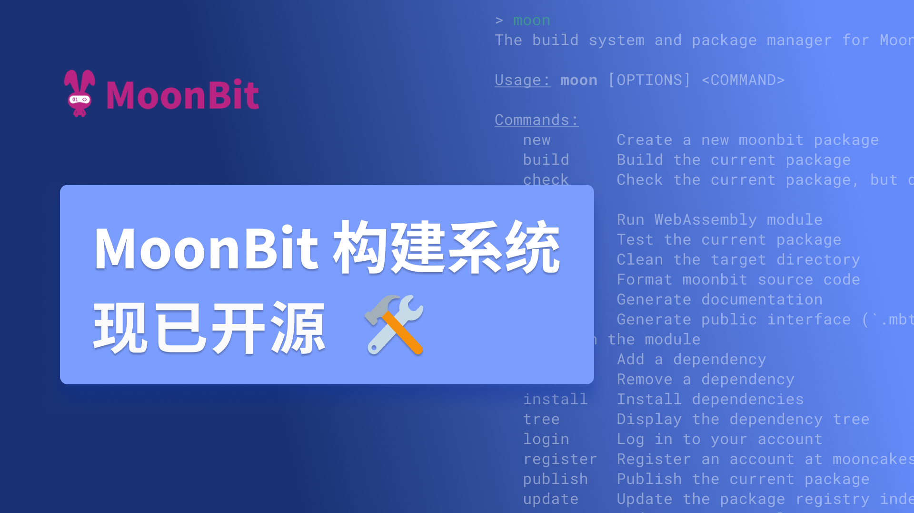
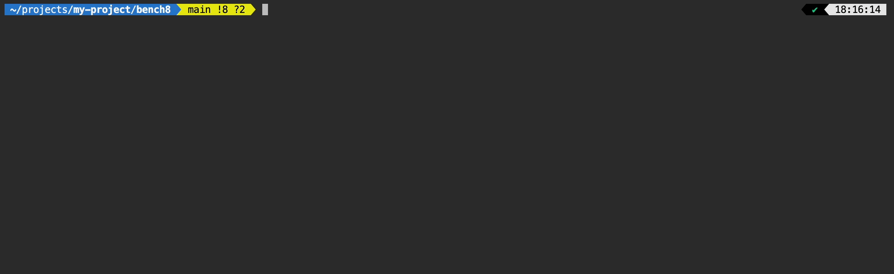
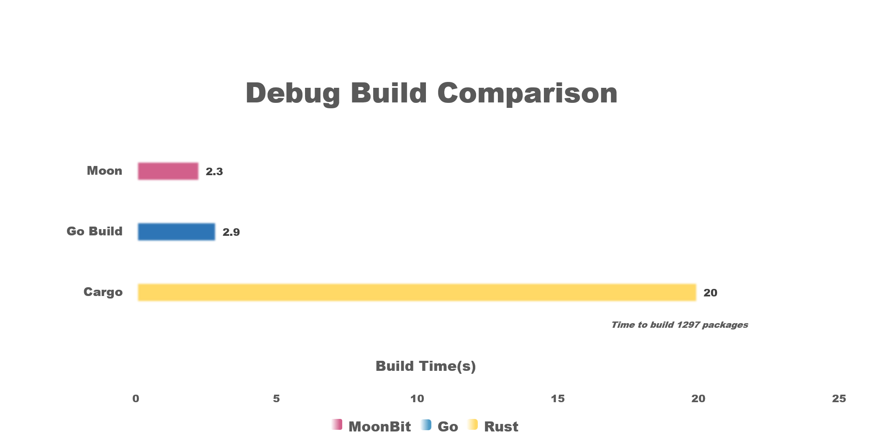
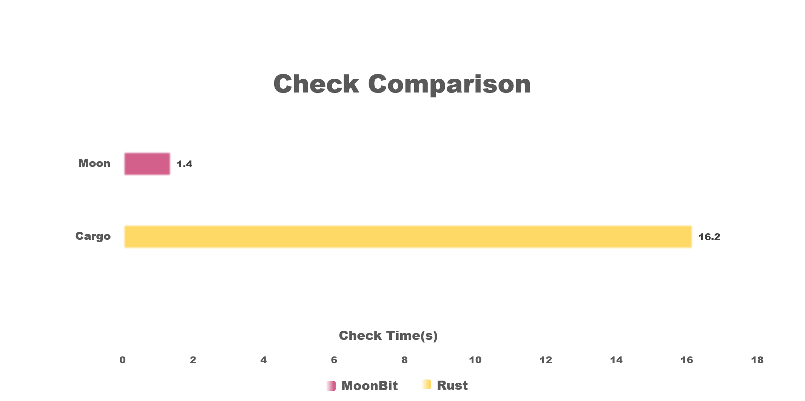
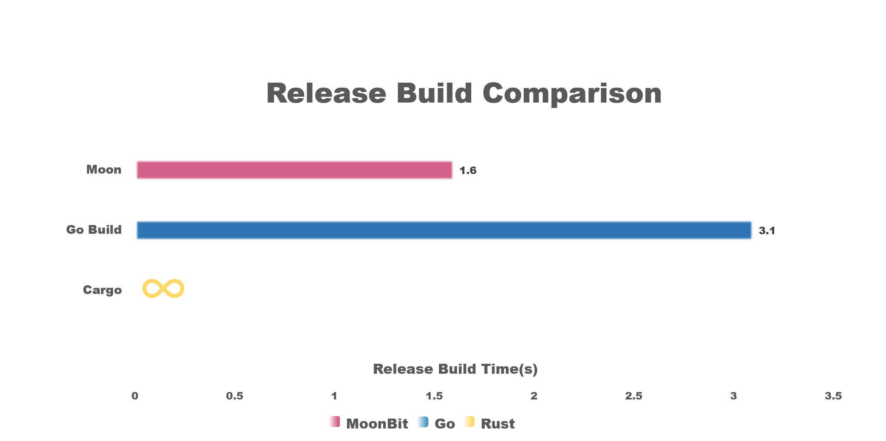
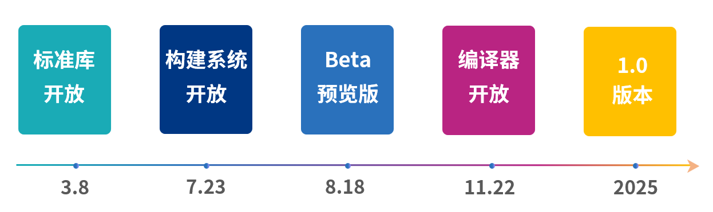

# MoonBit 构建系统正式开源



作为由 AI 驱动的云服务和边缘计算开发者平台，MoonBit 自设计之初便注重工具链与语言的协同效果。MoonBit 为开发者提供了一套开箱即用的工具链，包括集成开发环境（IDE）、编译器、构建系统和包管理器，使开发者在使用 MoonBit 时能够轻松入门，极大提高开发效率、代码质量和项目的可维护性，减少繁琐的手动操作和配置管理，从而更加专注于开发的核心逻辑与创新，以提升整体开发体验和生产力。
MoonBit 的构建系统 moon 启动于 2023 年 5 月，今天已通过 GitHub [moonbitlang/moon](https://github.com/moonbitlang/moon) 公开，以 AGPL 协议开源。

## moon：MoonBit构建系统

moon 是 MoonBit 的构建系统，为 MoonBit 项目提供编译构建，自动化测试工具（集成 [expect test](https://www.moonbitlang.cn/blog/expect-testing)），覆盖率测试、包管理器等功能，此外，moon 作为 MoonBit 语言编译工具链的重要组件，与 IDE 紧密结合，为 IDE 分析代码提供了详尽的项目结构和依赖等信息。

moon 用 Rust 开发，得益于 Rust 语言的内存安全、高性能和并发处理能力、跨平台等特性，确保构建过程的稳定性和速度。

moon 的并行与增量构建功能得益于 [n2](https://github.com/evmar/n2) 项目（n2 与 ninja 都是由 Evan Martin 创建，n2 相比 ninja 更加轻量，并且在增量构建方面更出色），对其修改部分将保持原项目的开源协议 [moonbitlang/n2](https://github.com/moonbitlang/n2)。

## 为什么选择 moon



- 速度

  - MoonBit 的编译器速度极快，这得益于其精心设计的编译流程和优化策略。作为用户与编译器之间的桥梁，moon 在底层设计上力求精简，最小化自身的封装开销，从而最大化编译速度。

  - 此外，moon 还为集成开发环境（IDE）提供了详尽的项目结构和依赖等信息，这对于对延迟极为敏感的 IDE 场景至关重要。moon 通过优化核心构建步骤的性能，确保了即使在高度交互的开发环境中也能提供流畅的用户体验。

- 并行增量构建

  - moon 得益于 n2 项目的并行增量构建功能是其高效性的关键所在。通过自动分析和理解各个构建任务之间的依赖关系，moon 能够智能地将独立的任务并行化处理，充分利用现代多核处理器的强大性能，从而显著加快构建速度。更为重要的是，moon 仅对自上次构建以来发生更改或其依赖项有所更新的文件进行构建，这种增量构建策略极大地提高了构建效率，使得 moon 能处理需要频繁构建的大型项目。

- 集成和测试支持

  - 与自动化测试工具紧密结合，能够在代码提交和构建过程中自动执行单元测试、集成测试和端到端测试，确保每一行代码都经过严格的检验。

  - 在代码质量保障方面，MoonBit 提供了代码格式化和静态分析工具，这些工具能够自动检查代码风格的一致性，并识别潜在的逻辑错误和安全漏洞。在持续集成/持续部署（CI/CD）的流水线中，这些功能尤为重要，它们能够在代码合并到主分支之前，及时发现并报告代码质量问题，从而确保团队能够协同开发出高质量的代码。

## Benchmark

### 构建矩阵性能测试

我们测试了 moon 在编译构建具有复杂依赖关系的项目时与 Rust cargo、Go 的性能差异。测试包括生成 DR _ DC 目录，即目录矩阵，每个目录包含 MR _ MC 模块，即模块矩阵。模块矩阵 r 行 c 列中的模块依赖于同一目录前一行中的所有模块。一个目录中的第一行模块依赖于前一行目录中的所有模块。这种依赖关系便于测试并行性，同一行中的模块可以并行编译，同一行中的目录也可以并行编译。如想进一步了解测试准则请参见 [omake1](http://blog.camlcity.org/blog/omake1.html)，项目生成器代码见 [moonbit-community/build-matrix](https://github.com/moonbit-community/build-matrix)。

在我们的测试中，取 DR、DC、MR、MC 均为 6，加上 `main` 模块后，每个项目都包含 1297（6^4 + 1）个包。测试环境为 MacBook Pro Apple M3 Max 128G RAM，操作系统为 macOS 14.4.1，测试结果如下：



**调试构建：** 在调试构建（debug build）任务中，moon 依旧表现优异，用时 2.3 秒，go 次之，为 2.9 秒，而 cargo 最慢，耗时 20.0 秒。



**类型检查：** 在类型检查（check）任务中，moon 的性能最佳，耗时仅为 1.4 秒，而 cargo 则需要 16.2 秒，go 在此项任务中无数据。go 没有类似于 `moon check` 与 `cargo check` 仅执行类型检查的命令，因此结果为 `-`。



**发布构建：** 在发布构建（release build）任务中，moon 的表现依然出色，仅耗时 1.6 秒，go 为 3.1 秒，而 cargo 则未能完成任务。`cargo build --release`在该项目中耗尽内存后崩溃，因此结果为 `∞`。

值得注意的是，moon 的发布构建要比调试构建的速度更快。

而当 DR、DC、MR、MC 均为 8 时，共 4097 个模块，`moon build` 用时为 5.7 秒，`go build` 用时 11.2 秒，而 `cargo build` 用时 1043 秒。在此项测试中，moon 与 go 均在数秒内完成，而 cargo 已经无法在合理的时间完成此项目的构建。

### 标准库上的性能测试

目前 [moonbitlang/core](https://github.com/moonbitlang/core) 为最大的 MoonBit 项目，截止到 2024/07/03，它共有 38177 行代码，46 个包，195 个.mbt文件，2576 个测试。对项目进行类型检查仅需 0.28 秒，执行全部测试仅需 1.27 秒。

## 马上使用 moon

- 访问[下载页](https://www.moonbitlang.cn/download/#moonbit-cli-tools)安装脚本下载 MoonBit 工具链，或者在 VS Code 中安装 MoonBit 插件后根据提示一键安装

- 用法：`moon help`

```plain text
The build system and package manager for MoonBit.

Usage: moon [OPTIONS] <COMMAND>

Commands:
  new       Create a new moonbit package
  build     Build the current package
  check     Check the current package, but don't build object files
  run       Run WebAssembly module
  test      Test the current package
  clean     Clean the target directory
  fmt       Format moonbit source code
  doc       Generate documentation
  info      Generate public interface (`.mbti`) files for all packages in the module
  add       Add a dependency
  remove    Remove a dependency
  install   Install dependencies
  tree      Display the dependency tree
  login     Log in to your account
  register  Register an account at mooncakes.io
  publish   Publish the current package
  update    Update the package registry index
  coverage  Code coverage utilities
  bench     Generate build matrix for benchmarking (legacy feature)
  upgrade   Upgrade toolchains
  version   Print version info and exit
  help      Print this message or the help of the given subcommand(s)

Options:
      --source-dir <SOURCE_DIR>  The source code directory. Defaults to the current directory
      --target-dir <TARGET_DIR>  The target directory. Defaults to `source_dir/target`
  -q, --quiet                    Suppress output
  -v, --verbose                  Increase verbosity
      --trace                    Trace the execution of the program
      --dry-run                  Do not actually run the command
  -h, --help                     Print help
```

## 如何贡献

我们欢迎来自社区各种形式的贡献，如文档、测试以及 issue 等，详细内容请参考[贡献指南](https://github.com/moonbitlang/moon/blob/main/docs/dev/README.md)。

## MoonBit 开源计划

自去年正式发布以来，MoonBit 已于今年 3 月 8 日对外[开放标准库](https://github.com/moonbitlang/core/tree/main)，在社区的热情贡献下，已经成功实现完备的数据结构库，进一步丰富了 MoonBit 语言的应用场景，使语言生态系统走向成熟。在本次构建系统开源后，我们将于下个月 8 月 18 日发布 MoonBit Beta 预览版本，标志着 MoonBit 语言达到一个相对成熟的阶段，可以供早期用户和开发者进行实际项目的开发和测试。在今年年底 11 月 22 日，MoonBit 编译器核心部分将正式开源。



**你还能做什么**

- [开始使用 MoonBit](https://www.moonbitlang.cn/download/)

- 查看[ MoonBit 文档](https://www.moonbitlang.cn/docs/syntax)

- 学习基于MoonBit设计的课程[《现代编程思想》](https://www.moonbitlang.cn/course/)

- 试用[库](https://www.moonbitlang.cn/gallery/)中在MoonBit IDE上运行的项目

- 加入[官方 Discord 中文论坛](https://discord.gg/nQGF77Dyek)
