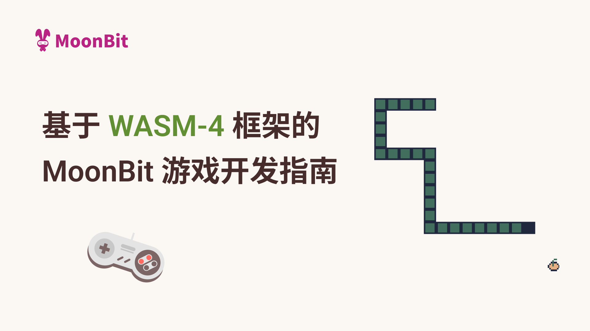

# 基于 Wasm4 框架的 MoonBit 游戏开发指南

> MoonBit 即将面向全国举办“编程创新挑战赛”，并包含游戏赛道。本教程将介绍本次比赛中使用的框架 Wasm4，以及如何使用 MoonBit 在 Wasm4 框架中编写游戏。相关赛事详情见文末。



如果你曾访问过 [mooncakes](https://mooncakes.io) 或我们官网的[库](https://www.moonbitlang.cn/gallery)，你可能已经注意到我们发布了一个名为 [`wasm4`](https://mooncakes.io/docs/#/moonbitlang/wasm4/)的包以及一个新的演示项目 [`Wasm4 Snake`](https://www.moonbitlang.cn/gallery/wasm4-snake/)。今天我们将向大家介绍这个出色的游戏开发框架，并演示如何使用 MoonBit 开发。

## 什么是 Wasm4

[WASM-4](https://wasm4.org/) 是一个使用 WebAssembly 构建复古风格游戏的框架。它提供了一个 160 x 160 像素的游戏主机，内存少于 64K。通过使用 WebAssembly 这一指令集的新标准，这些游戏能够在所有网页浏览器上运行，甚至可以在一些低端设备上运行。任何能够编译为 WebAssembly 的编程语言都可以用于开发游戏。随着 MoonBit Wasm4 SDK 的发布，现在开发者也能使用 MoonBit 轻松开发 Wasm4 游戏。

本教程将详细介绍如何使用 MoonBit 制作你的第一款 Wasm4 小游戏。

## 开发教程

MoonBit 库支持实时重载，你可以在我们的云 IDE 中试玩官方提供的 Wasm4 贪吃蛇游戏。

通过 MoonBit 提供的云 IDE，你可以直接在 gallery 上体验和开发游戏，无需任何安装步骤

gallery: https://www.moonbitlang.cn/gallery/wasm4-snake/

在您在本地端开发，你需要安装：

- [Node.js](https://nodejs.org/en)
- [MoonBit](https://www.moonbitlang.cn/download/)工具链

### 创建项目

在当前目录下使用 MoonBit 创建一个新项目，并使用 `npm` 安装 `wasm4`。

```bash
moon new --user moonbit --name demo --lib --path .
npm install -D wasm4
```

完成后，你将看到如下的目录结构（`node_modules` 目录未列在内）：

```bash
.
├── .gitignore
├── lib
│  ├── hello.mbt
│  ├── hello_test.mbt
│  └── moon.pkg.json
├── moon.mod.json
├── moon.pkg.json
├── package-lock.json
├── package.json
├── README.md
└── top.mbt
```

其中 `moon.mod.json` 定义了整个项目的配置，`moon.pkg.json` 则定义了每个包的配置。`top.mbt` 将作为游戏的主要入口文件，我们可以在 `lib` 目录中编写辅助函数，而  `hello_test.mbt` 提供了一个黑箱测试的示例。在这个示例中，我们将不使用 `lib` 目录。

### 添加 Wasm4 依赖

在创建项目后，我们需要添加  `moonbitlang/wasm4`依赖：

```bash
moon update && moon add moonbitlang/wasm4
```

这将导致 `moon.mod.json` 变更为如下内容（以当前版本为例）：

```json
{
  "name": "moonbit/demo",
  "version": "0.1.0",
  "deps": {
    "moonbitlang/wasm4": "0.2.0"
  },
  "readme": "README.md",
  "repository": "",
  "license": "Apache-2.0",
  "keywords": [],
  "description": ""
}
```

同时，还需要将 `moon.pkg.json` 修改如下，以满足要求：

```json
{
  "import": [
    "moonbitlang/wasm4"
  ],
  "link": {
    "wasm": {
      "exports": [
        "start",
        "update"
      ],
      "import-memory": {
        "module": "env",
        "name": "memory"
      },
      "heap-start-address": 6560
    }
  }
}
```

在这一步有几点需要注意：

- 我们将 `moonbitlang/wasm4/lib` 包导入为 `wasm4`，所以需要使用 `@wasm4` 修饰符来调用函数和类型。

- 我们将此包配置为 Wasm 后端的链接目标，并进行了以下设置：

  - 按照 Wasm4 的要求，导出 `start` 和 `update` 函数。

  - 导入名为 `env` 模块中的 `memory` 内存，以符合 Wasm4 的 ABI 规范。

  - 为了与 Wasm4 的 ABI 兼容，将 MoonBit 的堆内存起始地址设为 6560。低于 6560（0x19a0）的内存空间将保留给 Wasm4 使用。

相应地，我们将修改 `top.mbt` ：

```moonbit
pub fn start() -> Unit {

}

pub fn update() -> Unit {

}
```

现在，可以通过以下命令执行：

```bash
moon build --target wasm
npx wasm4 run target/wasm/release/build/demo.wasm
```

如有需要调试并查看带有函数名的堆栈跟踪信息，也可以使用调试模式：

```bash
moon build --target wasm -g
npx wasm4 run target/wasm/debug/build/demo.wasm
```


在这一步，浏览器会自动打开并显示游戏画面。接下来，让我们开始添加游戏内容吧！

### 示例：移动方块

首先，在屏幕上绘制一个方块：

```moonbit
pub fn start() -> Unit {

}

pub fn update() -> Unit {
  @wasm4.set_draw_colors(index=1, 2)
  @wasm4.rect(0, 0, 80, 80)
}
```


现在，你应该看到这样的画面。Wasm4 提供了四个调色板和四种绘图颜色。根据具体的 API，将使用相应的绘图颜色。这里的操作是我们将绘图颜色 1 设置为第二个调色板的颜色，然后从位置 `(0, 0)`开始绘制一个 80 x 80 的矩形。请记住，在编程世界中，显示坐标的原点位于左上角，y 轴方向朝下。

`moonbitlang/wasm4` 提供了一个高级抽象，使你可以轻松编写代码。为了避免混淆，绘图颜色和调色板的索引从 1 开始。你还可以设置 160 x 160 像素中的每一个像素。有关这一步的设置请参阅官方 [Wasm4 document](https://wasm4.org/docs/guides/basic-drawing) 和 MoonBit 的 [SDK API](https://mooncakes.io/docs/#/moonbitlang/wasm4/)。

现在屏幕上显示了一个静止的方块，但毕竟我们是在开发游戏，所以它最好是能动起来。`start` 函数将在初始化期间调用一次，而 `update` 函数将以 60Hz 的频率被调用。因此要让方块移动起来，我们可以这样编写代码：

```moonbit
struct Position {
  mut x : Int
  mut y : Int
}

let pos : Position = { x: 0, y: 0 }

pub fn update() -> Unit {
  if pos.x + 80 <= 160 {
    pos.x += 1
  }
  @wasm4.set_draw_colors(index=1, 2)
  @wasm4.rect(pos.x, pos.y, 80, 80)
}
```

然后它将变成这样（实际的移动速度会比图上显示的速度更快）：


### 操纵方块

Wasm4 提供了两个按钮（`X` 和 `Z`）以及四个方向按钮。让我们尝试让方块根据用户的输入移动吧！

```moonbit
pub fn update() -> Unit {
  if @wasm4.get_gamepad(index=1).button_right && pos.x + 80 < 160 {
    pos.x += 1
  } else if @wasm4.get_gamepad(index=1).button_down && pos.y + 80 < 160 {
    pos.y += 1
  } else if @wasm4.get_gamepad(index=1).button_left && pos.x >= 0 {
    pos.x -= 1
  } else if @wasm4.get_gamepad(index=1).button_up && pos.y >= 0 {
    pos.y -= 1
  }
  @wasm4.set_draw_colors(index=1, 2)
  @wasm4.rect(pos.x, pos.y, 80, 80)
}
```


### 更多开发内容

在调试过程中，你可以使用 `@wasm4.trace` 将调试信息写入控制台。此外，按下 `F8` 键查看详细的运行状态，如之前的截图所示。

如果要发布游戏，可以运行以下命令生成一个独立的 HTML 页面：`npx wasm4 bundle --html game.html target/wasm/release/build/demo.wasm`。通过静态文件服务器，其他人就能够轻松体验你设计的游戏。

Wasm4 支持最多四名玩家同时联网游戏，而且无需额外配置。这意味着你可以轻松创建自己的多人蛇蛇大作战，并与朋友一起享受游戏乐趣！更多信息请参考 [Wasm4 文档](https://wasm4.org/docs) 和 [SDK API](https://mooncakes.io/docs/#/moonbitlang/wasm4/)。

## 总结

还等什么？使用支持实时重载的 [MoonBit 库](https://www.moonbitlang.cn/gallery/wasm4-snake/)开始你的第一个 Wasm4 游戏吧，玩得开心！

如果对 Wasm4 框架下的游戏风格还不熟悉，访问 Wasm4 官方页面查看[更多案例](https://wasm4.org/play)。

## MoonBit 全球编程挑战赛

由深圳市河套深港科技创新合作发展署指导，IDEA-MoonBit 联合名企一线互联网大厂、全国知名高校举办的 MoonBit 全球编程创新挑战赛，即将拉开帷幕！

在游戏赛道中，参赛者将通过使用 MoonBit 编程语言和 Wasm4 框架，开发出具有创新性和趣味性的游戏作品，展示他们的创造力和编程技巧。

在 MoonBit 全球编程挑战赛中，每位参赛者都有机会让自己的作品得到广泛的推广，创作优秀作品的参赛者将得到丰厚奖金与奖品，表现突出的参赛者更有机会获得知名企业提供的工作或实习机会，为你的职业发展添砖加瓦！

大赛的更多信息和报名细节，后续将通过 MoonBit 的官方平台发布，敬请期待～

**更多资源**

- [开始使用MoonBit](https://www.moonbitlang.cn/download/).
- 查看[MoonBit文档](https://docs.moonbitlang.cn/).
- 学习基于MoonBit设计的课程[《现代编程思想》](https://moonbitlang.github.io/moonbit-textbook/)
- 加入[中文论坛](https://taolun.moonbitlang.com/)
- 查看多人Wasm4游戏案例：[双人乒乓](https://docs.moonbitlang.cn/examples/pingpong/)
