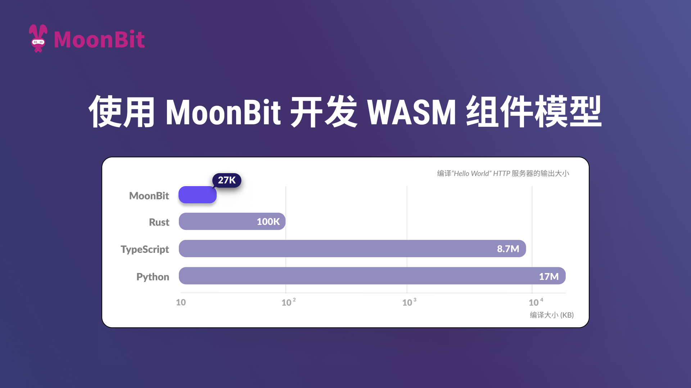
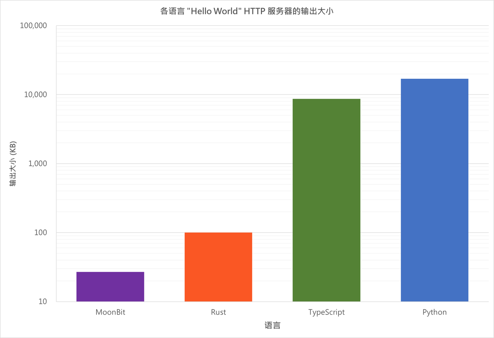

# 使用 MoonBit 开发 Wasm 组件模型



## Wasm组件

WebAssembly（Wasm）是一种新的低级虚拟指令集标准（low-level virtual instruction set standard），用于沙箱模型。低级的，意味着它接近原生速度。虚拟的，意味着它可以在包括浏览器和操作系统在内的多个运行时（runtime）上运行，例如[wasmtime](https://wasmtime.dev/)或[wamr](https://github.com/bytecodealliance/wasm-micro-runtime)。它是沙箱模型，这意味着它不能与外界交互，除非使用FFI。不过FFI只能返回数字，因此通过线性内存进行数据传输是更有效的方法。许多编程语言都可以编译成Wasm，包括Java、JavaScript/TypeScript、Python、Rust以及当然还有[MoonBit](https://www.moonbitlang.cn)。

那么如何结合用不同编程语言实现的Wasm组件呢？我们便需要引入组件模型（component model），一个统一接口的提案。通过组件模型，我们可以定义一个高级抽象的API。只要接口匹配，组件就可以与不同组件结合。

本文将介绍如何使用MoonBit编写一个输出“Hello World”的小型HTTP服务器。通过本教程我们可以看出，MoonBit在开发Wasm组件模型时实现了高兼容性和互操作性，同时能够显著减少输出大小。

## 操作步骤

我们将编写一个小型HTTP服务器，它将使用MoonBit打印“Hello World”。先决条件如下：

- [wit-deps](https://github.com/bytecodealliance/wit-deps)

- [wit-bindgen with MoonBit](https://github.com/peter-jerry-ye/wit-bindgen/tree/moonbit)（目前需要从源代码构建，因此还需要[Rust工具链](https://www.rust-lang.org/tools/install)）

- [wasm-tools](https://github.com/bytecodealliance/wasm-tools)

- [wasmtime](https://wasmtime.dev/)

- 当然还有[MoonBit工具链](https://www.moonbitlang.cn/download)。

### 定义WIT（Wasm Interface Type）

首先，你需要使用`WIT`定义接口（如何使用详见官方[手册](https://component-model.bytecodealliance.org/design/wit.html)）。

在`wit/deps.toml`中指定依赖项。本教程中仅使用`wasi-http`版本0.2.0。

```toml
http = "https://github.com/WebAssembly/wasi-http/archive/v0.2.0.tar.gz"
```

使用`wit-deps`更新依赖项，在`wit/deps`文件夹中可以看到所有依赖项。

然后我们在`wit/world.wit`中指定“世界”对应于生成的Wasm：

```wit
package moonbit:example;

world server {
  export wasi:http/incoming-handler@0.2.0;
}
```

一个“世界”可以包含其他“世界”，或导入/导出接口。这里我们导出`wasi:http`版本0.2.0的`incoming-handler`接口，因为HTTP服务器需要导出一个传入处理程序接口，以便运行时可以使用它来处理传入请求并生成响应。

### 生成代码

在这一步骤，我们会使用[wit-bindgen](https://github.com/peter-jerry-ye/wit-bindgen/tree/moonbit)生成代码。你可以利用这个命令安装：

```bash
cargo install wit-bindgen-cli --git https://github.com/peter-jerry-ye/wit-bindgen/ --branch moonbit
```

获得`wit-bindgen`命令后，只需使用适当的子命令(`moonbit`)和WIT文件的位置(`wit`)执行它。还有参数用于指定类型是否应派生`Show`trait 或`Eq`trait。

```bash
wit-bindgen moonbit wit --derive-show --derive-eq --out-dir .
```

你将获得以下内容：

```bash
.
├── ffi
│  ├── moon.pkg.json
│  └── top.mbt
├── gen
│  ├── ffi.mbt
│  ├── interface_exports_wasi_http_incoming_handler_export.mbt
│  ├── moon.pkg.json
│  └── worlds_server_export.mbt
├── interface
│  ├── exports
│  │  └── wasi
│  │     └── http
│  │        └── incomingHandler
│  │           ├── moon.pkg.json
│  │           ├── README.md
│  │           └── top.mbt
│  └── imports
│     └── wasi
│        ├── clocks
│        │  └── monotonicClock
│        │     ├── moon.pkg.json
│        │     ├── README.md
│        │     └── top.mbt
│        ├── http
│        │  └── types
│        │     ├── moon.pkg.json
│        │     ├── README.md
│        │     └── top.mbt
│        └── io
│           ├── error
│           │  ├── moon.pkg.json
│           │  └── top.mbt
│           ├── poll
│           │  ├── moon.pkg.json
│           │  ├── README.md
│           │  └── top.mbt
│           └── streams
│              ├── moon.pkg.json
│              ├── README.md
│              └── top.mbt
├── moon.mod.json
├── wit // contents ignored here
└── worlds
   └── server
      ├── import.mbt
      ├── moon.pkg.json
      └── top.mbt
```

生成的项目有四个文件夹：

- `ffi`和`gen`是生成的帮助Wasm绑定的文件，可以忽略。`gen`目录包含项目入口。

- `interface`包含所有导入到所选“世界”的接口。分为`imports`和`exports`，`imports`提供所有导入的函数和类型，而`exports`包含你所要导出的函数以及一个空实现（`panic()`）。

- `worlds`包含"世界"。与`interface`类似，它包含一个`import.mbt`，提供“世界”级别的导入函数和类型，以及一个`top.mbt`，包含导出函数的模板。

然后你可以像开发一般MoonBit应用一样继续开发。此时`moon check --target wasm`应该能够成功通过。你可以通过运行`moon doc --serve`查看API以及类型或函数的注释文档。别忘了执行`moon fmt`来格式化程序。

### 开发

以下是我们用于演示的实现最小输出的“Hello-World”服务器代码：

```moonbit
pub fn handle(
  request : @types.IncomingRequest,
  response_out : @types.ResponseOutparam
) -> Unit {
  let response = match request.path_with_query() {
      None | Some("/") => make_response(b"Hello, World")
      _ => make_response(b"Not Found", status_code=404)
    }
    |> Ok
  response_out.set(response)
}

fn make_response(
  body : Bytes,
  ~status_code : UInt = 200
) -> @types.OutgoingResponse {
  ...
}
```

完整示例见[moonbit-docs/examples/wasi-http](https://github.com/moonbitlang/moonbit-docs/tree/464356567270284446244cccecd101c04e9806f8/examples/wasi-http)。

### 组件化

我们已经实现了一个核心Wasm，即一个遵循WebAssembly标准的Wasm。然而，我们需要将其转变为一个组件，以便可以将必要的信息——接口——一并分发。

你需要使用[wasm-tools](https://github.com/bytecodealliance/wasm-tools)将核心Wasm嵌入到组件中。首先将WIT信息嵌入到核心Wasm的自定义部分中，此步骤需要指定编码为UTF-16。然后我们将核心Wasm转换为组件Wasm。

```bash
moon build --target wasm
wasm-tools component embed wit target/wasm/release/build/gen/gen.wasm -o target/wasm/release/build/gen/gen.wasm --encoding utf16
wasm-tools component new target/wasm/release/build/gen/gen.wasm -o target/wasm/release/build/gen/gen.wasm
```

如果你更喜欢使用`npm`或`pnpm`，也可以使用[JCO](https://bytecodealliance.github.io/jco/)来完成此步骤。

### 使用

利用我们创建的Wasm，可以使用[Wasmtime](https://wasmtime.dev/)进行托管：

```bash
wasmtime serve target/wasm/release/build/gen/gen.wasm
```

你也可以使用[JCO](https://bytecodealliance.github.io/jco/)在Node.js或Deno上进行服务，或者使用[WasmCloud](https://wasmcloud.com/)或[Spin](https://developer.fermyon.com/spin/v2/index)进行托管。

## 比较



至此，我们已经实现了一个简单的仅输出 “Hello World” 的 HTTP 服务器。下表为 MoonBit 与主流编程语言生成的`http-hello-world`大小对比（基于[WasmCloud](https://github.com/wasmCloud/wasmCloud/tree/main/examples)的模板）

| 语言        | 输出尺寸 |
| ----------- | -------- |
| Python      | 17M      |
| TypeScript  | 8.7M     |
| Rust        | 100K     |
| MoonBit     | 27K      |

## 结论

我们展示了如何使用MoonBit创建一个遵循组件模型标准的Wasm。组件模型为创建可互操作的Wasm提供了新标准。比如我们能够通过从Spin中提取WIT文件，在5分钟内轻松构建一个无服务器AI应用。

通过支持WebAssembly组件模型，MoonBit增强了其在微服务架构和云原生应用中的应用场景，具有高编译性能和紧凑代码尺寸，允许在各种环境中快速部署和执行。

在8月18日，MoonBit将达到beta预览版本，表明着我们在语言方面已达到一定的稳定性，适合投入更加广泛的测试与实际应用环境。未来，我们将继续拓展MoonBit生态系统，优化文档和工具链，以提供更好的用户体验。敬请期待！

**你还能做什么**

- [开始使用 MoonBit](https://www.moonbitlang.cn/download/)

- 查看[MoonBit 文档](https://www.moonbitlang.cn/docs/syntax)

- 学习基于MoonBit设计的课程[《现代编程思想》](https://www.moonbitlang.cn/course/)

- 试用[库](https://www.moonbitlang.cn/gallery/)中在MoonBit IDE上运行的项目

- 加入[官方 Discord 中文论坛](https://discord.gg/nQGF77Dyek)
