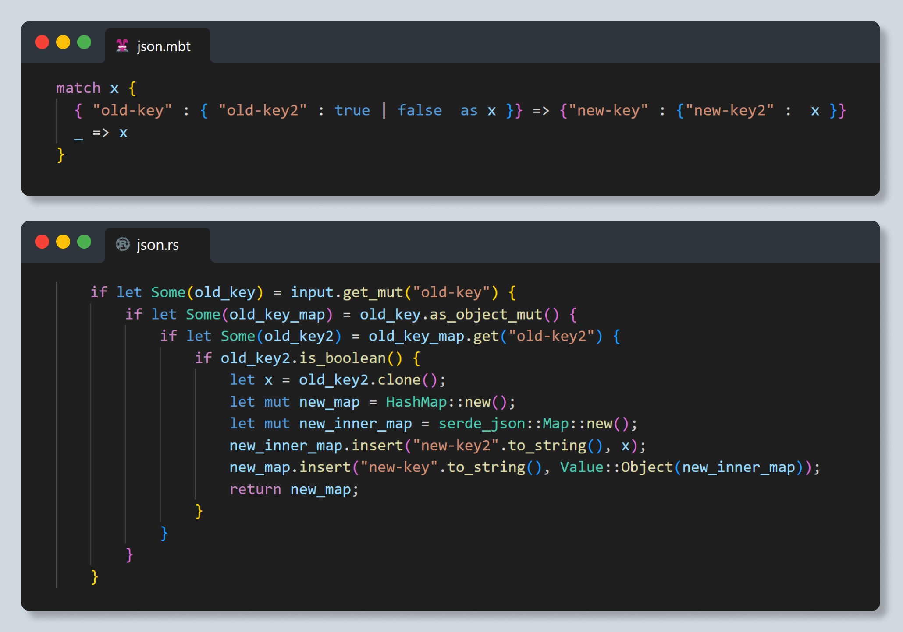

import aiNative from './ai-native.mp4'

# MoonBit 发布 beta 预览版，快速实现多领域落地应用

## AI时代下编程语言的战略机遇

这个世界是否还需要一门新的编程语言？毫无疑问每一门新编程语言诞生时都被这样质问过，我们相信 MoonBit 可以通过技术实力给你肯定明确的答案。

编程语言的发展经历了60年代：结构化编程的兴起，到70年代：面向对象编程与C语言，再到90年代：脚本语言与互联网 ，又转变为00年代：语言的统一与多样性，最终来到了10年代：现代语言与大数据；编程语言在不断进步，同时也有大量的编程语言慢慢销声匿迹。

大模型时代的横空出世，把万事万物席卷进这股浪潮，编程语言作为计算机核心组件与软件开发者创造技术世界最重要的工具，自然被顶上风口浪尖，整个技术行业都对编程语言提出了更高的要求。

在大模型时代，工具重新塑造了开发者的工作方式，同时也降低了学习新语言的门槛，开发者将更专注于创意和设计，代码的实现和优化将由编程工具完成。这一转变推动编程工具从简单的代码生成器进化为复杂问题解决平台。

MoonBit AI 云原生开发者平台（MoonBit 编程语言及工具链）就在这个机遇与挑战并存时代应运而生，整个开发者工具链于 AI高度垂直整合，应用场景聚焦于云计算和边缘计算，MoonBit 目标是重塑软件开发生态。

MoonBit 于 2022 年启动开发计划，凭借团队在 ReScript、OCaml、Flow等工业编程语言研发中的十多年经验，迅速在两年内完成了整套工具链的开发，致力于成为第一个走向国际的中国编程语言。

## Beta预览版的标志性意义

自从去年8月18日 [alpha 版的宣布](https://www.moonbitlang.cn/blog/first-announce)带来了热烈的反响，经过整整一年的高速迭代，MoonBit 迎来了 beta 预览版这样一个重要的里程碑: 我们在核心语言特性上媲美甚至超越了大部分主流语言 1.0，整个语言特性的开发趋于稳定，可以吸引开发者更广泛的参与到生态建设中来。这里列举几个 MoonBit 核心且有挑战性的特性：

- 现代化的泛型系统

现代语言复杂性的很大一部分在于类型系统的设计，很多主流工业语言，比如 [Java](https://legacy.cs.indiana.edu/classes/jett/sstamm/) ，[Go](https://go.dev/blog/intro-generics) 在 1.0 版本推出很多年以后才会渐渐完善泛型的支持，但是这会[对生态造成撕裂](https://groups.google.com/g/golang-nuts/c/LEEuJPOg0oo)。MoonBit 在 beta 版本已经完成了泛型和 ad-hoc polymoprhism，而且 MoonBit 在保持极快的编译速度的同时，提供了零开销的泛型支持。

- 准确的错误处理

错误处理是现代语言设计中的重要组成部分，大部分编程语言在静态分析中，彻底放弃错误处理的支持，这意味着任何函数都可以抛出异常，很难写出高可靠性的代码，MoonBit 通过准确的控制流分析，可以完全在编译时期跟踪函数的错误。这一过程几乎完全由编译器自行推导，而又不像 [Java checked exception](https://stackoverflow.com/questions/613954/the-case-against-checked-exceptions) 那样过于繁琐，对用户带来较高的心智负担。

- 高效的迭代器

传统的编程语言的迭代器会产生频繁的装箱操作，导致其性能比普通的循环要糟糕很多，MoonBit 创新性的使用了零开销的迭代器设计，可以让用户既能写出优雅的代码，也能保持程序的性能。

## 四大优势

2023 年 8 月 18 日，MoonBit首次在海外发布后，迅速登上了 [HackerNews 的头条](https://news.ycombinator.com/item?id=37174619)。此外，MoonBit 还在全球 DevOps 领域权威媒体平台 [The News Stack](https://thenewstack.io/moonbit-wasm-optimized-language-creates-less-code-than-rust/)、[日本顶尖科技社区 Zenn](https://zenn.dev/mizchi/articles/introduce-moonbit) 等知科技媒体上频频出现，进一步巩固了其全球影响力。

在这一过程中，MoonBit 一直致力于发挥其在语言速度、代码精简、安全保障和数据处理等方面的卓越优势。

### 快

  MoonBit 旨在实现全栈的高效，包括编译性能和运行时性能。MoonBit 为多级中间表示（IR）上的全局优化而设计，这种方法改善了内存布局，最小化缓存未命中率，并提供了优越的数据和控制流分析环境。[从编译速度来看，MoonBit 编译 626 个包（package）只需 1.06 秒，比 Rust 快了近 9 倍，运行时间仅为Go的1/6](https://github.com/moonbitlang/moonbit-docs/tree/main/legacy/benchmark/fibonacci)。

### 小

  MoonBit在输出Wasm代码体积上相较于传统语言显著优势，MoonBit 通过 [WebAssembly（Wasm）组件模型](https://www.moonbitlang.cn/blog/component-model)，在生成代码时实现了显著的体积优化。相比其他编程语言，MoonBit 编写的 Wasm 组件代码体积大幅减少。例如，在编译一个简单的“Hello World” HTTP 服务器时，MoonBit 的输出文件大小仅为 27KB，而 [WasmCloud 提供的`http-hello-world`模板](https://github.com/wasmCloud/wasmCloud/tree/main/examples)中 Rust 的输出为 100KB，TypeScript 为 8.7MB，Python 更是高达 17MB。

### 安全

借助前文提到的创新错误处理机制，MoonBit 有效解决了传统编译技术在错误处理机制转换中遇到的适用范围有限和内存开销大的问题。通过静态分析源程序中的错误处理代码并根据目标编程语言的特性进行转换，MoonBit 扩大了适用语言范围，减少了内存开销，同时提升了代码的安全性和稳定性。

健壮的类型系统是 MoonBit 对安全保障的重要设计之一。MoonBit 采用了强大的类型系统，并内置静态检测工具，在编译期检查类型错误，从而提高代码的正确性和可靠性。

MoonBit 对安全的保障也来源于对 WebAssembly 的原生支持。MoonBit 充分利用 Wasm 对沙箱环境，内存隔离、默认的无权限机制（deny-by-default）等安全架构的设计，释放其在云计算和边缘计算安全问题上的潜力；同时结合语言自身类型系统安全，删减无用代码（DCE）、编译为经过验证的 Wasm 指令等三层保障，确保代码可信与数据隐私安全。

### 专注于数据处理

MoonBit 作为一门多范式编程语言，在保持语言简单性的同时，也侧重于提供数据处理的最佳体验。MoonBit 通过原生支持 **Json 处理、Iter 类型和模式匹配**实现高效数据处理，在语法设计上兼具动态语言的灵活性和静态语言的安全高效，直观而简洁地进行对数据的解析和转换。

MoonBit 在数据处理上的语法设计旨在优化常见的数据处理场景，解决传统方法中由于生成多个中间数组而导致的性能问题，在 Iter 性能对比中，MoonBit 的数据处理速度达到了 [JavaScript 的 25 倍之多](https://github.com/moonbit-community/benchmark-202404)。

## AI 原生 IDE

相较于传统的编程语言设计路线，MoonBit 在战略上从一开始就提供全套开发、调试、部署一站式解决方案。MoonBit 不仅提供了多后端支持、通用程序语言设计，还涵盖了编译器、[构建系统](https://www.moonbitlang.cn/blog/build-system-opensource)、[包管理](https://www.moonbitlang.cn/blog/intro-to-mooncakes)、[集成开发环境（IDE）](https://try.moonbitlang.cn/)、调试器，部署工具等。这个全面的设计使得 MoonBit 能够实现高度垂直整合，而且可以同时在云端和边缘端执行，更好地与各种资源进行交互，从而为用户提供极致的开发体验和性能。

MoonBit 提供对 IDE 的支持不仅包含了现代 IDE 的所有功能，与其他 Cloud IDE 不同，MoonBit 无需依赖容器,快速语义分析技术可处理大量的代码库，并且在更大规模的代码库中也能在百毫秒级别完成 IDE 响应。

现今大多数编程语言的 IDE 是为桌面操作系统设计的，未能很好地适应云原生环境和边缘端的需求。MoonBit 则通过采用高度并行化的架构和对分离编译的原生支持，突破这一限制，使得 Cloud IDE 可以直接在边缘端运行。这在现今大多数语言的 Cloud IDE 中是首次。

除传统 IDE 的功能以外，MoonBit AI 助手现已内置于 MoonBit IDE，并实现了自动化测试生成、文档生成，以及代码解释功能，为应用的开发、测试和文档编写提供了全方位的支持，使得开发者能够更加专注于业务逻辑的实现，而不必担心底层的复杂性和维护工作。

<video controls src={aiNative} style={{width: '100%'}}></video>

MoonBit在初始阶段已经提供相对于其他语言通常在成熟阶段才拥有的调试工具。并在JavaScript后端实现开箱即用的调试功能，用户仅需在 JavaScript Debug Terminal 上执行 `moon run --target js --debug` 即可立刻进入调试。

## 应用场景

MoonBit 是一个全场景覆盖的开发者平台，紧跟科技前沿和行业趋势，侧重于云计算、边缘计算、AI 以及教学领域的发展，并在每个领域做到极致，确保在性能上领先其他语言至少一个数量级。多应用场景：

### 云计算

在云计算领域，MoonBit 近期已支持 Wasm 组件模型（component model），并有海外用户实现了与 Spin 框架集成的 [MoonBit SDK](https://github.com/gmlewis/spin-moonbit-sdk)。通过将应用程序拆分成独立的、可重用的组件，MoonBit 可以在云计算开发中更好地利用模块化开发、灵活的部署和更新、资源优化、防止单点故障提高安全性、易于扩展和集成等特性，实现云计算应用场景中的突出优势，提高系统的灵活性和安全性，简化扩展和集成过程，从而显著提高云计算开发效率并降低运营成本。

### 边缘计算

在边缘计算领域，目前已有 [MoonBit PDK 插件](https://github.com/extism/moonbit-pdk)，并被 Extism 收入官方 PDK 库。通过 PDK 的支持，MoonBit 能够在边缘计算应用中更高效地利用硬件资源，实现分布式计算和本地处理，提升性能和响应速度，同时确保设备兼容性和数据安全性，从而大大提升开发和部署效率，满足低延迟和高效能的需求。

### 教育(wasm4, mario, minimoonbit)

在 MoonBit 的应用生态发展中，我们同样注重为学生群体以及编程语言初学者提供简单易学的入门环境，并以游戏的形式打造轻松愉悦的学习体验。

MoonBit 现已支持使用 WebAssembly 开发小型复古游戏的 WASM-4 框架。凭借 MoonBit 的高效工具链和简洁设计，入门级开发者可以在官方教程的指导下轻松创作属于自己的第一款游戏。同时，框架内置的多玩家支持功能能够让至多四名玩家共同体验游戏的乐趣。无论是创作过程还是开发体验，MoonBit 都能让初学者体验前所未有的简单与高效。

不仅如此，由于 MoonBit 支持实时可视化开发，同时编译速度极快，开发者还能够实时更改代码来灵活调整游戏参数。

MoonBit 团队正在开发 MiniMoonBit 这一编译器教学项目。学生通过这个项目可以用 MoonBit 实现 MoonBit 语言的一个子集。它去除了多态等复杂的功能，同时学生也可以在简单的语言设计下深入了解类型推导、高阶函数等现代语言特性。由于 MoonBit 强大的表达力，相较传统的用 C/C++ 实现的编译器项目，学生可以更轻松地上手实现。同时，MiniMoonBit 项目采用了模块化的设计，多层 IR 都有对应的 Json 文本表示，学生不再需要从头实现编译器的每个环节，而是可以选择感兴趣的模块来学习。

## 未来计划与支持

MoonBit AI云原生开发者平台是一个“道阻且长，行则将至”的系统工程，开发编程语言工具链以及培养生态系统是一个漫长且耗费各项资源的过程，但值得骄傲的是 MoonBit 汇聚了一批非常年轻的技术精英。当然，仅靠自身的力量是很难走向巅峰，我们正在马不停蹄的扩大 MoonBit 社区力量，培养社区人才，2 年的时间里 MoonBit 工具链已有几百名社区贡献者，近万人的全球的用户，我们相信未来 MoonBit的 一定会成为百万级用户的现象级编程语言。

目前，MoonBit 已支持 Wasm 与 [JS 后端](https://www.moonbitlang.cn/blog/js-support)，未来，MoonBit 计划支持 native 后端。这意味着无论是 UI、客户端、边缘计算还是系统编程，用户都能在 MoonBit 平台上找到适合自己的使用场景，从而使生态能够覆盖所有可能的应用场景。

