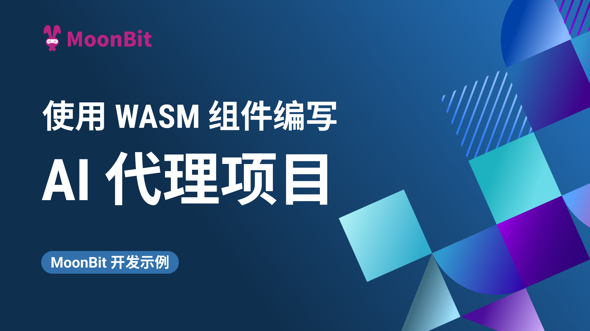
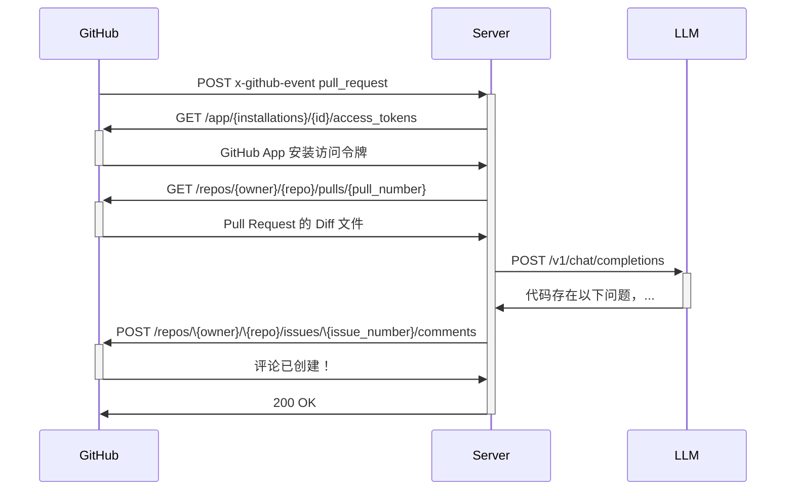

# 通过 Wasm 组件使用 MoonBit 编写 AI 代理

如果你有关注MoonBit的仓库，最近你可能发现了一个叫做 "peter-jerry-ye-code-review" 的机器人对每个新增的 PR 发表评论。如果有新的提交，它还会自动对评论进行更新。没错，这个实验性代码审查机器人就是我们用 MoonBit 编写的AI代理。在这篇文章中，我们将解释它的工作原理。

你可以在[这个仓库](https://github.com/moonbitlang/example-ai-agent)，中找到完整代码的快照，README 文件里有技术细节的详细说明。

## 使用场景

当有 Pull Request 提交时，我们都希望能够得到及时的审查。这时，如果可以实时提供一些初步检查反馈，便可以提高审查效率，以便开发者及时更新内容。

一个自动审查 PR 的机器人可以轻松地帮助我们实现这一目标。通过使用场景分析我们可以推断出这是一个无服务器任务：服务器接收到 Pull Request 的通知，获取必要的信息，然后发布评论。过程中无需存储任何数据。出于 WebAssembly 对无服务器任务场景的优势，尤其在冷启动中极快的速度，在本次任务中我们将选择使用 MoonBit 和 Wasm 组件模型（component model）实现项目。

## 工作原理

### 架构

本示例将基于开源运行时 [Spin](https://developer.fermyon.com/spin/v2/index) 开发。Spin 建立在 [wasi-http](https://github.com/WebAssembly/wasi-http) 标准上，并提供了连接 Redis 或关系型数据库的接口。本次示例将部署在  [Fermyon Cloud](https://developer.fermyon.com/cloud/index)，该平台为初学者提供免费计划。你也可以选择开源的 [Spin Kube](https://www.spinkube.dev/)，并在 Kubernetes 集群上自托管。

通过 [wit-bindgen](https://github.com/bytecodealliance/wit-bindgen) 对 MoonBit 的支持，我们可以通过获取 WIT 文件并生成绑定代码，轻松集成 Spin 的功能。

### 工作流程

下图展示了工作流程：

在创建 GitHub App 并由用户安装后，我们可以接收 [Webhook 事件](https://docs.github.com/en/webhooks)。GitHub 会根据配置发送 Webhook 事件。接收到负载后，我们可以验证并收集必要信息：仓库名称、安装 ID、Pull Request 编号以及事件类型。

通过安装 ID，我们可以为 App 获取访问令牌，使其能够访问用户授权的权限，如读取/写入 Pull Request 权限，特别是如果应用安装在私有仓库中。

我们可以根据事件类型决定采取的行动。例如，"opened" 表示新 PR，"synchronize" 表示现有 PR 的更新。对于前者，我们可以创建新的评论，而对于后者，我们更新现有评论。相关事件类型和负载在 [Webhook
 文档](https://docs.github.com/en/webhooks/webhook-events-and-payloads)中有详细描述。

通过负载中的信息，我们可以从 GitHub 获取 Pull Request 的变动情况，例如以 diff 或 patch 格式获取更改。我们还可以列出提交并获取相应的更改和消息等。

最后，我们将收集的信息通过 HTTP 请求发送到我们选择的 LLM 提供商，使用其响应内容在 Pull Request 上创建或更新评论。

## 结论

MoonBit 在支持组件模型后，可以适用于多种应用开发场景。随着越来越多的运行时对该标准的支持，MoonBit 将广泛应用于开发无服务器应用或边缘计算应用。本文介绍的 AI 代理只是其中一个示例，未来会有更多应用场景出现。

**Additional resources:**

- [开始使用MoonBit](https://www.moonbitlang.cn/download/).
- 查看[MoonBit文档](https://docs.moonbitlang.cn/).
- 学习基于MoonBit设计的课程[《现代编程思想》](https://moonbitlang.github.io/moonbit-textbook/)
- 加入[中文论坛](https://taolun.moonbitlang.com/)
