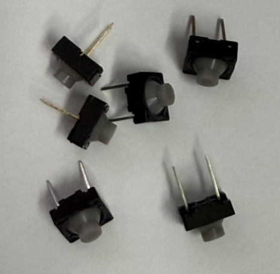

# 硬件实现：在ESP32-C6单片机上运行MoonBit WASM-4小游戏

本次[2024 MoonBit全球编程创新挑战赛](https://www.moonbitlang.cn/2024-mgpic)，我们开设了使用WASM-4开发的游戏赛道，在[《基于 Wasm4 框架的 MoonBit 游戏开发指南》](https://www.moonbitlang.cn/blog/wasm4)一文中，我们介绍了如何使用MoonBit在WASM-4框架中编写小游戏。

WASM-4模拟的[硬件规格](https://wasm4.org/docs/#hardware-specs)主要包括：160x160 像素的显示屏；64 KB 的线性内存；支持键盘、鼠标、触摸屏，以及最多 4 个游戏手柄作为输入设备；音频输出；1KB的存储空间。一个自然的想法便是将WASM-4移植到单片机上运行，将模拟的IO设备替换为真实的硬件。本文，我们将探索如何在真实的硬件中运行这些由MoonBit编写的小游戏。本文使用的芯片为 ESP32-C6，它搭载 RISC-V 32 位单核处理器，主频高达 160 MHz，内置 320 KB ROM，512 KB SRAM。

如下动图展示了在 ESP32-C6 开发板上运行使用MoonBit编写的贪吃蛇游戏。

## 移植过程

WASM-4 项目仓库中提供了两种运行时环境：一种是在Web环境中运行的，另一种是本地（native）运行时。所谓WASM-4运行时指的是一种能够运行符合WASM-4规范的游戏环境。 其中，本地运行时则是使用C语言实现的，只需要对其稍加修改、删除不需要的组件，便能在单片机上运行。

### LCD显示屏

WASM-4 的本地运行时自带图形用户界面 (GUI)，用于在屏幕上显示游戏图像。然而，当我们把它移植到硬件上时，就不再需要这个图形界面了，因为我们可以用真实的LCD屏幕来代替它。

因此，第一步是删除与 GUI 相关的组件。WASM-4 有一个内部的帧缓冲器，用于暂存显示数据，由 [MiniFB](https://github.com/emoon/minifb) 负责渲染每一帧。我们只需要保留这个缓冲区用于存储图像数据，同时移除 MiniFB 相关代码。在单片机上调试之前，我们可以将帧缓冲器中的数据输出为图片文件。一旦确认图像无误，我们的任务就变得非常简单了，只是将一个存有像素点数据的数组显示到显示屏上。本文所选用的显示设备为一块由ST7789驱动的1.54英寸LCD，其分辨率为240*240，如下图所示：

因此在居中显示WASM-4 160*160的图像时，四周会留有40像素的空间。此外还需注意，由于本文所选用的LCD显示屏只支持RGB565颜色格式，因此可能会出现颜色偏差。

### 游戏手柄

WASM-4支持键盘、鼠标、触摸屏，手柄等输入设备。本文使用硅胶按钮模拟手柄。

手柄有上下左右四个方向按键，以及X和Z两个动作按键。WASM-4使用其线性内存中的1个字节来表示一个手柄状态，其中的第 0 位和第 1 位分别对应 X 和 Z 按钮，第 4 到第 7 位对应方向键的左、右、上、下。每一位的值表示相应按钮是否被按下。因此只要为每个按钮的按下按键事件中设置对应的比特位即可。本文使用最简单的方式，每个按键占用一个GPIO接口。

### 使用 WAMR 替换 wasm3 解释器

由于 wasm3 项目不再活跃维护，缺失了一些需要的特性。因此，我们还需要将 WASM-4 本地运行时的 wasm 执行引擎为替换为 WAMR。与wasm3类似，我们只需要在WAMR的运行环境中提供相同的FFI即可。例如用于绘制线段的 `line`、`hline`、`vline`，用于绘制矩形的 `rect`，用于贴图的 `blit`、`blitSub`等。

## 总结

至此，本文已经完成了基本的游戏显示与控制功能，点击查看[完整代码](https://github.com/lijunchen/moonbit-wasm4-esp32)。当然，仍然有很多有趣的方向值得探索，例如本文并未充分利用ESP32芯片丰富的无线接口，我们可以利用WiFi实现WASM游戏模块的热加载。此外，本文未实现外接扬声器以支持音频输出。

**更多资源**

- 查看多人Wasm4游戏案例：[双人乒乓](https://docs.moonbitlang.cn/examples/pingpong/)
- [2024 MoonBit 编程创新挑战赛](https://www.moonbitlang.cn/2024-mgpic)
- [开始使用MoonBit](https://www.moonbitlang.cn/download/).
- 查看[MoonBit文档](https://docs.moonbitlang.cn/).
- 学习基于MoonBit设计的课程[《现代编程思想》](https://moonbitlang.github.io/moonbit-textbook/)
- 加入[中文论坛](https://taolun.moonbitlang.com/)
