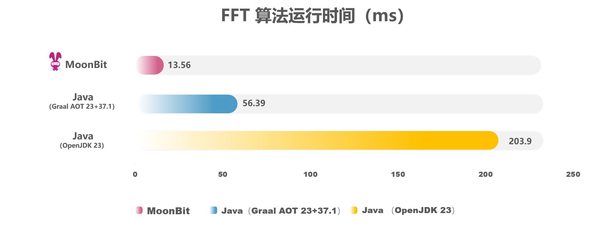
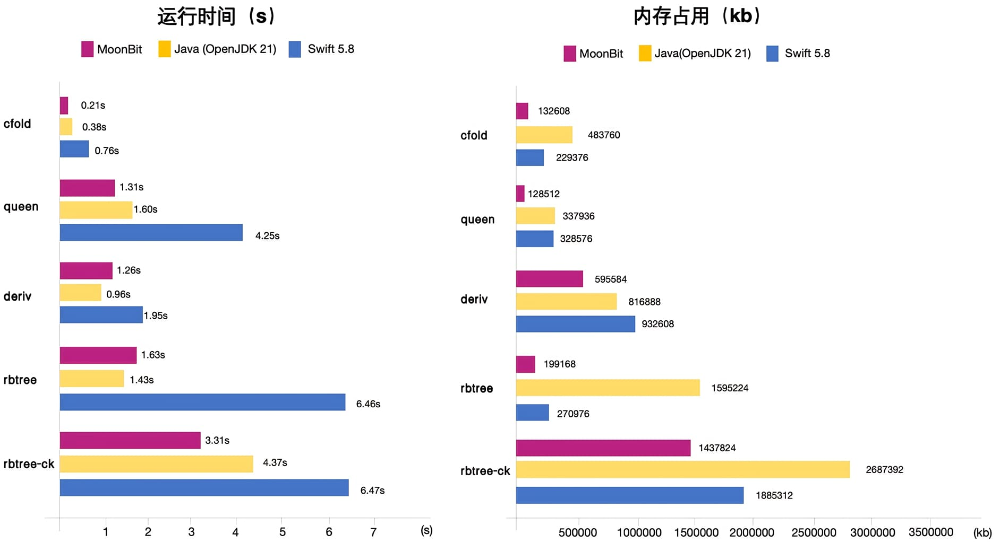

# MoonBit 支持 Native 后端


MoonBit 诞生于2022年，作为一款专为云计算与边缘计算设计的 AI 云原生编程语言及其完整工具链，融合了 Rust 和 Go 等现代语言的优秀设计理念。在 2023 年 8 月 18 日的首次公开展示中，MoonBit 支持了 [WebAssembly](https://www.moonbitlang.cn/blog/first-announce) 这一跨平台标准指令集，并实现了优越的运行速度和紧凑的代码体积。在 2023 年 5 月，MoonBit 支持 [JavaScript 后端](https://www.moonbitlang.cn/blog/js-support)，并在性能上实现突破，在 JSON5 库的测试中，MoonBit JS 性能表现比原生JavaScript提升了近8倍。在已有 WebAssembly 和 JavaScript 后端的基础上，MoonBit 平台**新增原生后端支持**。这一原生后端能够直接将 MoonBit 代码编译为机器码在硬件上运行，摆脱了虚拟机的限制，显著提升了性能。

## 为什么要支持 Native 原生后端？

编程语言的运行时实现方式主要分为两类：基于虚拟机的（如 Java、Kotlin 等）和直接在硬件上执行的（如C/C++、Rust等）。原生后端虽然具备更大的优化空间和更高的性能上限，但开发难度也相应增加。

目前，MoonBit 已支持 WebAssembly 和 JavaScript 后端，凭借虚拟机运行具备良好的生态支持。然而，在高性能要求的场景中，这些后端可能存在局限。MoonBit 的原生后端能够将代码编译为目标机器的可执行二进制文件，避免解释开销，充分利用硬件资源，如 CPU、内存和存储，从而显著提升性能。对于视频处理、机器学习和大规模数据分析等计算密集型应用，原生后端提供了必要的性能支持。

通过实际的性能数据对比， 根据不同应用场景， MoonBit 原生后端在数值计算领域以及内容管理性能方面超速领先于传统编程语言 Java 以及 Swift。

### 数值计算领域：相比 Java 快一个数量级

原生语言相比于基于虚拟机的编程语言的性能优势在数值计算领域尤为明显，这得益于原生编程语言很大程度上能更好的优化内存布局和利用硬件加速指令。

在这个经典的FFT算法 [benchmark](https://github.com/moonbit-community/moonbit-native-benchmark1) 中，同样的 Cooley-Tukey 算法， MoonBit 相比 Java 有15倍以上的性能提升，比最先进的商业版本的 Java 编译器 GraalVM 也有4倍以上的性能提升。

下面是 MoonBit 与 Java 实现的 FFT 算法的性能对比。FFT（快速傅里叶变换）是一个计算序列的离散傅里叶变换的高效算法，在信号处理、压缩等许多领域有重要应用。FFT 算法涉及大量数值运算和数组操作，可以很好地体现语言的基础性能：



与传统的 C/C++ 等底层语言不同，MoonBit 在实现显著性能提升的同时，保留了极佳的开发体验。MoonBit 与 Java 一样，采用自动内存管理，避免了手动管理内存的复杂性。同时，MoonBit 通过更现代化的语言设计，提供了比 Java 更丰富的现代语言特性，进一步提升了开发者的使用体验。

在数值计算类程序中，性能主要由两方面决定：对计算的优化程度和语言本身的运行开销。C/C++ 在数值计算领域表现出色，不仅得益于编译器优化，还在于语言本身几乎没有额外开销。对于自动内存管理的高级语言来说，如何消除高级语言功能带来的额外开销，是提升性能的关键。加上现代 CPU 的缓存机制，数据布局对性能也有重要影响。

MoonBit 实现了性能与开发体验的双重优势，归功于其科学、现代的顶层设计：

- MoonBit 语言设计简洁，额外开销极小，数据结构布局紧凑，能够更好地利用现代 CPU 的缓存架构。

- MoonBit 采用多层中间表示（IR）和全局优化编译架构，能有效消除泛型等高级功能的开销，并对数据布局进行全局优化，以最大化性能。

### 内存管理：性能优于 Java & Swift

数值计算类任务能很好反映编程语言的基础性能。但在应用类程序中，更常见的是对内存中数据结构的各种操作。得益于定制的内存管理系统，MoonBit 的 native 后端在内存操作性能与内存占用上表现也非常优秀，优于拥有高性能 GC 的 Java，与同样编译到二进制、自动管理内存的语言 Swift：



上述 [benchmark](https://github.com/moonbit-community/moonbit-native-benchmark2) 来自论文 ：[*Perceus: Garbage Free Reference Counting with Reuse*](https://www.microsoft.com/en-us/research/publication/perceus-garbage-free-reference-counting-with-reuse-2/)，通过对语言在大量动态内存分配操作时的**运行时间**和**内存占用**情况进行比较，从而很好反映语言的内存管理系统的性能差异。

在嵌入式与 IoT 设备上，计算资源与内存资源都非常紧张。因此编程语言的运行性能与内存占用表现都必须足够好，才能胜任嵌入式、IoT 开发的场景。

实践中，受制于硬件资源，嵌入式、IoT 开发者往往不得不使用 C/C++ 等底层语言来获得足够的性能。但这会极大增加开发者的心智负担、降低开发效率。而 MoonBit 原生提供了一种新的可能性：使用 MoonBit 原生开发程序，能**兼顾开发体验、运行性能与内存占用**。

## 深度硬件集成，接入嵌入式与 IoT 生态

原生后端的另一个优势就是深度硬件集成。原生应用能直接访问设备的硬件功能，如摄像头、GPS、传感器等，对后端服务至关重要。且深度硬件集成可以提供更快速的响应时间和更丰富的功能，增强用户体验。

除了生成开发机器的原生二进制，MoonBit 的原生后端还能交叉编译到所有 C 支持的平台，在第一时间实现了对 RISC-V 平台的原生支持，拥抱嵌入式与 IoT 生态。

MoonBit 的原生后端能生成只有少量 libc 依赖的可执行二进制。因此，MoonBit 的原生后端非常适合用于编写嵌入式、IoT 程序。此外，由于 MoonBit 原生生成的二进制高度self-contained，部署 MoonBit 原生程序到各类边缘设备上非常便捷。

下面是一个使用 MoonBit 交叉编译到 RISC-V 的例子。为了获得开箱即用的交叉编译体验，首先需要安装 Zig。接下来，我们创建一个新的项目：

```bash
moon new hello-riscv
cd hello-riscv
```

为了交叉编译到 RISC-V，我们需要修改 `src/main/moon.pkg.json` 文件，让 MoonBit 使用 `zig cc` 来进行 原生后端的交叉编译。打开 `src/main/moon.pkg.json`，将其修改为：

```json
{
  "is-main": true,
  "import": [
    "username/hello/lib"
  ],
  "link": {
    "native": {
      "flags": [ "-cc", "zig cc -target riscv64-linux-musl -O2 -static" ]
    }
  }
}
```

接下来，只需要执行：

```bash
moon build --target native
```

就能获得 `target/native/release/build/main/main.exe`，一个 RISC-V 二进制可执行文件。可以用 RISC-V 虚拟机或物理机直接运行这个可执行文件。这里以 Linux 下 [libriscv](https://github.com/libriscv/libriscv) 提供的虚拟机为例：

```bash
$ rvlinux ./target/native/debug/build/main/main.exe
Hello, World!
```

## 复用底层生态，同时提供安全可靠的系统编程体验

以C/C++语言为核心的原生生态在整个软件体系中占据着至关重要的地位。操作系统的底层 API、各类高性能计算库、以及 AI 张量库（如 llama.cpp、ggml 等），均通过 C ABI（应用二进制接口）提供服务。MoonBit的原生后端能够无缝与基于 C ABI 的第三方库进行交互，为MoonBit解锁更多开发场景，并带来卓越的用户体验。

MoonBit 原生后端采用多层 IR（中间表示）设计，其中最底层的 IR 是 C 语言的一个子集。这一设计确保了 MoonBit 与 C 语言之间的良好互操作性，避免了昂贵的 FFI（外部函数接口）开销，充分利用现有的各类高性能 C 语言库资源。未来，MoonBit 将提供规范化的 C 语言调用约定，进一步扩展其生态，便捷地集成现有的开源 AI 推理库，广泛应用于高性能计算和 AI 边缘推理领域，或用于开发直接调用操作系统 API 的高性能应用与服务。

相较于 C/C++ 等系统编程语言，MoonBit 在保持高性能的同时，尤为注重内存安全与可靠性。与 Rust 的内存安全机制不同，MoonBit 通过编译器自身的优化策略，在不影响开发者体验的前提下，在大多数开发场景中移除垃圾回收（GC）带来的开销。同时，针对部分核心场景，MoonBit 将逐步引入如“modality”等业界最新的研究成果，以提升程序的确定性。这一机制有效降低了学习曲线，使更多开发者能够轻松上手并从 MoonBit 生态中获益。

## 下一步

MoonBit 原生后端完成了 MoonBit 生态的最后一块拼图。通过原生后端，WebAssembly，JavaScript后端的支持可以满足绝大多数开发者的多场景需求。未来 MoonBit 团队将会聚焦于开发者的用户体验，提高软件的可靠性，以及培养开发者生态。在开发者体验方面值得注意的是，得益于 MoonBit 编程语言工具链的模块化设计，这三个后端共享了前面绝大部分基础框架，大部分前端的优化都会使三个后端的用户受益。

**更多资源：**

- [开始使用MoonBit](https://www.moonbitlang.cn/download/).
- 查看[MoonBit文档](https://docs.moonbitlang.cn/).
- 学习基于MoonBit设计的课程[《现代编程思想》](https://moonbitlang.github.io/moonbit-textbook/)
- [2024 MoonBit 编程创新挑战赛](https://www.moonbitlang.cn/2024-mgpic)
- 加入[中文论坛](https://taolun.moonbitlang.com/)
