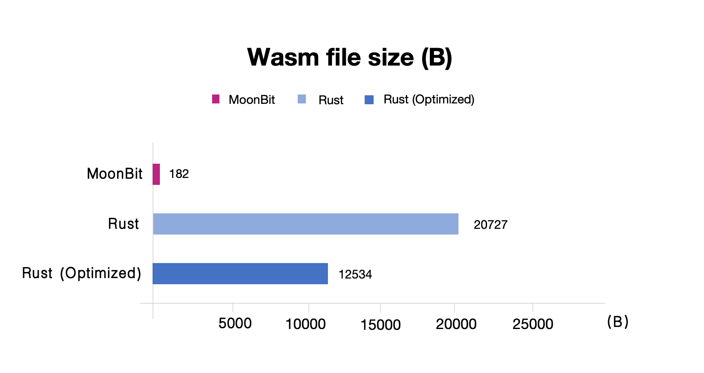

# MoonBit 中使用 Js string builtin 提案的介绍


长期以来，WASM 虽然以性能优越著称，但是由于它与JS 互操作成本较高，性能优势得不到充分体现。最新的 WASM 提案 Js builtin string  已经在 Chorme 默认实现， MoonBit 月兔团队的编译器已经完成对Js builtin string 提案的适配，最终评价结果显示新的后端输出体积远小于 Rust，而且性能会更好。

## 背景介绍

自从去年 [Wasm GC](https://github.com/WebAssembly/gc) 提案落地以来，已经有越来越多的编程语言支持编译到使用标准 GC 的 Wasm 代码，MoonBit 语言也在第一时间推出了 wasm-gc 后端，然而，标准 GC 中只提供了 struct, array 等比较基础的数据类型，对于字符串这种比较复杂的类型，目前还没有标准化的实现，考虑到字符串不同的编码形式以及不同的实现方式涉及到的不同的语义，标准化 Wasm 中字符串是一件极为复杂的事情。在这种情况下，对于字符串类型的处理方式就有以下两种主要的实现方式：

- 第一种方式是使用 GC 标准中提供的 struct, array 类型进行定制化的字符串类型实现，比如对于使用 UTF-16 编码的语言可以使用 (`array 16`) 作为字符串类型的实现，这种实现方式具有非常高的灵活度，可以通过复杂的优化提升字符串操作的性能，但是当涉及到使用 JavaScript 宿主环境中提供的 Web API （比如 fetch）或者 DOM API 的情况的时候，需要将语言中定制化的字符串类型转换为 JavaScript 中的字符串，这个转换往往不可避免地需要对字符串在内存中进行多次拷贝，这会对程序的运行时间带来不小的额外开销。

- 第二种方式则是通过外部引用 (externref) 的形式使用 JavaScript 中字符串作为实现，字符串相关的操作（比如字符串截断和拼接等）则是通过从宿主环境中导入 JavaScript 中的函数来进行实现，显然这种方式的好处在于使用 JavaScript 中的 Web API 的时候，不需要进行额外的转换，但是与此同时，因为字符串的操作都是导入的外部函数，所以每次函数调用都会发生一次间接调用，相比于直接函数调用，间接函数调用更加不利于 Wasm 引擎进行性能优化，并且有更高的性能开销

由此可见，以上两种方式都不能令人满意，在这种背景下，Js-string-builtins 提案被提出，并且已经在主流浏览器环境中得到了实现。该提案主要是解决了上述第二种字符串实现方式带来的性能问题，在这个提案中，编译 Wasm 模块的时候可以通过传递参数来允许其导入 “wasm:js-string” 这个预定义模块中的函数，这个模块中包括 “length”, “concat”, 和 “substring” 等常见字符串操作，与普通的函数不同的是，Wasm 引擎中内置了这些函数的相关信息，所以在编译这个 Wasm 的过程中不会再将这些操作当作间接调用进行处理，并且在一些情况下可以对这些操作进行内联以提升运行效率。

## 使用方式

目前 MoonBit 已经支持了 Js-string builtin 提案，这里我们使用两个简单的例子分别展示如何使用 deno 和浏览器环境中使用 Js-string builtin。这一小节中完整的代码示例可以在 [https://github.com/moonbit-community/demo-js-builtin-string](https://github.com/moonbit-community/demo-js-builtin-string) 仓库中找到。

### 使用 deno 环境

首先使用 `moon new --lib demo-js-builtin-string` 来创建一个新的项目，接下来我们在这个项目中新建一个叫做 `palindrome` 的包，并且用 MoonBit 写一个判断回文字符串的函数：

```moonbit
// demo-js-builtin-string/palindrome/palindrome.mbt
pub fn palindrome(s : String) -> String {
  let len = s.length()
  for i in 0..<(len / 2) {
    if s[i] != s[len - i - 1] {
      return "false"
    }
  }
  return "true"
}
```

这里函数的类型是 `(String) -> String` ，当我们将对这个函数编译到 wasm-gc 后端时， MoonBit String 类型会被编译到 wasm-gc 中的数组类型，这个数组类型和 JavaScript 中的 String object 并不兼容，所以这里的 `palindrome` 函数被导出之后并不能直接在 JavaScript 环境中使用。在开启了 Js-string builtin 这一特性之后，MoonBit String 类型将被编译为 JavaScript 中的 String object，从而可以实现非常简洁的互操作。我们需要在 `moon.pkg.json` 配置文件中开启这一特性：

```json
// demo-js-builtin-string/palindrome/moon.pkg.json
{
  "link": {
    "wasm-gc": {
      "exports": ["palindrome"],
      "use-js-builtin-string": true
    }
  },
}
```
这时我们可以执行 `moon build` 将这个包进行编译，接下来我们准备一个 JavaScript 环境来测试这个函数：

```javascript
// demo-js-builtin-string/a.js
const { instance } = await WebAssembly.instantiateStreaming(
  fetch(
    new URL(
      "./target/wasm-gc/release/build/palindrome/palindrome.wasm",
      import.meta.url
    )
  ),
  {},
  {
    builtins: ["js-string"],
    importedStringConstants: "_",
  }
);
console.log(instance.exports.palindrome("hello"));
console.log(instance.exports.palindrome("ada"));
```

这里我们通过 `builtins: ["js-string"]` 这个选项来在 JavaScript 环境中开启 Js string builtin 的特性，`importedStringConstants` 这个字段用于支持字符串字面量，这里的 `"_"` 是 MoonBit 编译器在编译字符串字面量时使用的默认名称，这个字段可以进行定制化，具体方式将会在后文中提到，这时我们可以使用最新版本的 deno 运行这个 JavaScript 程序：

```bash
$ deno run -A --v8-flags=--experimental-wasm-imported-strings a.js
false
true
```

### 使用浏览器环境

现在我们使用浏览器环境展示一个使用 MoonBit 操作 DOM API 的示例。我们新建一个名为 `dom` 的包，将 DOM object 作为抽象类型，并通过 JavaScript 环境导入一个 `set_css` 函数来操作 DOM，比如这里我们可以使用它来实现一个 `change_color` 函数：

```moonbit
// demo-js-builtin-string/dom/dom.mbt
type DOM
fn set_css(dom : DOM, key : String, value : String) -> Unit = "dom" "set_css"
pub fn change_color(dom : DOM) -> Unit {
  set_css(dom, "color", "red")
}
```

同样地，我们需要在 moon.pkg.json 文件中开启 Js string builtin：

```json
// demo-js-builtin-string/dom/moon.pkg.json
{
  "link": {
    "wasm-gc": {
      "exports": ["change_color"],
      "use-js-builtin-string": true
    }
  }
}
```

接下来我们通过下面的 JavaScript 程序提供需要被导入的 `set_css` 函数，并且调用 MoonBit 中的 `change_colo`r 函数来改变字体颜色。

```javascript
// demo-js-builtin-string/b.mjs
const { instance } = await WebAssembly.instantiateStreaming(
  fetch(
    new URL("./target/wasm-gc/release/build/dom/dom.wasm", import.meta.url)
  ),
  {
    dom: {
      set_css: (dom, key, value) => {
        dom.style[key] = value;
      },
    },
  },
  {
    builtins: ["js-string"],
    importedStringConstants: "_",
  }
);
document.getElementById("hello").addEventListener("click", () => {
  instance.exports.change_color(document.getElementById("hello"));
});
```

同时我们使用下面的 HTML 文件来展示这个示例。在这个 HTML 文件中，我们创建了一个简单的 div 元素，并通过 script 标签引入了我们之前编写的 JavaScript 模块。这样，当用户点击 "hello" 文本时，就会触发我们在 MoonBit 中定义的 change_color 函数，将文本颜色改变为红色。

```html
<!-- demo-js-builtin-string/index.html -->
<html>
  <body>
    <div id="hello">hello</div>
    <script src="b.mjs" type="module"></script>
  </body>
</html>
```

我们可以使用一个简单的 HTTP 服务器来托管我们的 HTML 和 JavaScript 文件。例如，我们可以使用 Python 的 http.server 模块来快速创建一个本地服务器。运行以下命令：

```bash
python -m http.server 8000
```

然后，在浏览器中访问 [http://localhost:8000](http://localhost:8000)即可查看我们的示例。
你会看到文字颜色变为红色，这证明我们成功地使用 MoonBit 和 Js-string builtin 实现了 DOM 操作。


### 更多细节

通过 `moon build --output-wat` 指令，可以看到生成的文本形式的 Wasm 代码，比如我们可以看到 `palindrome` 函数使用了 Js string builtin 提案中提供的 `length` 和 `charCodeAt` 函数，并且通过 `import "_" "true"` 这种形式声明了 "true" 这个字符串字面量，"false" 字面量同理：

```bash
;; target/wasm-gc/release/build/palindrome/palindrome.wat
(func $moonbit.js_string.length (import "wasm:js-string" "length")
 (param externref) (result i32))
(func $moonbit.js_string.charCodeAt (import "wasm:js-string" "charCodeAt")
 (param externref) (param i32) (result i32))
(global $moonbit.js_string_constant.0 (import "_" "true") (ref extern))
(global $moonbit.js_string_constant.1 (import "_" "false") (ref extern))
```

这里有两点需要注意：

- `"_"`这个特殊的 import module 是和 JavaScript 程序中加载 Wasm 模块时提供的选项中的 `importedStringConstants` 字段保持一致的。这个字段的作用在于声明一个特殊的 module name，通过使用这个特殊的 module name，Js builtin string 提案重载了 import 的语法来声明字符串字面量，如上面 Wat 文件所示。这里 MoonBit 中使用了 `"_"` 作为了 `importedStringConstants` 这个字段的默认值，这样做的动机在于使生成的二进制 Wasm 文件体积更小，不过当这里的 `"_"` 与需要导入的其他模块冲突时，这个字段也可以通过 moon.pkg.json 对其进行配置，比如：

```json
// moon.pkg.json
{
  "link": {
    "wasm-gc" : {
      "use-js-builtin-string": true,
      "imported-string-constants": "some-other-name"
    }
    ...
  }
}
```

这时需要在 JavaScript 中传入相同的模块名称作为 `importedStringConstants` 字段的值：

```bash
  {
    builtins: ["js-string"],
    importedStringConstants: "some-other-name",
  }
```

- MoonBit 在实现 `println` 函数时，直接使用了 `console.log` 函数，但是这个函数没有包含在原本的提案中，所以 JavaScript 环境在使用包含了 `println` 的 MoonBit 程序生成的 Wasm 代码时，需要通过 import object 提供 `console.log` 函数，使用形式如下：

```javascript
const { instance } = await WebAssembly.instantiateStreaming(
  ...,
  {
    console: {
      log: console.log,
    },
  },
  {
    builtins: ["js-string"],
    importedStringConstants: "_",
  }
);
```

## 体积比较

在使用了 Js builtin string 的提案之后，MoonBit 程序面向 wasm-gc 后端生成的 Wasm 二进制文件体积会进一步得到缩小，这里我们和 Rust 进行一个简单的对比，比如在 MoonBit 中我们可以实现下面这个 `print_and_concat` 函数：

```moonbit
// demo-js-builtin-string/print_and_concat/print_and_concat.mbt
pub fn print_and_concat(a : String, b : String) -> String {
  let c = a + b
  println(c)
  return c
}
```

这里使用的打印字符串和字符串拼接的功能都来自于 JavaScript 宿主环境，所以生成代码的体积非常小，在通过 MoonBit 编译后，得到的 Wasm 二进制文件体积仅为 182 字节，通过 wasm-opt 压缩后，其体积仅为 117 字节：

```javascript
$ wc -c target/wasm-gc/release/build/print_and_concat/print_and_concat.wasm
182 target/wasm-gc/release/build/print_and_concat/print_and_concat.wasm
$ wasm-opt -Oz target/wasm-gc/release/build/print_and_concat/print_and_concat.wasm -o - -all | wc -c
117
```

我们在 Rust 中实现类似的功能：

```javascript
// demo-js-builtin-string/rust-example/src/lib.rs
use wasm_bindgen::prelude::*;

#[wasm_bindgen]
pub fn print_and_concat(a: &str, b: &str) -> String {
    let c = format!("{}{}", a, b);
    println!("{}", c);
    c
}
```

我们使用 `wasm-pack` 将这个 Rust 程序编译到 Wasm，并计算其体积大小：

```shell
$ wasm-pack build --target web
$ wc -c ./pkg/rust_example_bg.wasm
20727 ./pkg/rust_example_bg.wasm
```

这时得到的 Wasm 二进制文件体积有 20 kB 左右，为了减小这个体积，我们可以在 `Cargo.toml` 文件中加上一些编译优化的选项：

```toml
// demo-js-builtin-string/rust-example/Cargo.toml

[profile.release]
lto = true
opt-level = 'z'
```

并通过 nightly 的 Rust 编译器使用如下命令在编译过程中对一些不必要的模块进行裁剪，得到 Wasm 文件：

```shell
$ wasm-pack build --target web --release --manifest-path ./Cargo.toml -Z build-std=panic_abort,std -Z build-std-features=panic_immediate_abort
$ wc -c ./pkg/rust_example_bg.wasm                                                                                    ~/playground/moonbit-playground/js-builtin-string/demo-js-builtin-string/rust-example
12534 ./pkg/rust_example_bg.wasm
$ wasm-opt -Oz pkg/rust_example_bg.wasm -o - -all | wc -c                                                             ~/playground/moonbit-playground/js-builtin-string/demo-js-builtin-string/rust-example
12706
```



**Rust 编译得到的 Wasm 文件体积有大概 12 kB，体积大小为 MoonBit 生成的 Wasm 文件 60 倍之多**，虽然这其中很多是内存管理相关的代码，但是 Rust 并没有提供相关工具链适配 Wasm 标准原生的 GC，相比之下 MoonBit 编程语言在面向 Wasm 平台时，用户可以选择生成的 Wasm 代码是否使用 Wasm 标准原生的 GC，当使用 Wasm 标准原生的 GC 时，MoonBit 可以生成非常简洁高效的二进制代码。
